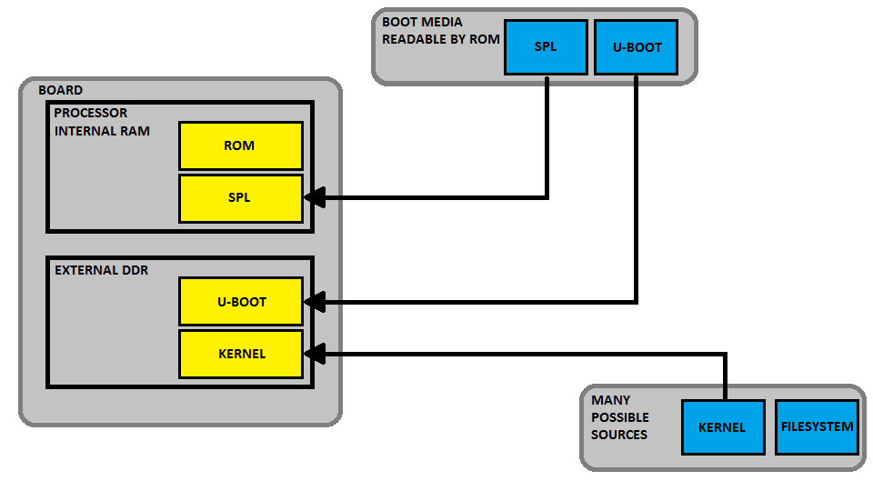
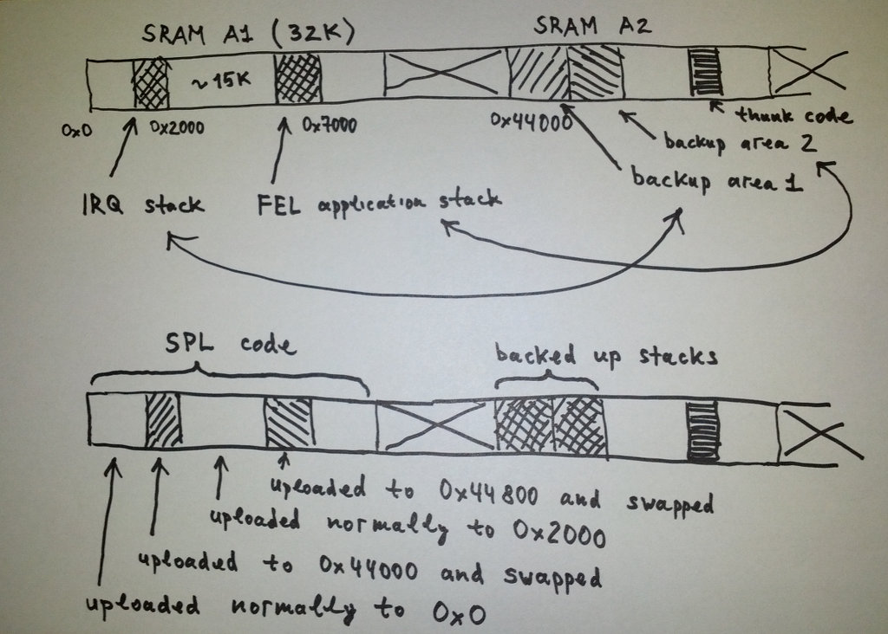

# A40i Boot Sequence
=====

## Determining boot source
- bootloader에서는 주소 0x28 의 데이터에 따라 부트 디바이스를 select한다. 
[http://linux-sunxi.org/Boot_Process]

## BROM
-----
- Primary Program Loader
- ROM code는 사전 프로그래밍 된 여러 위치 중 하나에서 SRAM으로 작은 부트코드를 로드.
- 예) NAND Flash, SPI (Serial Peripheral Interface)를 통해 연결된 플래시 메모리, MMC 장치 첫 번째 섹터(SD카드)등에서 SPL 을 읽는다.
- Allwinner사 SoC는 Specific boot process를 가지고 있다.
- SoC는 BROM이 있는 주소  0xffff0000에서 명령어를 가져오기 시작한다.(처음 a tiny on chip rom이라고 불리는 BROM이 실행된다.) 
- BROM은 두 부분으로 나뉘며, 첫번째 부분은 [0xffff0000](https://github.com/lchy0113/Allwinner-Info/blob/master/BROM/ffff0000.s) 은 FEL모드이고, 두번째 부분은 eGON.BRM([0xffff4000](https://github.com/lchy0113/Allwinner-Info/blob/master/BROM/ffff4000.s))이다.

- Reset vector 
 Reset vector는 FEL 모드의 맨 처음 주소 0xffff0000에 위치하며, reset시 0xffff0028로 점프하여 0xffff4000 (eGON.Boot ROM)을 프로그램 카운터에 로드하여 jump한다.

- eGON BOOT
 SDC0, SPI0, eMMC2, SDC2, NAND Flash 및 USB 에서 연속적으로 부팅을 시도하며 동시에 외부 핀  Boot Select Pin 이 Low 상태가 되면 USB Mode 로 부팅을 시도한다. 

### The eGON Boot ROM performs a few tasks:

1. does some [co-processor setup](https://github.com/lchy0113/Allwinner-Info/blob/4777ddf2a26eca973484714ac48bbaf18849dab4/BROM/ffff4000.s#L19)  
2. Disables the [WatchDog Timer](https://github.com/lchy0113/Allwinner-Info/blob/4777ddf2a26eca973484714ac48bbaf18849dab4/BROM/ffff4000.s#L23)	  
3. Setups [CPU, AXI, AHB, and APB0 clocks](https://github.com/lchy0113/Allwinner-Info/blob/4777ddf2a26eca973484714ac48bbaf18849dab4/BROM/ffff4000.s#L28)  
4. [Enables AHB Gating](https://github.com/lchy0113/Allwinner-Info/blob/4777ddf2a26eca973484714ac48bbaf18849dab4/BROM/ffff4000.s#L34)  
5. [Enables APB0 Gating](https://github.com/lchy0113/Allwinner-Info/blob/4777ddf2a26eca973484714ac48bbaf18849dab4/BROM/ffff4000.s#L38)  
6. [Sets the Stack Pointer to 32K](https://github.com/lchy0113/Allwinner-Info/blob/4777ddf2a26eca973484714ac48bbaf18849dab4/BROM/ffff4000.s#L40)  
7. then it [jumps](https://github.com/lchy0113/Allwinner-Info/blob/4777ddf2a26eca973484714ac48bbaf18849dab4/BROM/ffff4000.s#L41) to [boot](https://github.com/lchy0113/Allwinner-Info/blob/4777ddf2a26eca973484714ac48bbaf18849dab4/BROM/ffff4000.s#L84) which immedidately [jumps to](https://github.com/lchy0113/Allwinner-Info/blob/4777ddf2a26eca973484714ac48bbaf18849dab4/BROM/ffff4000.s#L86) [check_uboot](https://github.com/lchy0113/Allwinner-Info/blob/4777ddf2a26eca973484714ac48bbaf18849dab4/BROM/ffff4000.s#L2551).  
8. [check_uboot](https://github.com/lchy0113/Allwinner-Info/blob/4777ddf2a26eca973484714ac48bbaf18849dab4/BROM/ffff4000.s#L2551) setups up some registers, then [checks the status pin](https://github.com/lchy0113/Allwinner-Info/blob/4777ddf2a26eca973484714ac48bbaf18849dab4/BROM/ffff4000.s#L2560)(often called FEL pin, BSP pin or uboot)  
8.1 If the pin is low (connected to GND) [executes](https://github.com/lchy0113/Allwinner-Info/blob/4777ddf2a26eca973484714ac48bbaf18849dab4/BROM/ffff4000.s#L90) [FEL](https://linux-sunxi.org/FEL) mode at 0xffff0020.   
8.2 If the pin is high it continues trying to boot from the following media and on failure continues to the next in order.   
8.2.1 [SD Card0](https://github.com/lchy0113/Allwinner-Info/blob/4777ddf2a26eca973484714ac48bbaf18849dab4/BROM/ffff4000.s#L91) also known as MMC0  
8.2.2 [Internal Nand Flash](https://github.com/lchy0113/Allwinner-Info/blob/4777ddf2a26eca973484714ac48bbaf18849dab4/BROM/ffff4000.s#L98) also known as NAND  
8.2.3 [SD_Card2](https://github.com/lchy0113/Allwinner-Info/blob/4777ddf2a26eca973484714ac48bbaf18849dab4/BROM/ffff4000.s#L104) also known as MMC2  
8.2.4 [SPI connected NOR flash](https://github.com/lchy0113/Allwinner-Info/blob/4777ddf2a26eca973484714ac48bbaf18849dab4/BROM/ffff4000.s#L111) alsk known as SPI  
8.2.5 [If all fails](https://github.com/lchy0113/Allwinner-Info/blob/4777ddf2a26eca973484714ac48bbaf18849dab4/BROM/ffff4000.s#L117), FEL/USB Boot mode is [executed](https://github.com/lchy0113/Allwinner-Info/blob/4777ddf2a26eca973484714ac48bbaf18849dab4/BROM/ffff4000.s#L120) from 0xffff0020  
  
```
boot-> check fel key pressed (yes) --> FEL mode (boot from USB OTG0
				\
				(no) \
					\----->	1) try to boot from SDC0.
						2) try to boot from SPI0.
						3) try to boot from eMMC2.
						4) try to boot from SDC2.
						5) try to boot from NAND.
						6) FEL mode (boot form USB OTG.
```


* BROM은 부팅 모드를 확인 한다.(SDCARD > NAND) 각 장치의 u-boot SPL 로드를 시도한다.
(ROM)-> (SPL) -> (u-boot) -> (kernel)

## SPL(Secondary Program Loader)
-----
- 일반적으로 SRAM이 u-boot와 같은 전체 부트로더를 로드하기에 충분히 크지 않기 때문에 보조 프로그램 로더(SPL)가 있어야 한다.
- SPL은 TPL을 주 메모리(DRAM)에 로드하도록 메모리 컨트롤러 및 시스템의 기타 필수 부분의 초기화를 수행한다
- 그 다음 플래시 장치의 시작 부분에서 사전 프로그래밍 된 오프셋 또는 u-boot.bin등과 같은 알려진 파일 이름을 사용하여 ROM코드와 마찬가지로
- 저장 장치 목록에서 프로그램을 주 메모리에 올린다.

## u-boot
-----
- U-Boot 또는 Barebox와 같은 전체 부트 로더는 간단한 명령 줄 사용자 인터페이스, 커널 이미지를 네트웍 또는 플래시 저장소에서 로드 및 부팅과 같은 유지 관리 작업을 수행.
- 커널이 실행되면 부트로더는 일반적으로 메모리에서 사라지고 시스템 작동에 더 이상 참여하지 않는다.

## kernel
-----
- 커널이 실행되고 시스템의 제어권을 갖는다. 



- ROM 및 SPL 부트로더는 내부 RAM을 사용하여 실행하는 반면,  u-boot 및 커널은 DDR에서 실행된다.

</hr>
## 'sunxi-fel uboot' command.
-----
 USB를 통한 부팅 기능은 BROM에 hardcording되어 있다.
 SD Card/MMC/Nand에서 부팅하는 방법과 USB에서 부팅하는 방법의 주요 차이점은 아래와 같다. 
 - SD Card/MMC/Nand
	> BROM코드는 부팅 가능한 장치에서 eGON Sign을 검색하고, initial code를 SRAM의 0x0 Address(SRAM section A1)에 load 한다. 이 initial code(known as "SPL" in u-boot 또는, "boot0" in the Allwinner's bootloader)는 더 많은 storage spcae를 access하도록 DRAM을 설정한다음, Bootloader의 Main part와 시스템의 나머지 부분을 로드한다. 
 - FEL
	> SRAM의 0x2000 address 에 최대 15K의 코드만 load한 후 실행 해야 한다. 

 This is at least inconsistent and definitely not good for us.
 U-Boot used to require a special size-optimized variant of the SPL specifically for booting via FEL, which also had the base address changed from 0x0 to 0x2000 as an additional inconvenience.
 Having a special variant of the SPL means an extra configuration to maintain.
 And the code size limitation is also a nasty problem because a certain set of features has to be disabled.
 But the "spl" and "uboot" commands, which are implemented by the "sunxi-fel" tool, can work-around this limitation by smuggling just the ordinary MMC or NAND variant of the U-Boot SPL into SRAM.
 More technical details are provided below.

 FEL 을 이용한 부팅 시, 코드크기가 15K 이하인 이유는 아래 그림과 같다. FEL모드에서 장치를 부팅할 때, BROM에서 특수 코드가 활성화 되고 FEL 프로토콜을 사용하여 USB를 통해 통신을 시작한다. 
 
 BROM의 USB Driver Code는 SRAM의 첫 32K 위치에 2개의 Stack을 할당한다. 
 IRQ handler stack 은 0x2000에 세팅된다. 
 Application Stack은 0x7000에 세팅된다.
 이러한 Stack으로 인해 SRAM 이 조각회 되며, 가장 크게 사용가능한 영역(~15K)은 이 두 Stack사이에 위치하게 된다. 
 "sunxi-fel write"를 통해 위 Stack 중 하나를 덮어 쓰게 되면 장치가 충돌하게 되고 추가 FEL명령에 응답하지 않게된다. 
 So uploading a normal U-Boot SPL (which typically has size slightly larger than 20K) to the address 0x0 via "sunxi-fel write" command with the intention to execute it via "sunxi-fel exe" command does not work as expected.

 So, how do we solve this problem? Allwinner devices typically have more than 32K of SRAM (the smallest total amount of SRAM among all devices is 48K in Allwinner A13). And we can use extra SRAM locations as a backup storage for the FEL stacks (shown as "backup area 1" and "backup area 2" on the picture above). We also upload a special thunk code, which is responsible for swapping the content of the FEL stacks with the content of these backup areas before jumping to the address 0x0. Now in order to execute a full-fledged SPL from U-Boot, we only need to split the SPL into chunks and upload it to SRAM, writing the parts which are supposed to overlap the FEL stacks to the backup areas. Executing the thunk code saves the FEL stacks to the backup areas, reassembles the SPL together and passes control to the SPL.

 Why do we need to backup the original FEL stacks? The reason is that just uploading and executing the SPL alone is not enough to boot the system. The SPL code is very small and its primary task is to setup clocks and initialize the DRAM. After the DRAM is initialized, all the storage space problems are resolved and we want to load the main U-Boot code to the device. And for this we still need the BROM FEL code alive and getting control back, so that it can still talk with the 'sunxi-fel' tool over USB and execute FEL commands. Hence the SPL returns control back to the thunk code. The thunk code swaps FEL stacks with backup areas again and finally passes control back to the FEL code in the BROM, which is able to happily resume its work because it has all the original data back in its stacks.

</hr>
## EGON
-----
 Allwinner A10,A13,A20 and A31의 BROM은 부팅단계의 첫번째 단계이다. 
 BROM으로 이동하여 Allwinner는 boot0 및 boot1 을 부팅한다. 
 Allwinner의 부트로더의 Magicvalue는 'eGON'이다.


