# ALSA

<hr/>

## Introduce ALSA
 - user 영역과 kernel 영역이 나누어져 있고, user영역에서는 ALSA library를 호출하여 사용합니다.
  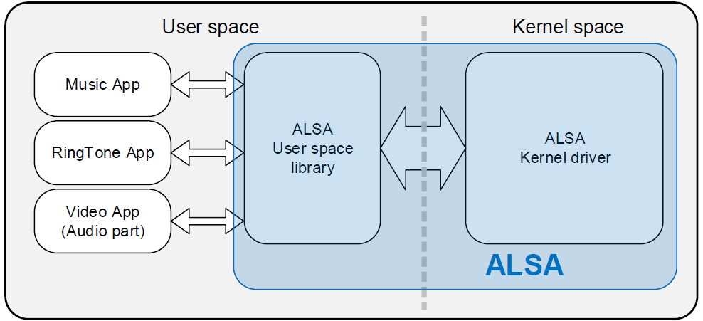

 - ALSA Kernel Driver
   * ALSA Kernel Driver는 User space의 System call(open, ioctl, write, read, close)에 대응
   * ALSA Kernel Driver는 User space의 Sound Card Device Drier의 인터페이스를 담당하고 Audio Buffer 및 Signal을 관리 및 운용
  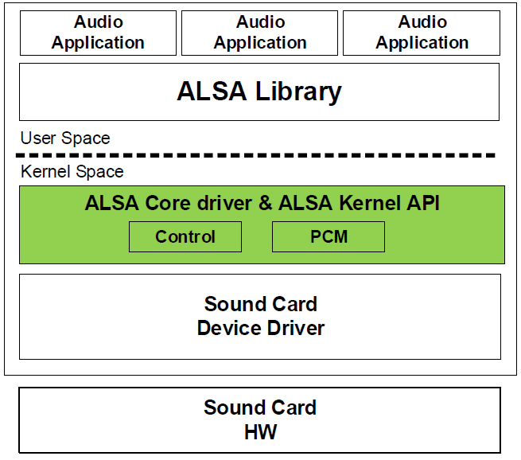

  - ALSA Library
   * Application에게 공통된 API를 제공하여 ALSA Kernel Driver를 사용 할 수 있도록 합니다.
   * ALSA Library가 /dev/snd/* 경로의 device file을 제어함으로써 Application에서 직접 device file을 제어할 필요가 없습니다.
  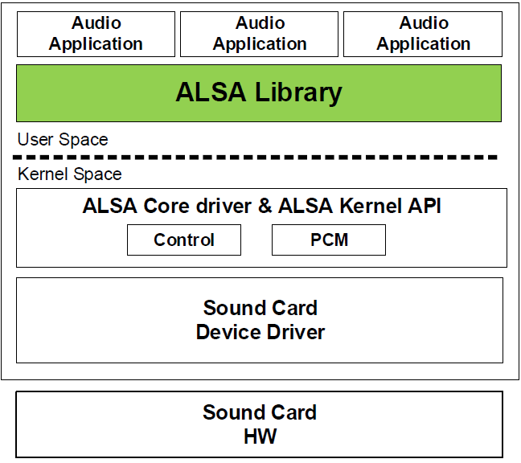


<hr/>

## ALSA directory Architecture

```bash
/kernel/sound$ tree -L 1 -d
.
├── aoa
├── arm
├── atmel
├── core
├── drivers
├── firewire
├── i2c
├── isa
├── mips
├── oss
├── parisc
├── pci
├── pcmcia
├── ppc
├── sh
├── soc
├── sparc
├── spi
├── synth
└── usb

20 directories
```
 1) arm, ppc, sparc 
 	: 각 아키텍처에 specific 한 top-level card 모듈
 2) core  
 	- core/oss : pcm 과 mixer oss 에뮬레이션 코드가 저장되어 있음.
	- core/seq : ALSA sequencer를 위한 서브 디렉토리. sequencer core & primary sequencer 모듈. CONFIG_SND_SEQUENCER가 kernel config에 설정되어 있을때만 컴파일 됨.
	- core/seq/oss : OSS sequencer 에뮬레이션 코드
 3) include 
 	: ALSA 드라이버의 공용 헤더파일들을 위한 디렉토리
 4) drivers 
 	: 서로 다른 아키텍쳐상의 서로 다른 드라이버들 중 공유 코드. ex) pcm driver, serial midi driver
 5) i2c
 	: alsa i2c 컴포넌트 포함.
	: linux상의 표준 i2c가 존재하지만 ALSA는 sound 카드를 위한 전용 i2c를 사용.
 6) oss
 	: oss/lite는 linux 2.6 tree에 여기에 저장됨.
 7) pci
 	: pci 사운드 카드를 사용한 top-level card module과 pci 버스에 특화된 코드.
 8) pcmcia
 	: pcmcia, 특히 pccard 드라이버는 이 디렉토리에 위치함.
 9) synth 
 	: the synth 미드레벨 모듈 포함하고 있음.
 10) soc
 	: embedded system을 위한 driver
 11) usb 
 	: usb-audio driver를 포함.

<hr/>

## ASoC 는 기본적으로 4가지의 driver로 구성됩니다.

 - codec driver : Audio Codec 내 Control을 제어한다.   
	: DAC 또는 AMP를 device에 붙이게 된다면 vendor사에서 기본적으로 제공하는 driver입니다. 또한 sound/soc/codecs directory에도 있으니 참조하면 됩니다.  
	: 말 그대로 codec의 특성 및 운영 방법에 대한 명세입니다. (regmap을 사용합니다.)  
	: Codec DAI 를 설정합니다.  
	: mixer와 오디오를 컨트롤합니다.(Documentation/sound/alsa/soc/codec.txt 73Line)   
	: ex) sound/soc/codecs/ak7755.c  
	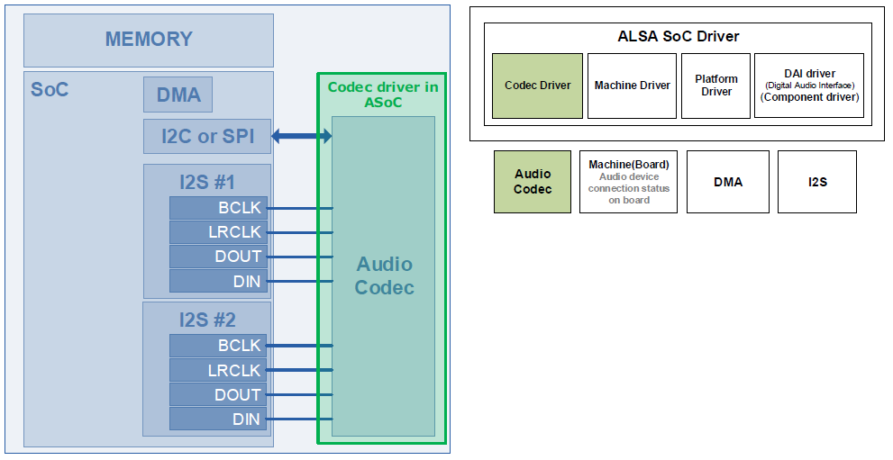

 - platform driver : SoC 내 DMA 및 DAI를 제어  
	: stream 제어와 관련된 사항들을 설정하는 부분입니다. raw data, pcm이나 compress data(mp3등)을 출력하기 위해서는 buffer를 control해주어야 하는데, 이와 관련된 부분이 platform driver입니다.  
	: platform driver 는 audio DMA drivers, SoC DAI drivers, DSP drivers 로 나눌수 있습니다. (Documentation/sound/alsa/soc/platform.txt)  
	  

 - machine driver : embedded board의 audio 관련 device의 연결상태를 선언 및 제어합니다.(sound card등록)  
	: sound card를 등록하고 dai(digital audio interface)-i2s 및 codec device 관계를 설정.  
	: 즉, ASoC machine driver는 모든 구성 요소 driver(e.g. codecs driver, platform driver, component driver)를 하나로 묶는 코드입니다.  
	: 기존에 machine driver를 참고하여 개발하거나 기존 reference code를 참고하여 개발하면 됨.  
	: ex) sound/soc/tcc/tcc_board_ak7755.c  
	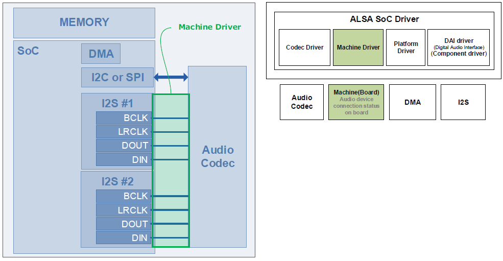  

 - component driver : i2s ip block 및 audio codec내 audio interface(i2s, pcm, pdm 등)을 제어합니다.  
	: i2s ip block 및 audio codec 내 audio interface 관계와 관련있습니다.   
	: machine driver에서 dai의 detail이 더해졌다고 생각하면 됩니다.  
	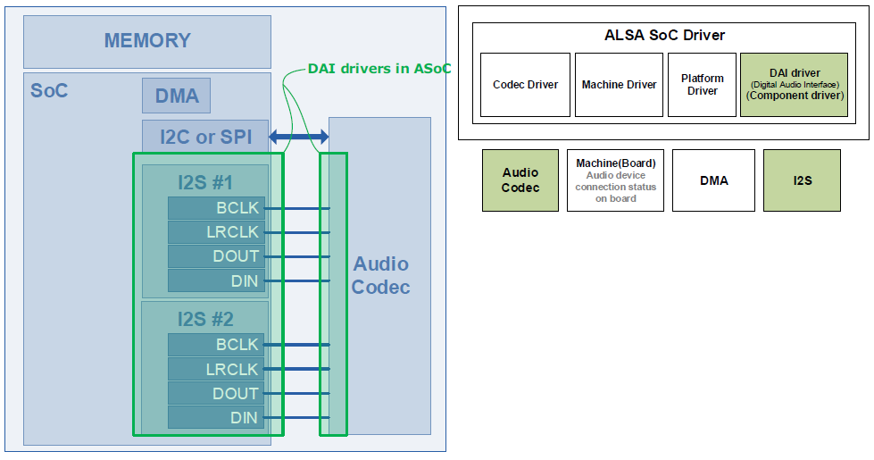  


> A. ALSA 는 X86의 Sound Card를 위해 만들어 졌습니다.
> B. Embedded processor 용에 대응하기 위하여 ALSA System On Chip(SoC) Layer가 존재.
> C. ASoC는 다음 목표로 설계 되었다.
>
>    1) Audio Codec Driver 독립적 및 재사용 가능 하도록 설계
>    2) Audio Codec 과 I2S 및 PCM Audio interfac의 연결을 쉽도록 설계
>    3) Dynamic Audio Power Management(DAPM) 설계 (Audio Codec 내 Power Block 자동 제어 알고리즘)
>    4) Pop 및 Click 잡음 감소 (Audio Codec의 Power를 up/down 하면서 생겨나는 잡음을 줄임)
>    5) Board 특정 컨트롤을 위해 설계. 예를들면 스피커 앰프를 위한 소리 제어
>       (ASoC의 도움 없다면 Audio Function과 별개로 GPIO 제어로 스피커 앰프를 ON/OFF 시켜야 한다)
>
<hr/>

## ALSA Operation Diagram
 - 초록색 Diagram은 PC에서 sound를 출력하는 형태.
 - 붉은색 Diagram은 embedded system에서 sound를 출력하는 형태.
 - 파란색 Diagram은 Android platform에서 sound를 출력하는 형태.
	 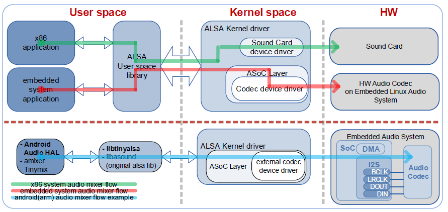

<hr/>

# ALSA audio system

## 1. Overview
 사용 버전 : 
 - kernel : 3.18.24
 - SoC : Telechips series
 - CODEC : cx20703, ak7755
 - userspace : tinyalsa
	
 Linux ALSA audio system Architecture 는 아래와 같습니다. 

```bash
            +--------+  +--------+  +--------+
            |tinyplay|  |tinycap |  |tinymix |
            +--------+  +--------+  +--------+
                 |           ^           ^
                 V           |           V
            +--------------------------------+
            |        ALSA Library API        |
            |      (tinyalsa, alsa-lib)      |
            +--------------------------------+
user space                   ^
-----------------------------|--------------------
kernel space 
            +--------------------------------+
            |             ALSA CORE          |
            | +-------+ +-------+ +-----+    |
            | |  PCM  | |CONTROL| | MIDI|....|
            | +-------+ +-------+ +-----+    |
            +--------------------------------+
                             |
            +--------------------------------+
            |            ASoC CORE           |
            +--------------------------------+
                             |
            +--------------------------------+
            |          hardware driver       |
            | +-------+ +--------+ +-----+   |
            | |Machine| |Platform| |Codec|   |
            | +-------+ +--------+ +-----+   |
            +--------------------------------+
```

 - Native ALSA Application : tinyplay/tinycap/tinymix, 사용자 프로그램은 alsa user space library interface를 직접 호출하여 playback, recording 및 control를 실현합니다.
 - ALSA library API: alsa userspace library interface, 일반적으로 tinyalsa, alsa-lib
 - ALSA CORE: alsa core layer, logical device(PCM/CTL/MIDI/TIMER/...) 시스템 호출을 상위레이어에게 제공하고 lower layer인 hardware device를 구동(Machine/I2S/DMA/CODEC)
 - ASoC CORE: asoc은 모바일 기기에 적용되는 임베디드 시스템과 오디오 코덱을 더 잘 지원하기 위해 표준 alsa 코어를 기반으로 하는 소프트웨어 시스템입니다.
 - Hardware Driver : machine, platform, codec의 세 부분으로 구성된 오디오 하드웨어 장치 드라이버

### ALSA / ASoC 간 Hardware device 관계

```bash
+--------------------------------------+
|                Machine               |
| +-------------+       +------------+ |
| |   platform  |       |   Codec    | |
| |             |  I2S  |            | |
| |      cpu_dai|<----->|codec_dai   | |
| |             |       |            | |
| +-------------+       +------------+ |
+--------------------------------------+
```
 - *platform* : exynox, omap, qcom 등과 같은 특정 SoC  platform의 audio module을 의미 합니다. platform은 2가지 부분으로 나눌 수 있습니다.
   + *cpu dai* : embedded system에서 일반적으로 i2s tx fifo에서 codec 장치로 audio data를 전송하는 역할을 하는 SoC의 I2S 및 PCM bus controller를 나타냅니다. cpu_dai는 snd_soc_register_dai()로 등록됩니다.
	   Note : DAI는 Digital Audio Interface의 약자로 I2S/PCM bus를 통해 연결되는 cpu_dai와 codec_dai로 구분되며, AIF는 Audio Interface 의 약자로 일반적으로 임베디드 시스템에서 I2S와 PCM Interface를 의미 합니다.
   + *pcm dma* : dma buffer의 audio data를 I2S tx FIFO로 이동하는 역할을 담당합니다. modem 자체가 이미 FIFO에 데이터를 전송한 다음 데이터 수신을 위해 codec_dai를 시작하기 때문에 모뎀과 코덱 간의 직접 연결과 같은 일부 경우에는 dma 작업이 필요하지 않습니다. 이 경우, machine driver인 dai_link .platform_name = "snd-soc-dummy"를 설정해야 합니다. 이것은 가상 dma driver입니다. 구현에 대해서는 sound/soc/soc-utils.c 를 참조하십시오.  오디오 dma 드라이버는 snd_soc_register_platform()을 통해서 등록되므로 platform은 일반적으로 audio dma driver를 참조하는 데에도 사용됩낟. (여기서 플랫폼은 SoC 플랫폼과 구별되어야 함.)
 - *codec* : playback을 위해 userspace에서 보내는 audio data는 샘플링되고 양자화된 digital 신호이며, 코덱의 DAC에 의해 아날로그 신호로 변환된 다음 AMP나 헤드폰으로 출력되어 소리를 들을 수 있습니다. codec은 말 그대로 codec을 의미하지만 칩에 많은 기능 구성 요소가 있으며 일반적인 것은 AIF, DAC, ADC, mixer, PGA, Line input, Line output이며 일부 고급 codec 칩에는 EQ, DSP, SRC 기능도 있습니다. 
 - *machine* : dai_link를 설정하여 cpu_dai, codec_dai, modem_dai의 audio interface를 audio link로 연결한 후, snd_soc-card를 등록합니다. 위의 두 가지와 달리 Platform 및 CODEC 드라이버는 일반적으로 재사용이 가능한 반면 Machine 은 고유한 하드웨어 특성이 있어 재사용이 거의 불가능 합니다. 


위의 설명에서 Playback 동작에 대한 PCM 데이터 흐름은 다음과 같습니다.
```bash
            copy_from_user                 DMA                        I2S                  DAC
+-----------+      |     |-----------+      |     +------------+       |      +------+      |     +-------+
| userspace +------------>DMA buffer +------------>I2S TX FIFO +-------------->CODEC +------------>SPK/HP |
+-----------+            +-----------+            +------------+              +------+            +-------+
```
 *dai_link* : codec, codec_dai, cpu_dai 및 link에서 사용하는 platform을 지정하는 machine driver에 정의된 audio data link.  
     ex) goni_wm8994 platform 의 media link : 아래 4가지의 audio data link는 Multimedia 사운드의 playback 및 recording 에 사용됩니다. 시스템에는 media 및 음성과 같은 여러 audio data link가 있을 수 있으므로 여러 dai_link를 정의할 수 있습니다. 

```
codec="wm8994-codec", 
codec_dai="wm8994-aif1",
cpu_dai="samsung-i2s",
platform="samsung-audio"
```

 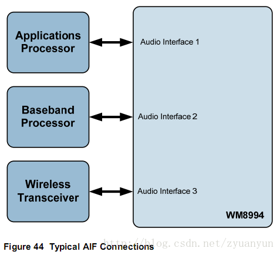


 WM8994의 구조와 같이 AP<->AIF1의 "HIFI"(멀티미디어 음성 링크), BP<->AIF2의 "Voice"(통화음성 링크) 및 BT<->AIF3(Bluetooth SCO)의 3가지 dai_link가 있습니다.

 code 
 ```c
 static struct snd_soc_dai_link goni_dai[] = {
    .name = "WM8994",
	.stream_name = "WM8994 HIFI",
	.cpu_dai_name = "samsung-i2s.0",
	.codec_dai_name = "wm8994-aif1",
	.platform_name = "samsung-audio",
	.codec_name = "wm8994-codec.0-001a",
	.init = goni_wm8994_init,
	.ops = &goni_hifi_ops,
 }, {
    .name = "WM8994 Voice",
	.stream_name = "Voice",
	.cpu_dai_name = "goni-voice-dai",
	.codec_dai_name = "wm8994-aif2",
	.codec_name = "wm8994-codec.0-001a",
	.ops = &goni_voice_ops,
 };
 ```

 *hw constraints* : 지원되는 channel 갯수/샘플링 속도/데이터 형식, DMA에서 지원하는 data period size period 갯수, 등과 같은 플랫폼 자체의 하드웨어 spec을 나타냅니다. 
  snd_pcm_hardware structure :
```c
static const struct snd_pcm_hardware dma_hardware = {
	.info = SNDRV_PCM_INFO_INTERLEAVED |
			SNDRV_PCM_INFO_BLOCK_TRANSFER |
			SNDRV_PCM_INFO_MMAP |
			SNDRV_PCM_INFO_MMAP_VALID |
			SNDRV_PCM_INFO_PAUSE |
			SNDRV_PCM_INFO_RESUME,
	.format = SNDRV_PCM_FMTBIT_S16_LE |
				SNDRV_PCM_FMTBIT_U16_LE |
				SNDRV_PCM_FMTBIT_U8 |
				SNDRV_PCM_FMTBIT_S8,
	.channels_min = 2,
	.channels_max = 2,
	.buffer_bytes_max = 128*1024,
	.period_bytes_min = PAGE_SIZE,
	.period_bytes_max = PAGE_SIZE*2,
	.period_min = 2,
	.period_max = 128,
	.fifo_size = 32,
};
```

 *hw params* : channels, sample rate, pcm format, period size, period count와 같은 사용자 계층에서 설정한 하드웨어 매개변수; 이러한 매개변수는 hw 제약 조건에 의해 제한됩니다.
 *sw params* : start threshold, stop threshold, silence threshold 과 같이 사용자 계층에서 설정한 소프트웨어 매개변수.


## 2. ASoC
ASoC: ALSA System on Chip은 표준 ALSA 드라이버를 기반으로 하며 임베디드 시스템과 모바일 장치에 적용되는 오디오 코덱용 소프트웨어 시스템 세트를 더 잘 지원하기 위해 표준 ALSA 드라이버 프레임워크에 의존합니다. 핵심 문서 Documentation/alsa/soc/overview.txt는 ASoC의 원래 설계 의도에 대해 자세히 설명하며 여기에 인용되지 않고 다음과 같이 간단히 설명됩니다.
 - 독립 코덱 드라이버인 표준 ALSA 드라이버 프레임워크의 코덱 드라이버는 종종 SoC/CPU와 너무 밀접하게 결합되어 다양한 플랫폼/머신에서 이식 및 재사용에 적합하지 않습니다.
 - 코덱이 PCM/I2S 버스를 통해 SoC와 연결하는 것이 편리합니다.
 - 코덱이 항상 가장 낮은 전력 상태에서 작동하도록 하고 오디오 라우팅 생성을 담당하는 동적 오디오 전원 관리 DAPM
 - 적절한 오디오 구성 요소 전원 켜기 시퀀스에 의해 ASoC에서 구현되는 POP 및 클릭 억제 완화
 - 헤드폰 및 마이크의 플러그인 감지 및 외부 증폭기 전환과 같은 기계 구동식 특정 제어

 아래 그림은 goni_wm8994 의 diagram입니다.  
 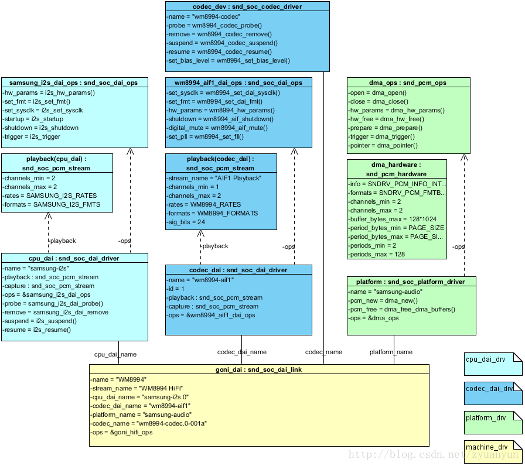

 아래 그림은 ak7755 의 diagram 입니다.
 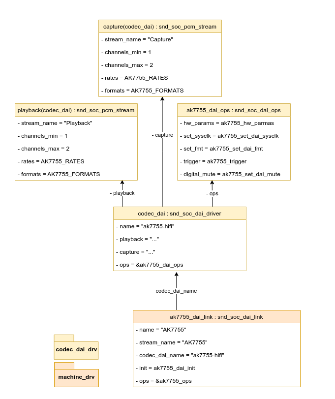

## 3. Codec
 이전 장에서는 기본적으로 커널 문서 Documentation/sound/alsa/soc/codec.txt의 내용을 기반으로 아래에 하나씩 소개되는 codec_drv의 여러 구성 요소에 대해 언급했습니다. 코덱의 역할은 앞에서 설명했지만 이 장에서는 코덱 드라이버에서 중요한 데이터 구조와 등록 프로세스를 주로 나열합니다.

먼저 WM8994를 예로 들어 코덱의 하드웨어 블록 다이어그램을 살펴보겠습니다.

 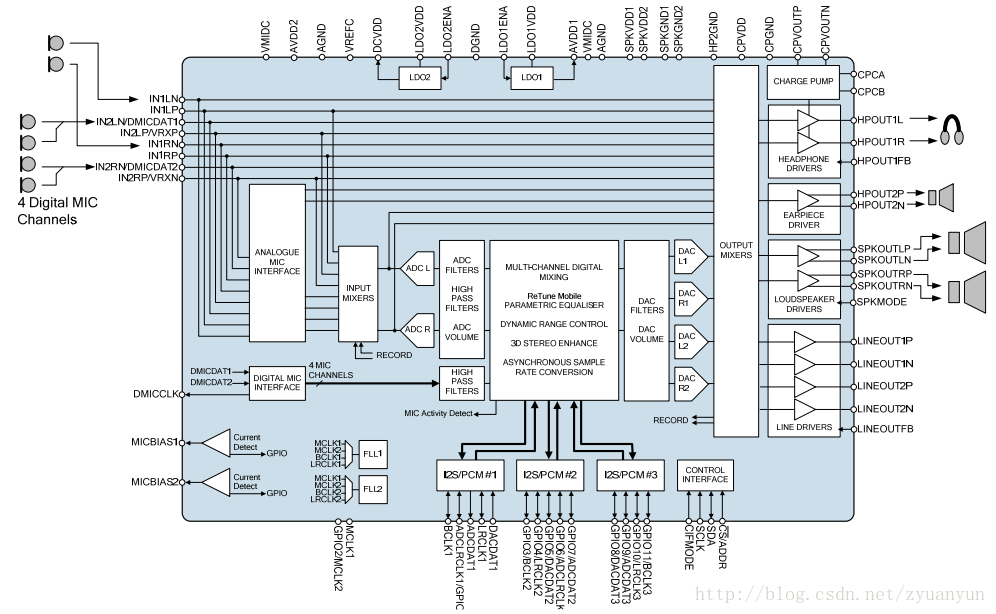

 | **Widget** 	| **Description**                                                                  	|
 |------------	|----------------------------------------------------------------------------------	|
 | ADC        	| 마이크에서 포착한 아날로그 신호를 디지털 신호로 변환                             	|
 | DAC        	| 오디오 인터페이스의 디지털 신호를 아날로그 신호로 변환                           	|
 | AIF        	| 코덱과 다른 장치(예: AP, BB 등) 간의 데이터 전송을 위한 오디오 디지털 인터페이스 	|
 | MIXER      	| 여러 입력 신호를 단일 출력으로 혼합하는 믹서                                     	|
 | DRC        	| 동적 범위 조정                                                                   	|
 | LHPF       	| 고역 및 저역 통과 필터링                                                         	|


### 3.1 Codec DAI and PCM configuration
codec_dai 및 pcm의 구성 정보는 dai의 기능 설명 및 작동 인터페이스를 포함하여 snd_soc_dai_driver 구조로 설명되며 snd_soc_dai_driver는 결국 soc-core에 등록됩니다.

```c
/*
 * Digital Audio Interface Driver.
 *
 * Describes the Digital Audio Interface in terms of its ALSA, DAI and AC97
 * operations and capabilities. Codec and platform drivers will register this
 * structure for every DAI they have.
 *
 * This structure covers the clocking, formating and ALSA operations for each
 * interface.
 */
struct snd_soc_dai_driver {
	/* DAI description */
	const char *name;
	unsigned int id;
	int ac97_control;
	unsigned int base;

	/* DAI driver callbacks */
	int (*probe)(struct snd_soc_dai *dai);
	int (*remove)(struct snd_soc_dai *dai);
	int (*suspend)(struct snd_soc_dai *dai);
	int (*resume)(struct snd_soc_dai *dai);
	/* compress dai */
	bool compress_dai;

	/* ops */
	const struct snd_soc_dai_ops *ops;

	/* DAI capabilities */
	struct snd_soc_pcm_stream capture;
	struct snd_soc_pcm_stream playback;
	unsigned int symmetric_rates:1;
	unsigned int symmetric_channels:1;
	unsigned int symmetric_samplebits:1;

	/* probe ordering - for components with runtime dependencies */
	int probe_order;
	int remove_order;
};
```
 - name : codec_dai의 이름 식별자,  dai_link는 codec_dai_name을 구성하여 해당 codec_dai를 찾습니다.
 - probe : 사운드 카드가 등록될 때 호출되는 codec_dai 의 초기화 함수
 - playback : playback device에서 지원하는 채널 수, sample rate 및 오디오 형식과 같은 재생 기능에 대한 설명
 - capture : 채널 수, sample rate 및 녹음 장치에서 지원하는 오디오 형식과 같은 녹음 기능에 대한 설명
 - ops: codec_dai의 연산 함수 집합 이 함수 집합은 매우 중요하며 dai의 클럭 설정, 포맷 설정, 하드웨어 파라미터 설정에 사용됩니다.

 예를 들어, wm8994에는 3개의 DAI가 있으며 그 중 하나만 여기에 나열되어 있습니다.

```c
static struct snd_soc_dai_driver wm8994_dai[] = {
	{
		.name = "wm8994-aif1",
		.id = 1,
		.playback = {
			.stream_name = "AIF1 Playback",
			.channels_min = 1,
			.channels_max = 2,
			.rates = WM8994_RATES,
			.formats = WM8994_FORMATS,
			.sig_bits = 24,
		},
		.capture = {
			.stream_name = "AIF1 Capture",
			.channels_min = 1,
			.channels_max = 2,
			.rates = WM8994_RATES,
			.formats = WM8994_FORMATS,
			.sig_bits = 24,
		 },
		.ops = &wm8994_aif1_dai_ops,
	},
```

### 3.2 Codec control IO
embedded device의 오디오 코덱의 경우 제어 인터페이스는 일반적으로 I2C 또는 SPI이며 제어 인터페이스는 코덱 레지스터를 읽고 쓰는 데 사용됩니다. 
snd_soc_codec_driver 구조에서 다음 필드는 코덱의 제어 인터페이스를 설명합니다.

```c
/* codec driver */
struct snd_soc_codec_driver {

	/* driver ops */
	int (*probe)(struct snd_soc_codec *);
	int (*remove)(struct snd_soc_codec *);
	int (*suspend)(struct snd_soc_codec *);
	int (*resume)(struct snd_soc_codec *);
	struct snd_soc_component_driver component_driver;

	/* Default control and setup, added after probe() is run */
	const struct snd_kcontrol_new *controls;
	int num_controls;
	const struct snd_soc_dapm_widget *dapm_widgets;
	int num_dapm_widgets;
	const struct snd_soc_dapm_route *dapm_routes;
	int num_dapm_routes;

	/* codec wide operations */
	int (*set_sysclk)(struct snd_soc_codec *codec,
			  int clk_id, int source, unsigned int freq, int dir);
	int (*set_pll)(struct snd_soc_codec *codec, int pll_id, int source,
		unsigned int freq_in, unsigned int freq_out);

	/* codec IO */
	struct regmap *(*get_regmap)(struct device *);
	unsigned int (*read)(struct snd_soc_codec *, unsigned int);
	int (*write)(struct snd_soc_codec *, unsigned int, unsigned int);
	unsigned int reg_cache_size;
	short reg_cache_step;
	short reg_word_size;
	const void *reg_cache_default;

	/* codec bias level */
	int (*set_bias_level)(struct snd_soc_codec *,
			      enum snd_soc_bias_level level);
	bool idle_bias_off;
	bool suspend_bias_off;

	void (*seq_notifier)(struct snd_soc_dapm_context *,
			     enum snd_soc_dapm_type, int);

	bool ignore_pmdown_time;  /* Doesn't benefit from pmdown delay */
};
```
 - read : read register
 - write : write register
 - volatile_register: 지정된 레지스터가 휘발성 속성인지 확인하고, 그렇다면 레지스터를 읽을 때 캐시를 읽지 않고 하드웨어에 직접 액세스합니다.
 - readable_register: 지정된 레지스터를 읽을 수 있는지 여부를 결정합니다.
 - reg_cache_default: 레지스터의 기본값;
 - reg_cache_size: 기본 regiser 값 배열 크기;
 - reg_word_size: register 너비.

 Linux-3.4.5에서는 많은 codec control interface 대신 regmap을 사용합니다. 
 Soc-core는 regmap이 사용되는지 여부를 판단하고 사용하는 경우, regmap 인터페이스를 호출합니다. 

 regmap을 사용하여 제어 인터페이스를 추상화합니다. 
 codec_drv는 현재 제어 모드가 무엇인지 신경 쓸 필요가 없습니다. 
 regmap 온라인 디버깅 디렉토리는 /sys/kernel/debug/regmap입니다.
 wm8994의 regmap 설명은 driver/mfd/wm8994-regmap.c를 참조하십시오.


3.3 Mixers and audio controls
Audio Control은 주로 component switch 및 volume settings에 사용됩니다.
Audio Control은 single-type controls과 같은 soc.h의 macro로 정의할 수 있습니다.

```c
#define SOC_SINGLE(xname, reg, shift, max, invert) \
{	.iface = SNDRV_CTL_ELEM_IFACE_MIXER, .name = xname, \
	.info = snd_soc_info_volsw, .get = snd_soc_get_volsw,\
	.put = snd_soc_put_volsw, \
	.private_value = SOC_SINGLE_VALUE(reg, shift, max, invert, 0) }
```

 위 type의 제어는 하나의 레지스터 주소의 범위에 해당되며 component switch에 사용됩니다. 

 - xname: control 이름의 식별자.
 - reg: 컨트롤에 해당하는 레지스터 주소;
 - shift: 레지스터에 있는 제어 제어 비트의 오프셋.
 - max: 제어 설정 값 범위;
 - invert: 설정된 값을 반전할지 여부.

 Audio Control의 실제 구조는 snd_kcontrol_new  입니다.

```c
struct snd_kcontrol_new {
	snd_ctl_elem_iface_t iface;	/* interface identifier */
	unsigned int device;		/* device/client number */
	unsigned int subdevice;		/* subdevice (substream) number */
	const unsigned char *name;	/* ASCII name of item */
	unsigned int index;		/* index of item */
	unsigned int access;		/* access rights */
	unsigned int count;		/* count of same elements */
	snd_kcontrol_info_t *info;
	snd_kcontrol_get_t *get;
	snd_kcontrol_put_t *put;
	union {
		snd_kcontrol_tlv_rw_t *c;
		const unsigned int *p;
	} tlv;
	unsigned long private_value;
};
```

Codec이 초기화되면 정의된 Audio Control은 snd_soc_add_codec_controls()를 통해 alsa-core에 등록되며,
upper layer은 tinymix 및 alsa_amixer와 같은 도구를 통하여 이러한 control의 설정을 확인하고 수정할 수 있습니다.

## 3.4 Codec audio operations
 Codec Audio Control interface는 snd_soc_dai_ops 구조로 설명됩니다.

```c
struct snd_soc_dai_ops {
	/*
	 * DAI clocking configuration, all optional.
	 * Called by soc_card drivers, normally in their hw_params.
	 */
	int (*set_sysclk)(struct snd_soc_dai *dai,
		int clk_id, unsigned int freq, int dir);
	int (*set_pll)(struct snd_soc_dai *dai, int pll_id, int source,
		unsigned int freq_in, unsigned int freq_out);
	int (*set_clkdiv)(struct snd_soc_dai *dai, int div_id, int div);
	int (*set_bclk_ratio)(struct snd_soc_dai *dai, unsigned int ratio);

	/*
	 * DAI format configuration
	 * Called by soc_card drivers, normally in their hw_params.
	 */
	int (*set_fmt)(struct snd_soc_dai *dai, unsigned int fmt);
	int (*xlate_tdm_slot_mask)(unsigned int slots,
		unsigned int *tx_mask, unsigned int *rx_mask);
	int (*set_tdm_slot)(struct snd_soc_dai *dai,
		unsigned int tx_mask, unsigned int rx_mask,
		int slots, int slot_width);
	int (*set_channel_map)(struct snd_soc_dai *dai,
		unsigned int tx_num, unsigned int *tx_slot,
		unsigned int rx_num, unsigned int *rx_slot);
	int (*set_tristate)(struct snd_soc_dai *dai, int tristate);

	/*
	 * DAI digital mute - optional.
	 * Called by soc-core to minimise any pops.
	 */
	int (*digital_mute)(struct snd_soc_dai *dai, int mute);
	int (*mute_stream)(struct snd_soc_dai *dai, int mute, int stream);

	/*
	 * ALSA PCM audio operations - all optional.
	 * Called by soc-core during audio PCM operations.
	 */
	int (*startup)(struct snd_pcm_substream *,
		struct snd_soc_dai *);
	void (*shutdown)(struct snd_pcm_substream *,
		struct snd_soc_dai *);
	int (*hw_params)(struct snd_pcm_substream *,
		struct snd_pcm_hw_params *, struct snd_soc_dai *);
	int (*hw_free)(struct snd_pcm_substream *,
		struct snd_soc_dai *);
	int (*prepare)(struct snd_pcm_substream *,
		struct snd_soc_dai *);
	/*
	 * NOTE: Commands passed to the trigger function are not necessarily
	 * compatible with the current state of the dai. For example this
	 * sequence of commands is possible: START STOP STOP.
	 * So do not unconditionally use refcounting functions in the trigger
	 * function, e.g. clk_enable/disable.
	 */
	int (*trigger)(struct snd_pcm_substream *, int,
		struct snd_soc_dai *);
	int (*bespoke_trigger)(struct snd_pcm_substream *, int,
		struct snd_soc_dai *);
	/*
	 * For hardware based FIFO caused delay reporting.
	 * Optional.
	 */
	snd_pcm_sframes_t (*delay)(struct snd_pcm_substream *,
		struct snd_soc_dai *);
};
```

Codec audio operation interface는 5개 parts 로 구분됩니다. 
clock configuration, format configuration, digital mute, PCM audio interface, FIFO delay.
clock configuration과 format configuration interface에 중점되었습니다.

 - set_sysclk : codec_dai system clock 설정. upper layer가 pcm device를 open할 때, Codec의 system clock을 설정하기 위해 인터페이스가 호출 됩니다. 
 - set_pll : codec fll 설정. codec은 MCLK을 input clock으로 사용합니다. 인터페이스는 MCLK를 based로 Codec FLL clock을 생성하기 위해 다시 호출 됩니다. 그런 다음 codec_dai의 sysclk, bclk, lrclk 를 FLL에서 분리할 수 있습니다. (codec이 master라고 가정) 
 - set_fmt : codec_dai format 설정. (Note : soc-dai.h)
   + SND_SOC_DAIFMT_I2S : audio data는 I2S format
   + SND_SOC_DAIFMT_DSP_A : audio data는 PCM format
   + SND_SOC_DAIFMT_CBM_CFM : codec 은 master(BCLK, LRCLK 는 Codec에 의해 제공됩니다.)
   + SND_SOC_DAIFMT_CBS_CFS : codec 은 slave(BCLK LRCLK 는 SoC/CPU에 의해 제공됩니다.)
 - hw_params : codec_dai hardware parameter 설정.  upper layer 에서 설정한 채널 수, sample rate, data foramt에 따라서 codec_dai 관련 레지스터를 구성합니다. 

 위의 인터페이스는 machine driver에서 다시 호출됩니다. 
 machine driver goni_wm8994.c의 goni_hifi_hw_params() 함수를 살펴보겠습니다.
 
```c
static int goni_hifi_hw_params(struct snd_pcm_substream *substream,
		struct snd_pcm_hw_params *params)
{
	struct snd_soc_pcm_runtime *rtd = substream->private_data;
	struct snd_soc_dai *codec_dai = rtd->codec_dai;
	struct snd_soc_dai *cpu_dai = rtd->cpu_dai;
	unsigned int pll_out = 24000000;
	int ret = 0;

	/* set the cpu DAI configuration */
	ret = snd_soc_dai_set_fmt(cpu_dai, SND_SOC_DAIFMT_I2S |
			SND_SOC_DAIFMT_NB_NF | SND_SOC_DAIFMT_CBM_CFM);
	if (ret < 0)
		return ret;

	/* set codec DAI configuration */
	ret = snd_soc_dai_set_fmt(codec_dai, SND_SOC_DAIFMT_I2S |
			SND_SOC_DAIFMT_NB_NF | SND_SOC_DAIFMT_CBM_CFM);
	if (ret < 0)
		return ret;

	/* set the codec FLL */
	ret = snd_soc_dai_set_pll(codec_dai, WM8994_FLL1, 0, pll_out,
			params_rate(params) * 256);
	if (ret < 0)
		return ret;

	/* set the codec system clock */
	ret = snd_soc_dai_set_sysclk(codec_dai, WM8994_SYSCLK_FLL1,
			params_rate(params) * 256, SND_SOC_CLOCK_IN);
	if (ret < 0)
		return ret;

	return 0;
}
```

snd_soc_dai_set_fmt()가 cpu_dai와 codec_dai의 callback 함수 set_fmt()를 호출하며, snd_soc_dai_set_pll()도 유사합니다.
codec의 source clock인 mclk 주파수는 24MHz 입니다. 
 cpu_dai 및 codec_dai format 설정 :   data format은 i2s, codec은 master, bclk 및 lrclk는 코덱에서 제공합니다.
 codec_dai의 FLL1을 설정합니다. clock source는 MCLK, clock source 주파수는 24MHz, target clock 주파수는 256 fs(fs는 샘플링 주파수) 입니다.


dai(codec_dai, cpu_dai)의 clock settings에 대해 주의해야 합니다. 위험하고 복잡합니다. 그리고 잘못된 설정은 많은 문제를 야기 시킵니다. 

ex)
 - system이 무음 : codec system clock, codec_dai bit clock 및 frame clock이 활성화 되어 있는지 확인 하십시오. 
 - 소리가 왜곡됨 : 오디오 데이터의 sampling rate 가 codec_dai frame clock 과 일치하는지 확인 하십시오.
 - 간헐적인 소리 : Codec system clock이 bit clock, frame clock과 일치하는지 확인 하십시오. 이는 sysclk와 BCLK/LRCK가 동일한 clock source로 나누어지지 않기 때문입니다.
——————————————
저작권 진술: 이 기사는 CSDN 블로거 "zyuanyun"의 원본 기사이며 CC 4.0 BY-SA 저작권 계약을 따릅니다. 재인쇄를 위해 원본 소스 링크와 이 진술을 첨부하십시오.
원본 링크: https://blog.csdn.net/zyuanyun/article/details/59170418
