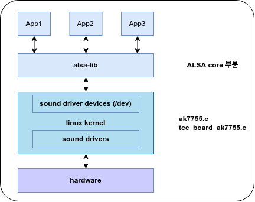
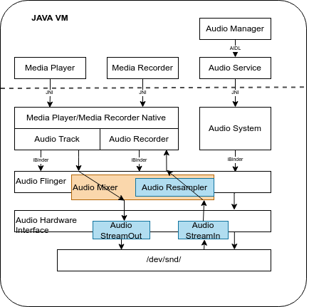

# ANDROID AUDIO
> Android Audio System (Audio Flinger)

## Android Sound System
 사운드 시스템은 시스템에 중요한 역할을 담당하는 드라이버이며, 또한 복잡도가 높은 드라이버 및 구조를 가지고 있습니다.
 복잡함의 가장 큰 원인은 효과적으로 소리를 출력하고, 마이크를 통한 입력, 폰의 경우에는 다양한 출력 형태를 제공해 줘야 하기 때문입니다.

## ALSA (Advanced Linux Sound Architecture)
 ALSA는 여러 응용프로그램부터의 사운드 데이터를 믹싱(mixing) 할 수 있는 인터페이스를 제공하는 구조로 만들어졌습니다. 
 기존 리눅스 시스템 구조에 향상된 오디오 기능을 부여하게 됩니다. 관련 장치 파일들은 /dev/snd에 존재하며 직접 액세스는 하지 않습니다. 
 alsa-lib를 통해서 ALSA의 모든 기능을 이용할 수 있는 구조로 되어 있습니다. 또한 관련 장치에 대한 제어도 이미 준비되어 있는 유틸리티를 이용하는 구조로 되어 있습니다.
 (alsa-utils), amixer(console버전), alsamixer(gui버전)

```bash
/ # ls -alh /dev/snd/
total 0
drwxr-xr-x  2 root   root       120 2014-05-25 17:25 .
drwxr-xr-x 16 root   root      3.3K 2014-05-25 17:25 ..
crw-rw----  1 system audio 116,   0 2014-05-25 17:25 controlC0
crw-rw----  1 system audio 116,  24 2014-05-25 17:25 pcmC0D0c
crw-rw----  1 system audio 116,  16 2014-05-25 17:25 pcmC0D0p
crw-rw----  1 system audio 116,  33 2014-05-25 17:25 timer
```

## ALSA 시스템 구조
 리눅스 커널 소스의 sound/soc/* 에 존재하며, 전체 구조 중 SoC에 해당하는 부분의 architecture부분이 분리되어 있습니다.




## ALSA 시스템의 주요 기능
 - control interface : 가능한 장치들을 체크하고, 사운드 카드의 레지스터를 관리하기 위한 일반적인 목적(general-purpose)을 위한 기능.
 - pcm interface : 일반적인 디지털 오디오 어플리케이션이 이용하는 디지털 오디오 캡쳐와 출력을 위한 인터페이스.
 - raw midi interface : 전자 음악 장비의 표준인 midi(musical instrument digital interface) 지원. api는 사운드 카드의 midi 버스로 접근을 제공. midi 이벤트와 직접 동작하고 프로그래머는 프로토콜과 타이밍에 대한 관리. 
 - time interface : 사운드 이벤트의 동기화에 사용되는 사운드 카드의 하드웨어 타이밍의 접근 제공.
 - sequencer interface : midi 프로그래밍을 위한 고수준 인터페이스로 보다 많은 midi 프로토콜과 타이밍을 관리.
 - mixer interface : 사운드 볼륨의 제어와 입력 시그널의 선택과 사운드 카드의 장비 제어. 컨트롤 인터페이스의 제일 위에 위치.


## ALSA API
 응용 프로그램에서 ALSA는 ALSA lib에서 제공하는 API를 이용하여 접근하도록 기능을 제공하고 있습니다. ALSA 라이브러리 API를 기술한 링크는 다음과 같습니다.
 - http://www.alsa-project.org/alsa-doc/alsa-lib/
 - http://www.alsa-project.org/~tiwai/alsa-driver-api/index.html
 - http://alsa.opensrc.org/index.php/Asynchronous_Playback_(Howto)


<hr/>

## Android Sound Subsystem 구조
 Android sound subsystem의 class구조와 흐름은 다음과 같습니다.




### Android Sound HAL
 Android Sound system은 다른 서브 시스템과 마찬가지 2가지 구조로 이루어져 있습니다.
 1) Audio service : service
 2) Audio user : client 

### Android Audio Service(server 구성)
 audio service를 구성하는 부분은 audioflinger입니다. 이 audio service는 init process가 실행되면서 init.rc의 내용에 따라 mediaserver를 구동시킵니다. 
 mediaserver는 데몬(daemon) 프로세서로 항상 동작대기 상태에 있으며, client의 요청에 따라 특정 동작에 대한 요청을 받아들이고, 
 HAL을 통해서 이를 실행하는 역할을 합니다.

### Android Audio User(client 구성)
 audio client는 JAVA에서의 응용프로그램이 실행되거나 할때 생성됩니다.
 sound play의 경우는 AudioTrack class를 생성해서 audioflinger쪽에 서비스를 요청하게 됩니다. 
 sound record의 경우에는 Audio Record class를 생성해서 audioflinger쪽에 서비스를 요청하게 됩니다.
 실제로 모든 서비스의 실행 및 동작은 서버 쪽에서 이루어집니다.

### Android Sound System 초기화
 Android Sound System의 초기화는 init process가 init.rc의 내용을 실행시킬 때, mediaserver가 실행되고, 
 AudioFlinger가 초기화 되면서 시작됩니다. 
 시스템의 init과정에서 AudioFlinger가 생성이 될때, AudioHardwareInterface가 초기화 됩니다.
 이 AudioHardwareInterface는 Android Audio Device의 Hardware Abstraction Layer라고 얘기 할 수 있습니다.

### 초기화 후, Routing 설정
 AudioFlinger system 초기화 시, 하드웨어 초기화가 끝나면 Audio System의 Routing에 대한 정보를 설정하게 됩니다.
  * 출력 : 스피커 혹은 헤드셋, bluetooth등.
  * 입력 : 마이크 혹은 line-in 등.
 Audio system의 기반이 되는 HAL을 제어하는 AudioFlinger는 다음과 같이 mediaserver daemon이 시작되면서 시작합니다.


```bash

frameworks/av/media/mediaserver/mediaserver.rc
	|
	+-> service media /system/bin/mediaserver
		    class main
		    user media
		    group audio camera inet net_bt net_bt_admin net_bw_acct drmrpc mediadrm
		    ioprio rt 4
		    writepid /dev/cpuset/foreground/tasks /dev/stune/foreground/tasks

```
