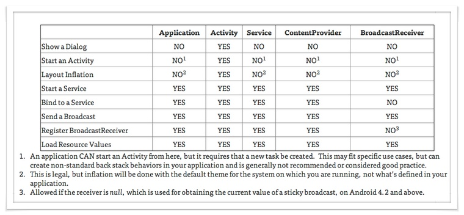

# Android Context
=====

* Context의 정의
> Interface to global information about an application environment.
> This is an abstract class whose implementation is provided by the Android system. 
> It allows access to application-specific resources and classes, as well as up-calls for application-level operations such as launching activities, broadcasting and receiving intents, etc.

- Application 환경에 대한 전역 정보를 접근하기 위한 인터페이스.
- 추상 클래스이며 실제 구현은 Android 시스템에 의해 제공된다.
- Context를 통해 어플리케이션에 특화된 리소스나 클래스에 접근할 수있다.
- Activity 실행, Intent 브로드캐스팅 그리고 Intent 수신등과 같은 응용프로그램 수준의 작업을 수행하기 위한 API를 호출 할 수 있다.

* 어플리케이션에 관하여 시스템이 관리하고 있는 정보에 접근.
- Context 인터페이스가 제공하는 API 중 getPackageName(), getResource() 등의 메서드.

* 안드로이드 시스템에서 제공하는 API 를 호출할 수 있는 기능.
- startActivity(), bindService()와 같음 메서드.

* Context 역활.
 Context는 어플리케이션과 관련된 정보에 접근하고자 하거나 어플리케이션과 연관된 시스템 레벨의 함수를 호출하고자 할 때 사용된다.
 그런데 안드로이드 시스템에서 어플리케이션 정보를 관리하고 있는 것은 시스템이 아닌, ActivityManagerService 라는 일종의 또 다른 어플리케이션이다.
 따라서 일반적인 플랫폼과는 달리, 안드로이드에서 어플리케이션과 관련된 정보에 접근하고자 할 때는 ActivityManagerService를 통해야만 한다. 
 당연히 정보를 얻고자 하는 어플리케이션이 어떤 어플리케이션인지에 관한 키 값도 필요하다.
 즉, 안드로이드 플랫폼 관점에서 Context는 다음과 같은 두 가지 역할을 수행하기 때문에 꼭 필요하다.
  - 자신이 어떤 어플리케이션을 나타내고 있는지 알려주는 ID 역할.
  - ActivityManagerService에 접근할 수 있도록 하는 역할.

* Context 생성.
 Acitivy와 Service가 생성될 때 만들어지는 Context와 BroadcastReceiver가 호출될 때 (onReceive()) 전해지는 Context는 모두 서로다른 인스턴스이다.
 즉, Context는 어플리케이션이 시작될 때는 물론, 어플리케이션 컴포넌트들이 생성될 때 마다 생성된다.
 새롭게 생성되는 Context들은 부모와 완전히 독립되어 있는 존재가 아니고 ‘거의’ 비슷한 내용을 담고 있다.

* Context 종류.
 안드로이드 프레임워크에서 Context는 2가지 종류로 나뉜다
  - Application Context.
  - Activity Context.
  
 안드로이드 프레임워크에서 Context는 Application Context와 Activity Context로 구분지을 수 있는데, Application Context는 application life-cycle에 접목되는 개념이고,
 Activity Context는 activity life-cycle에 접목되는 개념이다. 
 즉, 전자는 하나의 애플리케이션이 실행되어 종료될 때까지 동일한 반면, 
 후자는 액티비티가 onDestroy()된 경우 사라질 수 있는 객체 이다. 
 이를 참고하여 목적에 맞도록 알맞는 context를 참조해야 한다.

* Application Context.
 Application Context는 애플리케이션 자체의 생명 주기(라이프 사이클)에 영향을 받는다.
 따라서 항상 애플리케이션의 생명 주기와 함께한다.

* Activity Context.
 Activity Context는 Activity의 라이프사이클과 함께 작동해 onDestroy()와 함께 사라진다.
 즉, Activity에 대한 환경 정보들이 Context에 있고, 이 Context에 Intent를 통해 다른 액티비티를 띄우면, 액티비티 스택이 쌓이게 된다.

* Context Type.
-----
* Application
 실행중인 어플리케이션 프로세스는 Singletone instances 이다.
 Activity이나 Service에서는 getApplication() 메소드를 통해 getApplicationContext()로 Context를 얻어 올 수 있다.
 프로세스내 동일한 instanees를 받게 된다.

* Activity/Service
 ContextWrapper를 상속받아 구현한 Context이며 메소드로 Context를 얻어 오면 기본 Context로 구성되어 있다.
 프레임워크는 Activity또는 Service가 실행 될때 기본 Context에다 필요한 정보를 warp한다.
 실행시 고유한 Context를 가지게 된다.

* BroadcaseReceiver
 위의 2가지와 다르게 자기자신이 Context자체는 아니다.
 하지만 onRecevie()시 Context를 가져올 수 있는데, 이때의 Context는 ReveiverRestrictedContext이며 두가지 기능 registerReceiver()와 bindService()를 사용 할 수 없다.
 리시버가 브로드캐스트를 처리 할때마다 새로운 Context가 생성 된

* ContextProvider
 브로드캐스트와 마찬가지로 자기자신이 Context를 상속 받은것은 아니다.
 하지만 액세스후 getContext()를 통해 Context를 가져 올 수 있다.
 ContextProvider가 동일한 응용프로그램에 대해 호출시, 동일한 응용프로그램의 Singletone instances를 반환하게 된다.
 하지만 별도의 프로세스에 있는 경우(서로다른 다른 앱), 프로바이더가 실행되는 응용프로그램의 instances가 반환된다.

 

* Context 참조.

* LoginActivity.this
 LoginActivity.this 는 Acitivity를 상속받은 자신의 클래스를 참조하지만 Activity 또한 Context class를 상속받으므로 activity context를 제공하는데 사용될 수 있다.

* getApplication()
 getApplication()은 Application 객체를 참조하지만 Application 클래스는 Context 클래스를 상속받으므로 application context를 제공하는데 사용될 수 있다.

* getApplicationContext()
 getApplicationContext()는 application context를 제공한다.

* getBaseContext()
 getBaseContext()는 activity context를 제공한다.

출처: https://shnoble.tistory.com/57 [노블의 개발이야기]
