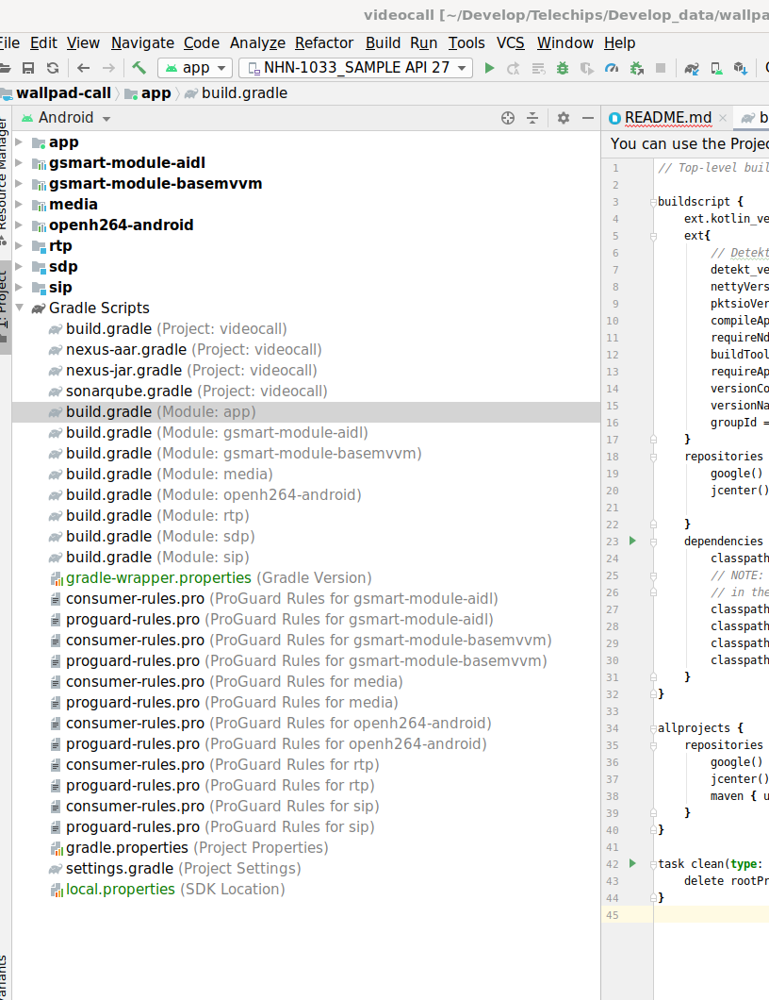

## [Android] Gradle이란? 
=====
 Gradle 이란 빌드 배포 도구(build tool)이다.  
 안드로이드 스튜디오(IDE)와 빌드 시스템이 서로 독립적이기 때문이다.  
 이클리스에서는 프로젝트 빌드를 이클립스 내에서 담당했지만, 안드로이드 스튜디오는 코드의 편집만을 담당할 뿐, 빌드는 Gradle을 통해 모두 수행한다. 
 
  
* 파일 내부의 옵션들의 대해서 정리.   
```
apply plugin: 'com.android.application'

android {
    compileSdkVersion 29
    buildToolsVersion "29.0.2"
    defaultConfig {
        applicationId "com.wallpad.videocall"
        minSdkVersion 24
        targetSdkVersion 29
        versionCode 15
        versionName "1.0"
        testInstrumentationRunner "androidx.test.runner.AndroidJUnitRunner"
        multiDexEnabled true
    }

    signingConfigs {
        debug {
            storeFile file('../gsmart-debug-key.keystore')
            storePassword 'android'
            keyAlias = 'androiddebugkey'
            keyPassword 'android'
        }
    }

    buildTypes {
        release {
            minifyEnabled false
            proguardFiles getDefaultProguardFile('proguard-android-optimize.txt'), 'proguard-rules.pro'
        }
    }
    dataBinding {
        enabled true
    }
    compileOptions {
        sourceCompatibility JavaVersion.VERSION_1_8
        targetCompatibility JavaVersion.VERSION_1_8
    }
    packagingOptions {
        exclude 'META-INF/proguard/androidx-annotations.pro'
        exclude 'META-INF/gradle/incremental.annotation.processors'
        exclude 'META-INF/DEPENDENCIES'
        exclude 'META-INF/LICENSE'
        exclude 'META-INF/LICENSE.txt'
        exclude 'META-INF/license.txt'
        exclude 'META-INF/LICENSE.md'
        exclude 'META-INF/NOTICE.md'
        exclude 'META-INF/NOTICE'
        exclude 'META-INF/LICENSE.md'
        exclude 'META-INF/NOTICE.md'
        exclude 'META-INF/NOTICE.txt'
        exclude 'META-INF/notice.txt'
        exclude 'META-INF/ASL2.0'
    }
}

dependencies {
    implementation fileTree(dir: 'libs', include: ['*.jar'])
    implementation 'androidx.appcompat:appcompat:1.1.0'
    implementation 'androidx.core:core-ktx:1.2.0-rc01'
    implementation 'com.google.android.material:material:1.0.0'
    implementation 'androidx.constraintlayout:constraintlayout:1.1.3'
    testImplementation 'junit:junit:4.12'
    androidTestImplementation 'androidx.test:runner:1.3.0-alpha02'
    androidTestImplementation 'androidx.test.espresso:espresso-core:3.3.0-alpha02'

    implementation 'androidx.multidex:multidex:2.0.1'
    // ViewModel and LiveData
    implementation "android.arch.lifecycle:extensions:1.1.1"
    implementation "androidx.lifecycle:lifecycle-common-java8:2.1.0"
    ////lifecycler aware
    implementation 'androidx.lifecycle:lifecycle-viewmodel:2.1.0'
    implementation 'androidx.recyclerview:recyclerview-selection:1.0.0'

    ///databinding
    implementation 'com.android.databinding:compiler:3.3.1'
    implementation project(path: ':gsmart-module-basemvvm')
    implementation project(path: ':gsmart-module-aidl')
    implementation 'com.google.android.exoplayer:exoplayer-core:2.10.5'
    implementation 'com.google.android.exoplayer:exoplayer-dash:2.10.5'
    implementation 'com.google.android.exoplayer:exoplayer-ui:2.10.5'

    //Room
    def room_version = "2.2.4"
    implementation "androidx.room:room-runtime:$room_version"
    annotationProcessor "androidx.room:room-compiler:$room_version"
    implementation "androidx.room:room-ktx:$room_version"
    implementation "androidx.room:room-rxjava2:$room_version"
    implementation "androidx.room:room-guava:$room_version"

    implementation "androidx.annotation:annotation:1.1.0"
    implementation "io.netty:netty-all:${rootProject.nettyVersion}"
    implementation "io.pkts:pkts-sip:${rootProject.pktsioVersion}"
    implementation 'io.reactivex.rxjava2:rxjava:2.1.1'
    implementation 'io.reactivex.rxjava2:rxandroid:2.1.1'

    implementation project(':sip')
    implementation project(':sdp')
    implementation project(':rtp')
    implementation project(':media')
}

```
