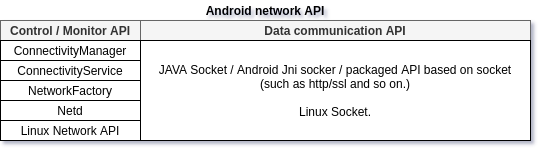
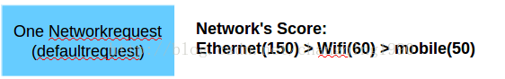
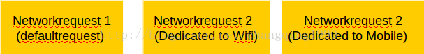

# Android Network.


**Control / Monitor API** : like the control bus of a device. The primary responsibilities of these API :
> 1) Monitor network connections (Wi-Fi, mobile, Ethernet, etc).
> 2) Send broadcast intents when network connectivity changes.
> 3) Attempt to "fail over" to another network when connectivity changes.
> 4) Provide an API that allows applications to query the coarse-grained or fine-grained state of the available network.
> 5) Provide an API that allows applications to request and select networks for their data traffic.
> 6) start/stop the assigned network, etc.


## Android M network's mechanism of connectivity & magagement. 
 Android Multi-network의 connectivity & management를 메커니즘을 알기 위해, 명확해야 할 2가지 중요한 개체인 **Networkrequest**와 **NetworkAgent**가 있다. 

### Networkrequest.
 이름에서 알수 있듯이, 하나 이상의 Network type에 대한 요청이다. 
 예를 들어, Ethernet type의 Network가 필요하면 Ethernet에 대한 Networkrequest를 작성해야 한다. 
 그리고 모든 Type의 Network(Ethernet, Wi-Fi, Mobile)가 필요한 경우, 모든 Network type에 대한 Networkrequest를 작성해야 한다. 

### NetworkAgent.
 이름에서 알수 있듯이, Network의 Agent입니다. Network는 NetworkAgent에 의해 제어 또는 모니터링 된다. 즉, NetworkAgent는 어떤 의미에서 Network를 나타낸다.
 NetworkAgent는 NetworkFactory에서 생성한다. 
 Network Type은 하나의 NetworkFactory만 가질 수 있고, NetworkFactory는 다수의 NetworkAgent를 가질 수 있다. 
 NetworkAgent는 하나의 networkType 이다. 
 예를 들어, NetworkFactory는 물 제공 공장과 같고, NetworkAgent는 각 가정의 수도꼭지와 같다.
 물이 필요하면 물 보충 공장에 가지 않고 수도꼭지를 열어 물을 얻을 수 있다. 

 Network interface는 NetworkAgent에 의해 간접적으로 시작/중지 된다. (NetworkFactory에서 직접)

### Network machanism(The core logic of the network's mechanism)
 위의 2 개체(Networkrequest, NetworkAgent)를 알면 코드 세그먼트를 쉽게 읽을 수 있다. 
 Network mechanism의 핵심 논리이다.

 rematchNetworkAndRequests()라는 함수로, Networkrequest/NetworkAgent가 등록되거나, 해당 Network 상태가 변경 될 때 호출된다. 
 rematchNetworkAndRequests()의 임무는 networkAgentInfo 및 retworkrequest에 대한 match / rematch 이다. 
 NetworkAgentInfo는 networkAgent의 정보이다. 
 ```
    private void rematchNetworkAndRequests(NetworkAgentInfo newNetwork,
            ReapUnvalidatedNetworks reapUnvalidatedNetworks, long now) {
        if (!newNetwork.everConnected) return;
        boolean keep = newNetwork.isVPN();
        boolean isNewDefault = false;
        NetworkAgentInfo oldDefaultNetwork = null;

        final boolean wasBackgroundNetwork = newNetwork.isBackgroundNetwork();
        final int score = newNetwork.getCurrentScore();

        if (VDBG) log("rematching " + newNetwork.name());

        // Find and migrate to this Network any NetworkRequests for
        // which this network is now the best.
        ArrayList<NetworkAgentInfo> affectedNetworks = new ArrayList<NetworkAgentInfo>();
        ArrayList<NetworkRequestInfo> addedRequests = new ArrayList<NetworkRequestInfo>();
        NetworkCapabilities nc = newNetwork.networkCapabilities;
        if (VDBG) log(" network has: " + nc);
        for (NetworkRequestInfo nri : mNetworkRequests.values()) {
            // Process requests in the first pass and listens in the second pass. This allows us to
            // change a network's capabilities depending on which requests it has. This is only
            // correct if the change in capabilities doesn't affect whether the network satisfies
            // requests or not, and doesn't affect the network's score.
            if (nri.request.isListen()) continue;

            final NetworkAgentInfo currentNetwork = getNetworkForRequest(nri.request.requestId);
            final boolean satisfies = newNetwork.satisfies(nri.request);
            if (newNetwork == currentNetwork && satisfies) {
                if (VDBG) {
                    log("Network " + newNetwork.name() + " was already satisfying" +
                            " request " + nri.request.requestId + ". No change.");
                }
                keep = true;
                continue;
            }

            // check if it satisfies the NetworkCapabilities
            if (VDBG) log("  checking if request is satisfied: " + nri.request);
            if (satisfies) {
                // next check if it's better than any current network we're using for
                // this request
                if (VDBG) {
                    log("currentScore = " +
                            (currentNetwork != null ? currentNetwork.getCurrentScore() : 0) +
                            ", newScore = " + score);
                }
                if (currentNetwork == null || currentNetwork.getCurrentScore() < score) {
                    if (VDBG) log("rematch for " + newNetwork.name());
                    if (currentNetwork != null) {
                        if (VDBG) log("   accepting network in place of " + currentNetwork.name());
                        currentNetwork.removeRequest(nri.request.requestId);
                        currentNetwork.lingerRequest(nri.request, now, mLingerDelayMs);
                        affectedNetworks.add(currentNetwork);
                    } else {
                        if (VDBG) log("   accepting network in place of null");
                    }
                    newNetwork.unlingerRequest(nri.request);
                    setNetworkForRequest(nri.request.requestId, newNetwork);
                    if (!newNetwork.addRequest(nri.request)) {
                        Slog.wtf(TAG, "BUG: " + newNetwork.name() + " already has " + nri.request);
                    }
                    addedRequests.add(nri);
                    keep = true;
                    // Tell NetworkFactories about the new score, so they can stop
                    // trying to connect if they know they cannot match it.
                    // TODO - this could get expensive if we have alot of requests for this
                    // network.  Think about if there is a way to reduce this.  Push
                    // netid->request mapping to each factory?
                    sendUpdatedScoreToFactories(nri.request, score);
                    if (isDefaultRequest(nri)) {
                        isNewDefault = true;
                        oldDefaultNetwork = currentNetwork;
                        if (currentNetwork != null) {
                            mLingerMonitor.noteLingerDefaultNetwork(currentNetwork, newNetwork);
                        }
                    }
                }
            } else if (newNetwork.isSatisfyingRequest(nri.request.requestId)) {
                // If "newNetwork" is listed as satisfying "nri" but no longer satisfies "nri",
                // mark it as no longer satisfying "nri".  Because networks are processed by
                // rematchAllNetworksAndRequests() in descending score order, "currentNetwork" will
                // match "newNetwork" before this loop will encounter a "currentNetwork" with higher
                // score than "newNetwork" and where "currentNetwork" no longer satisfies "nri".
                // This means this code doesn't have to handle the case where "currentNetwork" no
                // longer satisfies "nri" when "currentNetwork" does not equal "newNetwork".
                if (DBG) {
                    log("Network " + newNetwork.name() + " stopped satisfying" +
                            " request " + nri.request.requestId);
                }
                newNetwork.removeRequest(nri.request.requestId);
                if (currentNetwork == newNetwork) {
                    clearNetworkForRequest(nri.request.requestId);
                    sendUpdatedScoreToFactories(nri.request, 0);
                } else {
                    Slog.wtf(TAG, "BUG: Removing request " + nri.request.requestId + " from " +
                            newNetwork.name() +
                            " without updating mNetworkForRequestId or factories!");
                }
                // TODO: Technically, sending CALLBACK_LOST here is
                // incorrect if there is a replacement network currently
                // connected that can satisfy nri, which is a request
                // (not a listen). However, the only capability that can both
                // a) be requested and b) change is NET_CAPABILITY_TRUSTED,
                // so this code is only incorrect for a network that loses
                // the TRUSTED capability, which is a rare case.
                callCallbackForRequest(nri, newNetwork, ConnectivityManager.CALLBACK_LOST, 0);
            }
        }
        if (isNewDefault) {
            // Notify system services that this network is up.
            makeDefault(newNetwork);
            // Log 0 -> X and Y -> X default network transitions, where X is the new default.
            logDefaultNetworkEvent(newNetwork, oldDefaultNetwork);
            // Have a new default network, release the transition wakelock in
            scheduleReleaseNetworkTransitionWakelock();
        }

        if (!newNetwork.networkCapabilities.equalRequestableCapabilities(nc)) {
            Slog.wtf(TAG, String.format(
                    "BUG: %s changed requestable capabilities during rematch: %s -> %s",
                    newNetwork.name(), nc, newNetwork.networkCapabilities));
        }
        if (newNetwork.getCurrentScore() != score) {
            Slog.wtf(TAG, String.format(
                    "BUG: %s changed score during rematch: %d -> %d",
                   newNetwork.name(), score, newNetwork.getCurrentScore()));
        }

        // Second pass: process all listens.
        if (wasBackgroundNetwork != newNetwork.isBackgroundNetwork()) {
            // If the network went from background to foreground or vice versa, we need to update
            // its foreground state. It is safe to do this after rematching the requests because
            // NET_CAPABILITY_FOREGROUND does not affect requests, as is not a requestable
            // capability and does not affect the network's score (see the Slog.wtf call above).
            updateCapabilities(score, newNetwork, newNetwork.networkCapabilities);
        } else {
            processListenRequests(newNetwork, false);
        }

        // do this after the default net is switched, but
        // before LegacyTypeTracker sends legacy broadcasts
        for (NetworkRequestInfo nri : addedRequests) notifyNetworkAvailable(newNetwork, nri);

        // Linger any networks that are no longer needed. This should be done after sending the
        // available callback for newNetwork.
        for (NetworkAgentInfo nai : affectedNetworks) {
            updateLingerState(nai, now);
        }
        // Possibly unlinger newNetwork. Unlingering a network does not send any callbacks so it
        // does not need to be done in any particular order.
        updateLingerState(newNetwork, now);

        if (isNewDefault) {
            // Maintain the illusion: since the legacy API only
            // understands one network at a time, we must pretend
            // that the current default network disconnected before
            // the new one connected.
            if (oldDefaultNetwork != null) {
                mLegacyTypeTracker.remove(oldDefaultNetwork.networkInfo.getType(),
                                          oldDefaultNetwork, true);
            }
            mDefaultInetConditionPublished = newNetwork.lastValidated ? 100 : 0;
            mLegacyTypeTracker.add(newNetwork.networkInfo.getType(), newNetwork);
            notifyLockdownVpn(newNetwork);
        }

        if (keep) {
            // Notify battery stats service about this network, both the normal
            // interface and any stacked links.
            // TODO: Avoid redoing this; this must only be done once when a network comes online.
            try {
                final IBatteryStats bs = BatteryStatsService.getService();
                final int type = newNetwork.networkInfo.getType();

                final String baseIface = newNetwork.linkProperties.getInterfaceName();
                bs.noteNetworkInterfaceType(baseIface, type);
                for (LinkProperties stacked : newNetwork.linkProperties.getStackedLinks()) {
                    final String stackedIface = stacked.getInterfaceName();
                    bs.noteNetworkInterfaceType(stackedIface, type);
                    NetworkStatsFactory.noteStackedIface(stackedIface, baseIface);
                }
            } catch (RemoteException ignored) {
            }

            // This has to happen after the notifyNetworkCallbacks as that tickles each
            // ConnectivityManager instance so that legacy requests correctly bind dns
            // requests to this network.  The legacy users are listening for this bcast
            // and will generally do a dns request so they can ensureRouteToHost and if
            // they do that before the callbacks happen they'll use the default network.
            //
            // TODO: Is there still a race here? We send the broadcast
            // after sending the callback, but if the app can receive the
            // broadcast before the callback, it might still break.
            //
            // This *does* introduce a race where if the user uses the new api
            // (notification callbacks) and then uses the old api (getNetworkInfo(type))
            // they may get old info.  Reverse this after the old startUsing api is removed.
            // This is on top of the multiple intent sequencing referenced in the todo above.
            for (int i = 0; i < newNetwork.numNetworkRequests(); i++) {
                NetworkRequest nr = newNetwork.requestAt(i);
                if (nr.legacyType != TYPE_NONE && nr.isRequest()) {
                    // legacy type tracker filters out repeat adds
                    mLegacyTypeTracker.add(nr.legacyType, newNetwork);
                }
            }

            // A VPN generally won't get added to the legacy tracker in the "for (nri)" loop above,
            // because usually there are no NetworkRequests it satisfies (e.g., mDefaultRequest
            // wants the NOT_VPN capability, so it will never be satisfied by a VPN). So, add the
            // newNetwork to the tracker explicitly (it's a no-op if it has already been added).
            if (newNetwork.isVPN()) {
                mLegacyTypeTracker.add(TYPE_VPN, newNetwork);
            }
        }
        if (reapUnvalidatedNetworks == ReapUnvalidatedNetworks.REAP) {
            for (NetworkAgentInfo nai : mNetworkAgentInfos.values()) {
                if (unneeded(nai, UnneededFor.TEARDOWN)) {
                    if (nai.getLingerExpiry() > 0) {
                        // This network has active linger timers and no requests, but is not
                        // lingering. Linger it.
                        //
                        // One way (the only way?) this can happen if this network is unvalidated
                        // and became unneeded due to another network improving its score to the
                        // point where this network will no longer be able to satisfy any requests
                        // even if it validates.
                        updateLingerState(nai, now);
                    } else {
                        if (DBG) log("Reaping " + nai.name());
                        teardownUnneededNetwork(nai);
                    }
                }
            }
        }
    }


 ```
 and,
 ```
    private void evalRequest(NetworkRequestInfo n) {
        if (VDBG) log("evalRequest");
        if (n.requested == false && n.score < mScore &&
                n.request.networkCapabilities.satisfiedByNetworkCapabilities(
                mCapabilityFilter) && acceptRequest(n.request, n.score)) {
            if (VDBG) log("  needNetworkFor");
            needNetworkFor(n.request, n.score);
            n.requested = true;
        } else if (n.requested == true &&
                (n.score > mScore || n.request.networkCapabilities.satisfiedByNetworkCapabilities(
                mCapabilityFilter) == false || acceptRequest(n.request, n.score) == false)) {
            if (VDBG) log("  releaseNetworkFor");
            releaseNetworkFor(n.request);
            n.requested = false;
        } else {
            if (VDBG) log("  done");
        }
    }

 ```


### 결론
하나의 네트워크 요청에 대해, 

 score가 가장 높은 네트워크가 작동하고, 다른 네트워크는 종료 된다. 
 
 - Multi-networkrequest의 경우, 
 > Multi-networkrequest 경우, 모든 네트워크 요청은 일치 할 때 "One Networkrequest" 과 동작은 동일하다. 프레임워크를 수정하여 완료해야 한다.
 


# The process for starting Ethernet.
> networkRequest 으로만 start/stop  한다.
 networkrequest 으로 Ethernet start/stop.
-> [EthernetService.java]: onBootPhase()
[EthernetNetworkFactory.java] 의 start() 함수를 호출한다. 
```
    public void onBootPhase(int phase) {
        if (phase == SystemService.PHASE_SYSTEM_SERVICES_READY) {
            mImpl.start();
        }
    }

```
-> [EthernetNetworkFactory.java]:start()
register()을 호출한다. 

```
    public void start(Context context, Handler handler) {
        mHandler = handler;

        // The services we use.
        IBinder b = ServiceManager.getService(Context.NETWORKMANAGEMENT_SERVICE);
        mNMService = INetworkManagementService.Stub.asInterface(b);
        mEthernetManager = (EthernetManager) context.getSystemService(Context.ETHERNET_SERVICE);

        // Interface match regex.
        mIfaceMatch = context.getResources().getString(
                com.android.internal.R.string.config_ethernet_iface_regex);

        // Create and register our NetworkFactory.
        mFactory = new LocalNetworkFactory(NETWORK_TYPE, context, mHandler.getLooper());
        mFactory.setCapabilityFilter(mNetworkCapabilities);
        mFactory.setScoreFilter(NETWORK_SCORE);
        mFactory.register();

        mContext = context;

        // Start tracking interface change events.
        mInterfaceObserver = new InterfaceObserver();
        try {
            mNMService.registerObserver(mInterfaceObserver);
        } catch (RemoteException e) {
            Log.e(TAG, "Could not register InterfaceObserver " + e);
        }

        // If an Ethernet interface is already connected, start tracking that.
        // Otherwise, the first Ethernet interface to appear will be tracked.
        mHandler.post(() -> trackFirstAvailableInterface());
    }

```
-> [NetworkFactory.java]:register()
NetworkFactory의 register() 호출.
```
    public void register() {
        if (DBG) log("Registering NetworkFactory");
        if (mMessenger == null) {
            mMessenger = new Messenger(this);
            ConnectivityManager.from(mContext).registerNetworkFactory(mMessenger, LOG_TAG);
        }
    }

```

-> [ConnectivityService.java]:registerNetworkFactory()
이 함수는 EVENT_REGISTER_NETWORK_FACTORY 을 호출 하여, handleRegisterNetworkFactory()를 호출한다. 
```
    @Override
    public void registerNetworkFactory(Messenger messenger, String name) {
        enforceConnectivityInternalPermission();
        NetworkFactoryInfo nfi = new NetworkFactoryInfo(name, messenger, new AsyncChannel());
        mHandler.sendMessage(mHandler.obtainMessage(EVENT_REGISTER_NETWORK_FACTORY, nfi));
    }
```


-> [ConnectivityService.java]: registerNetworkFactory()
```
    private void handleRegisterNetworkFactory(NetworkFactoryInfo nfi) {
        if (DBG) log("Got NetworkFactory Messenger for " + nfi.name);
        mNetworkFactoryInfos.put(nfi.messenger, nfi);
        nfi.asyncChannel.connect(mContext, mTrackerHandler, nfi.messenger);
    }
```
 이 함수는 nfi.asyncChannel.connect() 를 호출 하며, CMD_CHANNEL_HALF_CONNECTED 메시지를 보낸다. 
 그리고 handleAsyncChannelHalfConnect()에 의해 CMD_CHANNEL_HALF_CONNECTED 메시지는 수신된다. 

 ```
        private boolean maybeHandleAsyncChannelMessage(Message msg) {
            switch (msg.what) {
                default:
                    return false;
                case AsyncChannel.CMD_CHANNEL_HALF_CONNECTED: {
                    handleAsyncChannelHalfConnect(msg);
                    break;
                }
                case AsyncChannel.CMD_CHANNEL_DISCONNECT: {
                    NetworkAgentInfo nai = mNetworkAgentInfos.get(msg.replyTo);
                    if (nai != null) nai.asyncChannel.disconnect();
                    break;
                }
                case AsyncChannel.CMD_CHANNEL_DISCONNECTED: {
                    handleAsyncChannelDisconnected(msg);
                    break;
                }
            }
            return true;
        }

 ```

-> [ConnectivityService.java]: handleAsyncChannelHalfConnect()
NetworkFactory 에게 CMD_REQUEST_NETWORK 메시지를 전달한다. 
```
    private void handleAsyncChannelHalfConnect(Message msg) {
        AsyncChannel ac = (AsyncChannel) msg.obj;
        if (mNetworkFactoryInfos.containsKey(msg.replyTo)) {
            if (msg.arg1 == AsyncChannel.STATUS_SUCCESSFUL) {
                if (VDBG) log("NetworkFactory connected");
                // A network factory has connected.  Send it all current NetworkRequests.
                for (NetworkRequestInfo nri : mNetworkRequests.values()) {
                    if (nri.request.isListen()) continue;
                    NetworkAgentInfo nai = getNetworkForRequest(nri.request.requestId);
                    ac.sendMessage(android.net.NetworkFactory.CMD_REQUEST_NETWORK,
                            (nai != null ? nai.getCurrentScore() : 0), 0, nri.request);
                }
            } else {
                loge("Error connecting NetworkFactory");
                mNetworkFactoryInfos.remove(msg.obj);
            }
        } else if (mNetworkAgentInfos.containsKey(msg.replyTo)) {
            if (msg.arg1 == AsyncChannel.STATUS_SUCCESSFUL) {
                if (VDBG) log("NetworkAgent connected");
                // A network agent has requested a connection.  Establish the connection.
                mNetworkAgentInfos.get(msg.replyTo).asyncChannel.
                        sendMessage(AsyncChannel.CMD_CHANNEL_FULL_CONNECTION);
            } else {
                loge("Error connecting NetworkAgent");
                NetworkAgentInfo nai = mNetworkAgentInfos.remove(msg.replyTo);
                if (nai != null) {
                    final boolean wasDefault = isDefaultNetwork(nai);
                    synchronized (mNetworkForNetId) {
                        mNetworkForNetId.remove(nai.network.netId);
                        mNetIdInUse.delete(nai.network.netId);
                    }
                    // Just in case.
                    mLegacyTypeTracker.remove(nai, wasDefault);
                }
            }
        }
    }
```

위 함수는 모든 Factories에게 [CMD_REQUEST_NETWORK]를 전달하고, [CMD_REQUEST_NETWORK]는 handleAddRequest()에 의해 처리 된다. 
-> [NetworkFactory.java]:handleAddRequest()
```
    @VisibleForTesting
    protected void handleAddRequest(NetworkRequest request, int score) {
        NetworkRequestInfo n = mNetworkRequests.get(request.requestId);
        if (n == null) {
            if (DBG) log("got request " + request + " with score " + score);
            n = new NetworkRequestInfo(request, score);
            mNetworkRequests.put(n.request.requestId, n);
        } else {
            if (VDBG) log("new score " + score + " for exisiting request " + request);
            n.score = score;
        }
        if (VDBG) log("  my score=" + mScore + ", my filter=" + mCapabilityFilter);

        evalRequest(n);
    }
```

-> [NetworkFactory.java]: evalRequest()
```
    private void evalRequest(NetworkRequestInfo n) {
        if (VDBG) log("evalRequest");
        if (n.requested == false && n.score < mScore &&
                n.request.networkCapabilities.satisfiedByNetworkCapabilities(
                mCapabilityFilter) && acceptRequest(n.request, n.score)) {
            if (VDBG) log("  needNetworkFor");
            needNetworkFor(n.request, n.score);
            n.requested = true;
        } else if (n.requested == true &&
                (n.score > mScore || n.request.networkCapabilities.satisfiedByNetworkCapabilities(
                mCapabilityFilter) == false || acceptRequest(n.request, n.score) == false)) {
            if (VDBG) log("  releaseNetworkFor");
            releaseNetworkFor(n.request);
            n.requested = false;
        } else {
            if (VDBG) log("  done");
        }
    }

```

-> [NetworkFactory.java]:needNetworkFor():
```
    // override to do fancier stuff
    protected void needNetworkFor(NetworkRequest networkRequest, int score) {
        if (++mRefCount == 1) startNetwork();
    }
```

-> [EthernetNetworkFactory.java]:startNetwork():
```
        protected void startNetwork() {
            if (!mNetworkRequested) {
                mNetworkRequested = true;
                maybeStartIpManager();
            }
        }
```

-> [EthernetNetworkFactory.java]:maybeStartIpManager();
```
    public void maybeStartIpManager() {
        if (mNetworkRequested && mIpManager == null && isTrackingInterface()) {
            startIpManager();
        }
    }

``

-> [EthernetNetworkFactory.java]:startIpManager();
Static IP 세팅 시, 네트워크 통신이 되지 않는 문제 발생되어 
아래 코드로 수정. 
[origin code]
```
    public void startIpManager() {
        if (DBG) {
            Log.d(TAG, String.format("starting IpManager(%s): mNetworkInfo=%s", mIface,
                    mNetworkInfo));
        }

        LinkProperties linkProperties;

        IpConfiguration config = mEthernetManager.getConfiguration();

        if (config.getIpAssignment() == IpAssignment.STATIC) {
            if (!setStaticIpAddress(config.getStaticIpConfiguration())) {
                // We've already logged an error.
                return;
            }
            linkProperties = config.getStaticIpConfiguration().toLinkProperties(mIface);
        } else {
            mNetworkInfo.setDetailedState(DetailedState.OBTAINING_IPADDR, null, mHwAddr);
            IpManager.Callback ipmCallback = new IpManager.Callback() {
                @Override
                public void onProvisioningSuccess(LinkProperties newLp) {
                    mHandler.post(() -> onIpLayerStarted(newLp));
                }

                @Override
                public void onProvisioningFailure(LinkProperties newLp) {
                    mHandler.post(() -> onIpLayerStopped(newLp));
                }

                @Override
                public void onLinkPropertiesChange(LinkProperties newLp) {
                    mHandler.post(() -> updateLinkProperties(newLp));
                }
            };

            stopIpManager();
            mIpManager = new IpManager(mContext, mIface, ipmCallback);

            if (config.getProxySettings() == ProxySettings.STATIC ||
                    config.getProxySettings() == ProxySettings.PAC) {
                mIpManager.setHttpProxy(config.getHttpProxy());
            }

            final String tcpBufferSizes = mContext.getResources().getString(
                    com.android.internal.R.string.config_ethernet_tcp_buffers);
            if (!TextUtils.isEmpty(tcpBufferSizes)) {
                mIpManager.setTcpBufferSizes(tcpBufferSizes);
            }

            final ProvisioningConfiguration provisioningConfiguration =
                    mIpManager.buildProvisioningConfiguration()
                            .withProvisioningTimeoutMs(0)
                            .build();
            mIpManager.startProvisioning(provisioningConfiguration);
        }
    }
```
[bugfix code]
```
    public void startIpManager() {
        if (DBG) {
            Log.d(TAG, String.format("starting IpManager(%s): mNetworkInfo=%s", mIface,
                    mNetworkInfo));
        }

        LinkProperties linkProperties;

        IpConfiguration config = mEthernetManager.getConfiguration();

        if (config.getIpAssignment() == IpAssignment.STATIC) {
            if (!setStaticIpAddress(config.getStaticIpConfiguration())) {
                // We've already logged an error.
                return;
            }
            linkProperties = config.getStaticIpConfiguration().toLinkProperties(mIface);

+			if (config.getProxySettings() == ProxySettings.STATIC || 
+					config.getProxySettings() == ProxySettings.PAC)	{
+				// mIpManager.setHttpProxy(config.getHttpProxy());
+				linkProperties.setHttpProxy(config.getHttpProxy());
+			}

+			String tcpBufferSizes = mContext.getResources().getString(
+					com.android.internal.R.string.config_ethernet_tcp_buffers);

+			if (TextUtils.isEmpty(tcpBufferSizes) == false) {
+				linkProperties.setTcpBufferSizes(tcpBufferSizes);
+			}
        } else {
            mNetworkInfo.setDetailedState(DetailedState.OBTAINING_IPADDR, null, mHwAddr);
+		}
		IpManager.Callback ipmCallback = new IpManager.Callback() {
			@Override
			public void onProvisioningSuccess(LinkProperties newLp) {
				mHandler.post(() -> onIpLayerStarted(newLp));
			}

			@Override
			public void onProvisioningFailure(LinkProperties newLp) {
				mHandler.post(() -> onIpLayerStopped(newLp));
			}
			
			@Override
			public void onLinkPropertiesChange(LinkProperties newLp) {
				mHandler.post(() -> updateLinkProperties(newLp));
			}
		};
		
		stopIpManager();
		mIpManager = new IpManager(mContext, mIface, ipmCallback);

		if (config.getProxySettings() == ProxySettings.STATIC ||
				config.getProxySettings() == ProxySettings.PAC) {
			mIpManager.setHttpProxy(config.getHttpProxy());
		}

		final String tcpBufferSizes = mContext.getResources().getString(
				com.android.internal.R.string.config_ethernet_tcp_buffers);
		if (!TextUtils.isEmpty(tcpBufferSizes)) {
			mIpManager.setTcpBufferSizes(tcpBufferSizes);
		}

+		if (config.getIpAssignment() == IpAssignment.STATIC) {
+			mIpManager.startProvisioning(config.getStaticIpConfiguration());
+		} else {
			final ProvisioningConfiguration provisioningConfiguration =
					mIpManager.buildProvisioningConfiguration()
						.withProvisioningTimeoutMs(0)
						.build();
			mIpManager.startProvisioning(provisioningConfiguration);
+		}
	}
```

