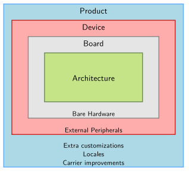
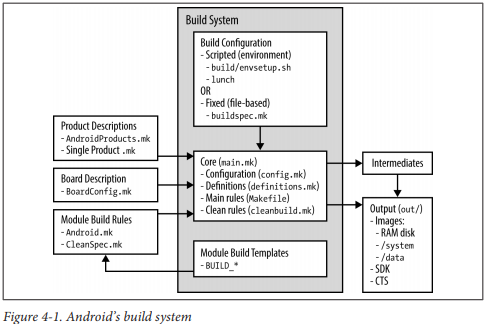

Android source tree
=====
-  **bionic** – bionic libc(BSD의 libc 수정)를 포함  
-  **bootable** - bootloader, recovery mode 관련 코드  
-  **build** - 빌드 관련 스크립트를 저장  
	-  envsetup.sh  
		-  build shell script들이 있음, 툴체인 경로 설정등 환경설정  
	-  generic board에 대한 configuration  
		-  build/target/board/generic/device.mk  
			-  root filesystem의 구성을 어떻게 해야하는가에 대한 방향을 지정하는 파일  
			-  android 최종 결과물 구성시 자동으로 포함하고 싶은 binary들에 대한 install을 결정  
		-  build/target/board/generic/BoardConfig.mk  
			-  Android의 makefile인 Android.mk에 기본적으로 포함되는 최상위 Makefile  
			-  주로 HAL 혹은 기능들에 대한 enable/disable과 관련이 깊음  
			-  Android.mk 파일에 영향을 주고 Android.mk 파일에서 define을 제어할 수 있도록 설정하는 경우가 많음  
			-  ex> BoardConfig.mk의 BOARD_USES_GENERIC_AUDIO := true 의 경우  
				- • frameworks/base/services/audioflinger/Android.mk  
				- • frameworks/base/services/audioflinger/AudioHardwareInterface.cpp  
				- • 파일의 해당 부분을 참조  
-  **CTS** – Compatibility Test Suite관련 소스 디렉토리  
-  **dalvik** - dalvik VM 관련 소스코드  
-  **development** – 개발용 app등…  
-  **device**  
	-  각 vendor에서 만드는 vendor별 device들에 대한 설정파일  
	-  자체 device와 product를 만들기 위해서는 이 디렉토리에서 관련 파일들을 작성하는 것이 좋음  
	-  작성되는 주요 파일 리스트  
		-  AndroidProducts.mk  
			-  Product, device 관련 이름들을 지정  
		-  BoardConfig.mk, device.mk  
			-  generic board에서와 마찬가지 역할을 한다.  
-  **external**  
	-  Android 고유의 library가 아닌 linux 혹은 기존에 작성된 library/binary 소스  
	-  작성된 library 중 shared library(*.so) 파일은 root filesystem의 system/lib 로 install  
	-  작성된 library 중 binary 파일은 root filesystem의 system/bin 으로 install  
	-  framework test app와 library등은 이 디렉토리에서 작업하는게 좋음  
-  **frameworks**  
	-  base/policy  
		-  PhoneWindowManager 소스  
		-  Android 전체 시스템을 background에서 제어하는 최상위 application인 PhoneWindowManager는 다음과 같은 기능을 갖는다  
			-  KeyGuard관련 – LockScreen  
			-  화면 전체 동작 제어(ex> Rotation)  
			-  event 관리 – Key event등  
		-  base – android framework source  
			-  libs/ui  
				-  Android framework에서 JNI를 통해서 호출되는 android client part  
				-  HAL – Input device(key, touch)의 경우  
			-  libs/utils  
				-  Wrapping class, 압축관련 유틸리티 등…  
			-  libs/binder  
				-  Android binder & Anonymous shared memory 제어 클래스  
			-  cmds  
				-  binder관련 binary인 servicemanager 소스와 여러가지 command들  
			-  media  
				-  media관련 JAVA, JNI, Client, Service, Media engine(libstagefright)등의 소스  
				-  media관련은 너무 크고, 독립적이기 때문에 따로 디렉토리를 만들어 관련 소스를 하나의 디렉토리에 넣음  
-  **hardware**  
	-  HAL source & header file – HAL Class의 prototype  
	-  일반적으로 android에서 사용되는 hardware 관련 소스들을 포함, 반드시 이 디렉토리에만 위치하는 것은 아님  
		-  device, vendor 디렉토리에 존재하는 경우가 많음  
	-  libhardware  
		-  board hardware dependency가 높은 하드웨어 모듈들의 example 및 header  
		-  일반적으로 안드로이드 폰에 기본적으로 탑재되지 않고, cpu혹은 제조사의 모듈에 의존성이 높은 부분들에 관련된 class prototype 코드가 있음  
		-  안드로이드 소스 전체를 컴파일 하지 않는 경우도 있고, 모듈단위로 직접 컴파일해서 안드로이드 root filesystem에 install하는 경우도 있음  
		-  Android framework에서 동적으로 module(*.so 파일 형태)을 loading하는 hw_get_module() 함수에 대한 소스가 있음  
			-  hw_get_module()함수는 다음과 같은 순서로 동적 module을 loading한다.  
				- • $(MODULE_NAME).%ro.hardware%.so -> ex> sensors.origen.so  
				- • $(MODULE_NAME).%ro.product.board%.so -> ex> sensors.origenboard.so  
				- • $(MODULE_NAME).%ro.board.platform%.so -> ex> sensors.insignal_origen.so  
				- • $(MODULE_NAME).%ro.arch%.so -> ex> sensors.exynos4.so  
			-  hw_get_module()함수는 rootfs의 system/lib/hw, vendor/lib/hw 디렉토리를 검색  
	-  libhardware_legacy  
		-  일반적으로 android phone에 존재해야 하는 hardware에 대한 제어 코드들이 들어 있음  
		-  Android compile시 같이 컴파일 된다  
		-  ex> wifi/wifi.c  
		-  include/*  
			-  Android built-in HAL의 일부 prototype이 선언되어 있음  
			-  ex> Audio  
-  **packages**  
	-  android 기본 application source  
	-  주의해야할 점은 모든 app가 컴파일 되지 않는다.  
	-  컴파일 되는 패키지들은 각 device별 device.mk에 지정이 되는 PRODUCT_PACKAGES 변수에 포함되어야 함  
	-  ex> build/target/product/generic-no-telephony.mk  
-  **prebuilt**  
	-  toolchain & 필요한 binary  
-  **system**  
	-  android의 root filesystem에 포함되는 기본 binary 소스(ex> init)  
	-  /core/init – android init source  
	-  /vold – vold2, android 2.3 버전서부터 사용됨  
-  **vendor**  
	-  device 디렉토리와 같은 역할  
	-  Android 2.1/2.2 버전에서는 이 디렉토리를 기본 device들에 대한 디렉토리로 사용  
	-  현재(Ice Cream Sandwich)도 이 디렉토리를 사용하는 경우 있음  
-  **out**  
	-  android compile 결과물 디렉토리  
-  **ndk**  
	-  Native Development Kit 관련 파일들이 있음  
	-  docs/ANDROID-MK.html  
		-  Android에서 사용되는 makefile인 Android.mk 파일을 어떻게 작성해야 하는지에 대해서 설명되어 있음  
		-  PDK(Platform Development Kit – Android 소스)에 적용되는 부분에 대한 설명보다는 NDK용 Android.mk 파일에 대한 설명임  
		-  하지만, PDK용 문서로 참고하기 좋음  


-----


AOSP 시스템 설정 값 저장 위치.
=====

* AOSP 시스템 설정 값 위치는 아래 두 위치에 있다.   
[Android Root]에서  
- ./frameworks/base/packages/SettingsProvider/res/values/defaults.xml  
- ./frameworks/base/core/res/res/values/config.xml  
  
보통 장치 제조사의 기본 설정값은 아래의 위치에 있다.  
- ./device/(company name)/(product name)/overlay/frameworks/base/core/res/res/values/config.xml  

빌드 시 위의 파일을 원래 파일에 덮어 쓴다.  


-----
안드로이드의 기본 설정값 및 기본 동작은 아래에서 설명할 파일들을 수정하여 변경 할 수 있다.  
1. 안드로이드 기본 설정값  
```
frameworks/base/packages/SettingsProvider/res/values/defaults.xml
```
> 안드로이드 시스템 설정의 초기값을 정할 수 있다.  이중에는 기기 사용자가 설정에서 변경할 수 없는 것도 있다. 시스템 초기의 WiFi의 On 여부, 기본 값 등.  

2. 안드로이드 시스템 설정  
```
frameworks/base/core/res/res/values/config.xml
```
> 시스템 전반의 동작 유형에 대한 변경을 할 수 있다.  
> MasterVolume, NavigationBar 표시 여부, 전원 버튼 동작 등.  

3. 기본 바탕 화면 이미지를 변경.
```
frameworks/base/core/res/res/drawable-nodpi/default_wallpaper.jpg
```
> 위의 파이를 변경하여 기본 배경 화면 이미지를 변경 할 수 있다.  

4. device 폴더의 overlay 폴더를 이용하여 원본 수정 없이, 각 기기 별 설정을 적용 할 수 있다.  
```
device/<company-name>/<product-name>/overlay/frameworks/base/core/res/res/values/config.xml
```
> overlay 폴더 밑에는 AOSP 프로젝트를 root로 보고, 그 하위에 절대 경로로 폴더 및 파일을 배치하면, 원본을 overlay하게 된다. 이를 이용하여, AOSP 원본을 건드리지 않고도 각 기기에 맞춘 수정이 가능하다.  

5. 또한, vendor 폴더를 이용하여, vendor의 미리 빌드 된 앱, 펌웨어 등을 탑재/이용할 수 있다.   
```
vendor/
```

-----

빌드 설정  
=====

빌드 아키텍쳐  
-----

  

 
> 빌드는 envsetup.sh & lunch 명령의 조합이나 buildspeck.mk 파일을 통해서 최종 빌드 타겟을 설정한다.  
> buildspeck.mk 이용시, build/buildspec.mk.default 를 참조하여 필요한 환경변수를 설정한 뒤, buildspeck.mk를 루트 디렉토리에 저장하면 된다.   
> 아래는 make 명령 시, 설정된 타겟과 관련된 환경변수를 보여준다.  

```
18:56:40 ============================================
18:56:40 PLATFORM_VERSION_CODENAME=REL
18:56:40 PLATFORM_VERSION=8.1.0
18:56:40 TARGET_PRODUCT=full_tcc898x
18:56:40 TARGET_BUILD_VARIANT=eng
18:56:40 TARGET_BUILD_TYPE=release
18:56:40 TARGET_PLATFORM_VERSION=OPM1
18:56:40 TARGET_BUILD_APPS=
18:56:40 TARGET_ARCH=arm
18:56:40 TARGET_ARCH_VARIANT=armv7-a-neon
18:56:40 TARGET_CPU_VARIANT=cortex-a7
18:56:40 TARGET_2ND_ARCH=
18:56:40 TARGET_2ND_ARCH_VARIANT=
18:56:40 TARGET_2ND_CPU_VARIANT=
18:56:40 HOST_ARCH=x86_64
18:56:40 HOST_2ND_ARCH=x86
18:56:40 HOST_OS=linux
18:56:40 HOST_OS_EXTRA=Linux-5.3.0-62-generic-x86_64-with-Ubuntu-16.04-xenial
18:56:40 HOST_CROSS_OS=windows
18:56:40 HOST_CROSS_ARCH=x86
18:56:40 HOST_CROSS_2ND_ARCH=x86_64
18:56:40 HOST_BUILD_TYPE=release
18:56:40 BUILD_ID=OMC1.180417.001
18:56:40 OUT_DIR=out
18:56:40 AUX_OS_VARIANT_LIST=
18:56:40 ============================================
```
  
> 타겟 디바이스 설정은 build/make/target/product/ 과 device/*/*/ 에 존재하는 AndroidProducts.mk 에서 시작한다.   
> lunch에서 표시되는 타겟리스트는 master:/device/*/*/AndroidProducts.mk 에서 COMMON_LUNCH_CHOICES와/device/*/*/vendorsetup.sh 에서 add_lunch_combo()로 추가되는 LUNCH_MENU_CHOICES에 저장된 리스트를 표시한다.   
> add_lunch_combo() 는 /device/*/*/vendorsetup.sh 에서 호출된다.  
> 커널파라미터, 커널로딩 주소, CPU instruction set 등을 결정하는 BoardConfig.mk는 device/*/TARGET_DEVICE/BoardConfig.mk 에 존재한다.  


envsetup.sh
-----
> 소스 검색, 빌드 타겟 확인 등 여러가지 빌드 설정(lunch) 및 빌드 디버깅 기능을 제공한다.   
이 스크립트에서 정의된 명령은 vendorsetup.sh 에서도 사용 할 수 있다.  

* 도움말 :   
```  
$ hmm  
```  

* 파일 검색 명령(AndroidProduct.mk) :  
```
lchy0113@cfc0c6849124:~/Develop/Telechips/NHN-1033_GERRIT$ godir
Usage: godir <regex>
lchy0113@cfc0c6849124:~/Develop/Telechips/NHN-1033_GERRIT$ godir AndroidProducts.mk
Creating index... Done

   [1] ./build/make/target/product
   [2] ./device/asus/fugu
   [3] ./device/generic/arm64
   [4] ./device/generic/armv7-a-neon
   [5] ./device/generic/car
   [6] ./device/generic/mini-emulator-arm64
   [7] ./device/generic/mini-emulator-armv7-a-neon
   [8] ./device/generic/mini-emulator-mips
   [9] ./device/generic/mini-emulator-mips64
  [10] ./device/generic/mini-emulator-x86
  [11] ./device/generic/mini-emulator-x86_64
  [12] ./device/generic/mips
  [13] ./device/generic/mips64
  [14] ./device/generic/qemu
  [15] ./device/generic/uml
  [16] ./device/generic/x86
  [17] ./device/generic/x86_64
  [18] ./device/google/dragon
  [19] ./device/google/marlin
  [20] ./device/google/muskie
  [21] ./device/google/taimen
  [22] ./device/huawei/angler
  [23] ./device/lge/bullhead
  [24] ./device/linaro/hikey
  [25] ./device/sample/products
  [26] ./device/telechips/tcc898x

Select one: 26
lchy0113@cfc0c6849124:~/Develop/Telechips/NHN-1033_GERRIT/device/telechips/tcc898x$ 
```
  
vendorsetup.sh  
-----
> build/envsetup.sh에 의해 실행되며 주요 기능은 add_lunch_combo()를 이용해 envsetup.sh와 lunch에서 사용할 빌드 타겟을 설정한다. 

* envsetup.sh 에서 정의된 모든 함수를 사용할 수 있다.  
* 아래 처럼 호출하면 TARGET_PRODUCT=full_tcc898x, TARGET_BUILD_VARIANT=eng 으로 설정된다.   
* 설치되는 각 모듈은 LOCAL_MODULE_TAGS 변수에 user, debug, eng, tests, optional, samples 중 하나로 설정되며 TARGET_BUILD_VARIANT에 설정된 값에 매치되는 모듈이 빌드 된다.  
```
$ add_lunch_combo full_tcc898x-eng
```

  
AndroidProducts.mk
-----
> 빌드 시스템에 전달할 makefile 리스트인 PRODUCT_MAKEFILES을 설정한다.  
> 이 파일이 적용시 LOCAL_DIR 외 다른 변수는 설정된 것이 없으므로 다른 변수를 이용한 조건문은 불가능하다.  
* 아래는 Telechips 사의 TCC898x 의 설정이다.  

```
PRODUCT_MAKEFILE := \
    $(LOCAL_DIR)/full_tcc898x.mk
```

  
device/company/*/PRODUCT_MAKEFILE 
-----
> AndroidProduct.mk에서 작성한 제품별 빌드파일로 제품이름 인스톨 패키지 등을 설정한다.  

* PRODUCT_PACKAGES:
> 추가할 패키지를 지정한다. 

* DEVICE_PACKAGE_OVERLAYS:
> 기본 패키지 리소스를 기기에 특화된 리소스로 대체한다.

* PRODUCT_COPY_FILES:
> 대상 파일시스템에 복사할 파일을 지정한다.

* PRODUCT_NAME:
> 사용자에게 노출되는 제품 이름.

* PRODUCT_DEVICE:
> 이 변수와 같은 폴더의 BoardConfig.mk를 적용한다.

* PRODUCT_MODEL:
> 사용자에게 노출된 모델 이름.

* vendor prebuilt makefile  추가됨. (아래 강조 참고).

* 나머지 변수의 의미 참고 : [Product Definition Variables](https://source.android.com/setup/develop/new-device#prod-def, "google link")   

```
# Build option for TV device
TV_DEVICE_BUILD := true
CTS_BUILD := false

ifeq ($(TV_DEVICE_BUILD),true)
$(call inherit-product, device/google/atv/products/atv_base.mk)
else
$(call inherit-product, $(SRC_TARGET_DIR)/product/full_base.mk)
endif

ifeq ($(TV_DEVICE_BUILD),true)
TV_DEVICE_CTS_CDD342_PASS_BUILD := false
endif

# How this product is called in the build system
PRODUCT_NAME := full_tcc898x
PRODUCT_DEVICE := tcc898x
PRODUCT_BRAND := Android
PRODUCT_MANUFACTURER := kdiwin 

# Define the name of target board                                                                                                                                                                                 
#TARGET_BOARD_8980_STB := true
TARGET_BOARD_8985_OTT := true
#TARGET_BOARD_8985_STICK := true

ifeq ($(TV_DEVICE_BUILD),true)
#PRODUCT_CHARACTERISTICS := tv,sdcard
PRODUCT_CHARACTERISTICS := tablet,sdcard
else
PRODUCT_CHARACTERISTICS := tablet,sdcard
endif
#PRODUCT_TAGS += nand_v8

# The user-visible product name
ifeq ($(TARGET_BOARD_8980_STB),true)
PRODUCT_MODEL := TCC8980_STB
endif

ifeq ($(TARGET_BOARD_8985_OTT),true)
PRODUCT_MODEL := NHN-1033
endif

ifeq ($(TARGET_BOARD_8985_STICK),true)
PRODUCT_MODEL := TCC8985_STICK
endif
```

build/core/main.mk
-----


