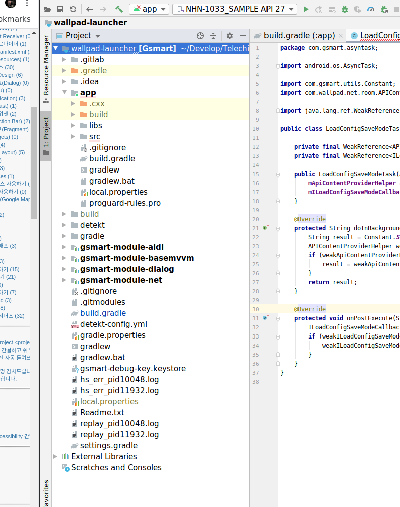
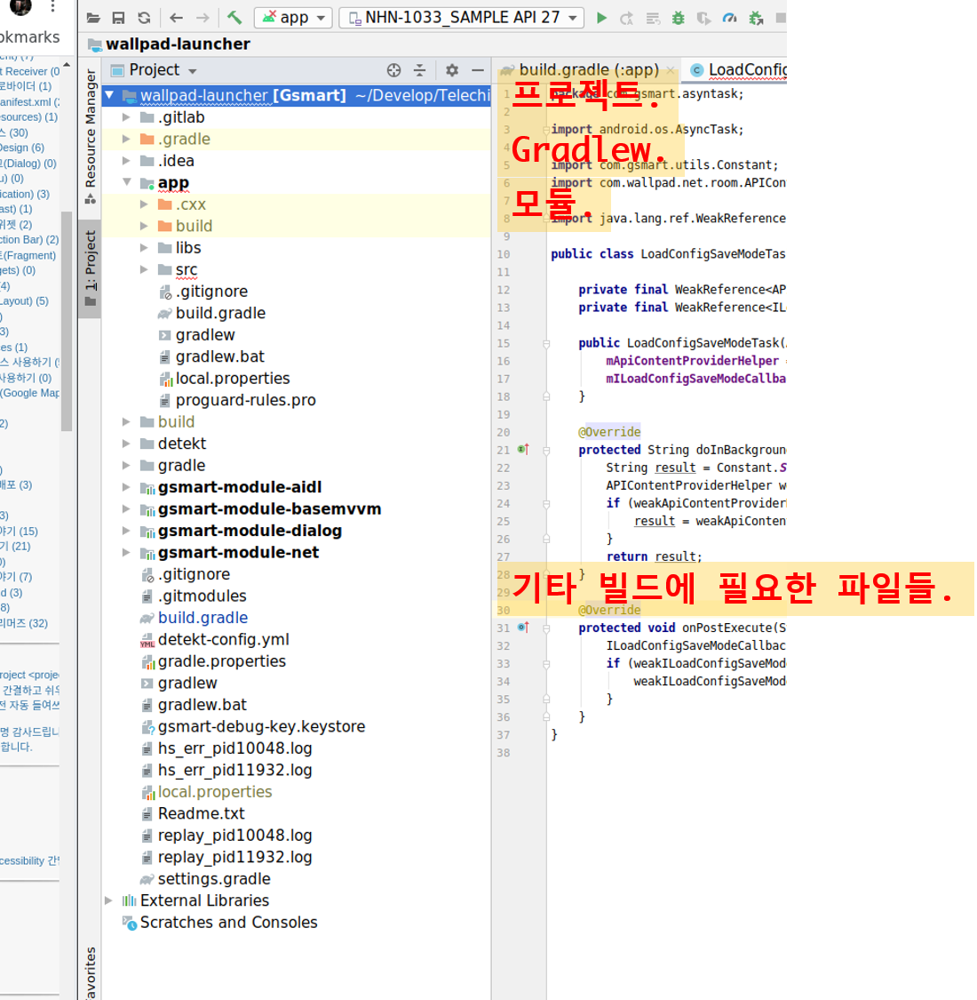
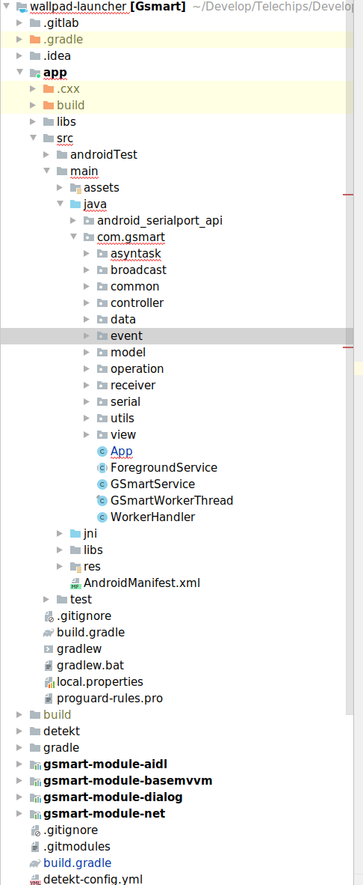
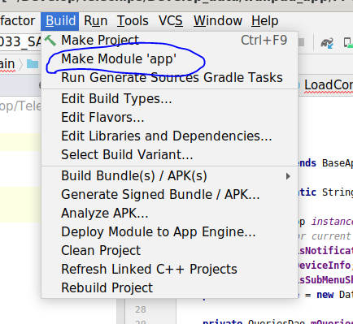

## ANDROID STUDIO  
=====  
  
# 안드로이드 스튜디오의 프로젝트 구조  
-----

  
위의 프로젝트 구성은 크게 아래와 같이 나눌 수 있다.  

프로젝트를 구성하는 각 부분에 대해 조금 더 자세히 알아보자.  

* 프로젝트(project)  
 이클립스에서 애플리케이션이나 라이브러리가 각각 하나의 프로젝트로 구성되어 있던 것과 달리, 안드로이드 스튜디오의 프로젝트는 범위가 더 넓다.  
 따라서, 프로젝트는 "모듈"이라 불리는 작은 프로젝트들로 구성된다.  
 예를 들어, 어떤 프로젝트가 애플리케이션 프로젝트 하나와 안드로이드 라이브러리 프로젝트 하나로 구성되어 있을 경우, 이클립스에서는 이 두개의 프로젝트가 각각 별개의 프로젝트로 존재하는 반면, 안드로이드 스튜디오 에서는 이 두 개의 작은 프로젝트들을 모듈로 구성하여 하나의 프로젝트로 관리 할 수 있다.  

* 모듈(module)  
 모듈은 애플리케이션이나 라이브러리를 구성하는 최소 단위 이다.  
 이클립스의 프로젝트와 동일한 역할을 한다.  
 모듈은 독립적으로 존재할 수 없으며, 항상 프로젝트 내에 포함되어 있어야 한다.  

* Gradle Wrapper  
 빌드에 사용하는 Gradle 툴을 편리하게 사용할 수 있도록 도와주는 일종의 스크립트 이다.  
 Gradle wrapper 는 적절한 Gradle 바이너리를 자동으로 다운로드 해주므로, 별도의  Gradle을 설치하지 않아도 빌드를 진행할 수 있도록 해준다.  

* 기타  
 - build.gradle : 빌드 스크립트이다. 보통 여기에는 프로젝트 내 모듈들의 빌드 진행 시 공통으로 적용해야 하는 설정들을 적어 준다.  
 - FirstAndroidStudio.iml : 안드로이드 스튜디오에서 사용하는 프로젝트 설정 파일 이다.  
 - gradle / gradlew.bat : Gradle wrapper 를 통해 빌드를 진행하기 위한 스크립트 이다.  
 - local.properties : 빌드를 진행할 때 필요한 환경변수 정보를 저장하는 파일 이다. 안드로이드SDK 의 경로가 이 곳에 저장된다.  
 - settings.gradle : 빌드와 관련된 환경설정 및 같이 빌드되어야 할 하위 모듈들의 정보를 포함하고 있다.  

 프로젝트를 구성하는 파일들을 관찰해보면, 이클립스 때 프로젝트 구성에 비해 파일들이 많은 것 같다는 인상을 받으실 겁니다. 이는, 안드로이드 스튜디오(IDE)와 빌드 시스템이 서로 독립적이기 때문이다.  
 이클립스에서는 프로젝트 빌드를 이클립스 내에서 담당했지만, 안드로이드 스튜디오는 코드의 편집만을 담당할 뿐, 빌드는 Gradle을 통해 모두 수행됩니다. 때문에, 간혹 안드로이드 스튜디오의 프로젝트 설정과 Gradle 빌드 설정이 동기화되지 않아 스튜디오에서 에러로 표시하는 경우도 있습니다.  
 하지만, 빌드 절차와 IDE가 분리되어 있기 떄문에 프로젝트를 더 깔끔하게 관리할 수 있게 되었습니다.  
  
 프로젝트 구성에 대해 알아보았으니, 이제는 실질적으로 애플리케이션을 구성하는 모듈의 구조에 대해 자세히 알아볼 차례입니다.   
 모듈은 다음과 같이 구성되어 있습니다.  
  
  
각 부문에 대해 자세히 알아보자.  

* build
 빌드 과정에서 생성된 파일(R.java 등) 및 최종 산출물(*.apk)이 이곳에 저장되니다. 이클립스 기반 프로젝트에서 gen, bin 폴더와 동일한 역할을 한다.  

* src
 소스 및 리소스 파일이 저장됩니다. main 폴더 아래에 자바 소스를 저장하는 java 폴더와 리소스를 저장하는 res 폴더가 있습니다. 이와 함께 애플리케이션의 각종 정보를 저장하는 매니페스트 파일(AndroidManifest.xml)이 있습니다.   
 쓸데없이 main 폴더가 왜 하나 더 있을까 궁금하신 분들도 많을 텐데, 이에 대한 자세한 내용은 추후 다른 포스트에서 다루도록 하겠습니다.   

* build.gradle
 모듈의 빌드 방법이 정의된 빌드스크립트이다. 빌드에 사용할 SDK 버전부터 시작하여 애플리케이션 버전, 사용하는 라이브러리 등 다양한 항목을 설정하는 것이 가능하다.   

# 프로젝트 빌드 및 실행
-----
 안드로이드 스튜디오에서 프로젝트를 빌드하는 것은 이클립스와 다르지 않습니다.  
 메뉴에서 Build > Make Project 를 선택하면 프로젝트에 포함된 모듈들을 빌드하여 APK 파일을 생성해 준다.  
  
* Make Module [모듈명] : 모듈을 빌드하여 해당 모듈의 결과물을 생성한다. 애플리케이션 프로젝트의 경우, APK 파일이 생성된다.  
