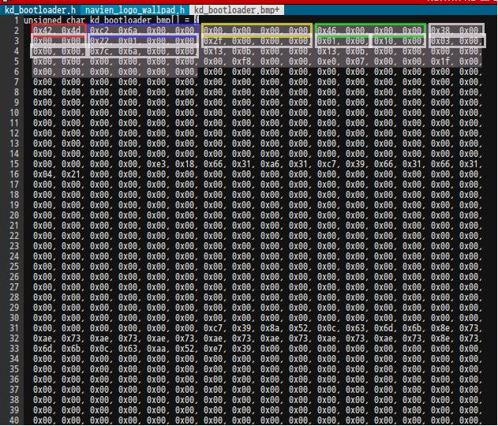

# BMP 
-----

1. bmp file header 부분

| 표시   	| size   	| mean                                                                                                         	|
|--------	|--------	|--------------------------------------------------------------------------------------------------------------	|
| 빨간색 	| 2 Byte 	| 아스키코드로 각각 0x42 = 'B', 0x4D =  'M'을 의미                                                             	|
| 파란색 	| 4 Byte 	| 파일의 전체 크기를 의미(c2 6a 00 00 = 27,330 Byte)                                                           	|
| 노란색 	| 4 Byte 	| 보류(사용안함)                                                                                               	|
| 연두색 	| 4 Byte 	| 픽셀 데이터의 시작 주소를 바이트로 표현 (46 00 00 00 = 70 Byte 는 14 Byte + 56 Byte 이 지나면 픽셀데이터 값) 	|
| 하얀색 	| 4 Byte 	| 38 00 00 00 헤더의 크기(70 Byte)                                                                             	|
| 하얀색 	| 4 Byte 	| 22 01 00 00 가로 사이즈(290 pixel)                                                                           	|
| 하얀색 	| 4 Byte 	| 2f 00 00 00 세로 사이즈(47 pixel)                                                                            	|
| 하얀색 	| 2 Byte 	| 01 00 생략                                                                                                   	|
| 하얀색 	| 2 Byte 	| 10 00 비트수(16 Bit)                                                                                         	|
| 하얀색 	| 4 Byte 	| 03 00 00 00 압축 타입                                                                                        	|
| 하얀색 	| 4 Byte 	| 7c 6a 00 00 27,260(290 x 47 x 2(16bit))                                                                      	|

