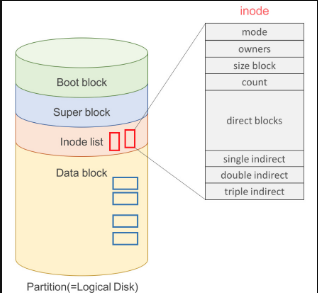

# FREE command

> free 명령어는 리눅스 시스템에서 메모리의 전체적인 현황을 빠르게 살펴보는 명령어. 
> 전체 메모리의 크기, 사용중인 메모리 크기, 공유 메모리, buffer, cache 메모리 및 Swap의 크기 확인 가능

```bash
# free -h
total        used        free      shared     buffers
Mem:             1.8G        1.7G        104M         11M        4.6M
-/+ buffers/cache:           1.7G        109M
Swap:            951M        2.2M        948M
```
  
 - total : 현재 시스템에 설치되어있는 전체 메모리 크기  
 - used : 현재 사용중인 메모리 크기. (total - free - buffer/cache)  
 - free : 시스템에서 사용 가능한 잔여 메모리 크기  
 - shared : 프로세스 사이에서 공유되는 메모리 크기. (주로 프로세스 또는 스레드 간 통신 사용)  
 - buffer/cache : 커널 성능 향상을 위해 캐시 영역으로 사용되는 메모리 크기.   
                 buffer : buffer cache의 크기  
				 cache : page cache + slabs 크기   
  
<br/>
<br/>
<br/>
<hr>
  
## buffer/cache 차이 
   

 유닉스의 파일 시스템은 디렉토리와 내부의 파일을 찾기 쉽도록 유지 및 관리 하는 시스템.   
 다음과 같이 4가지의 블록으로 구성.  

  1. Boot Block  
  부팅에 필요한 정보 저장.
  
  2. Super Block  
  파일시스템에 대한 충체적인 정보 저장.  
  어디서부터 Inode block 인지, data block 인지, 파일 시스템의 크기 등을 저장.  

  3. Inode(index node)list  
  파일 하나당 inode 가 할당, 해당 inode 는 파일의 메타데이터를 가지고 있음.  
  이러한 inode의 묶음으로 보면 됨.  inode는 파일의 정보인 접근 권한, 소유주, 파일 크기, inode 번호 등을 저장하는 부분.  
  
  4. Data Block  
  실제로 데이터의 내용이 저장되는 디스크 영역,   
  각각 데이터 블록은 한번에 하나의 파일만 할당 가능.  

   4가지 블록을 설명한 이유는 buffer와 cache를 분리해서 이애하기 위함.  
   **buffer는 buffer cache로 설명**했으며, **cache 는 page cache + slabs 라고 표현** 했음. 
   그러면 *page cache*, *buffer cache*, *slabs*가 무엇인지 알아보자.  

<br/>
<br/>
<br/>
<hr>

## page cache

 page cache 는 리눅스 커널이 I/O 성능 향상을 위해 사용하는 메모리 영향.  
 느린 디스크 접근의 단점을 보완하기 위해 한번 읽은 파일의 내용을 커널 메모리의 일부인 **page cache** 영역에 저장  
 이후 재 접근이 일어나게 되는 경우, **디스크의 내용을 전달하는 것이 아닌 메모리의 page cache 영역에 저장된 내용을 전달**함으로써 빠른 접근을 간으하게 한다.   
 이를 page라는 단위로 관리하며, page cache라고 부른다.   

 프로세스가 데이터를 파일에 쓰면 커널은 page cache에 데이터를 작성하고, 이때 해당하는 페이지 테이블에 '수정된 것' 이라는 의미로 **dirty flag**를 붙인다.  
 이 flag가 붙은 페이지를 dirty page라고 부른다.  이러한 dirty page 의 내용은 나중에 커널의 백그라운도 처리되며, 스토리지 내의 파일에 반영하고 해당 flag를 지운다.  
  
  page cache사이즈는 시스템의 메모리가 비어있는 상태에서 프로세스가 캐시에 없는 파일을 읽을 때마다 점점 증가한다.  
  이후 시스템 메모리가 부족해지면 dirty page가 아닌 것들 부터 파기시켜, 메모리 확보를 하고, 그래도 부족하면 dirty page 들은 write back 한 뒤 파기시켜 확보한다.  

  - 관련 커널 파라미터
  vm.dirty_writeback_centisecs : dirty page 의 write back이 발생하는 주기를 변경. 
                                 단위는 1/100초로 default는 5초에 1번 write back 한다.   

<br/>
<br/>
<br/>
<hr>

## buffer cache

 buffer cache 도 page cache와 동일하게 리눅스 커널이 I/O 성능 향상을 위하여 사용하는 메모리 영역.  
 page cache는 파일의 내용을 저장했다면 buffer cache는 파일의 내용이 아닌 UFS 기준으로 
 **Super Block과 Inode Block에 해당하는 메타데이터를 저장** 한다.  
 디렉토리를 읽고자 하는 경우에는 디렉토리에 포함된 파일들의 inode block들을 버퍼 캐시에 저장한다.  
 이후 접근 시, buffer cache에 존재하는 값을 가져다 보여준다.  
 실제로 ls 명령어를 입력하면 free 명령어의 buffers 결과가 달라짐을 확인 할 수 있다.  
 
<br/>
<br/>
<br/>
<hr>

## slab 

 커널 역시 프로세스이므로 메모리가 필요하다.  
 즉, **slab 영역이란 디렉토리 구조를 캐시하는 dentry cache와 파일의 정보를 저장하고 있는 inode cache 등 커널이 사용하는 메모리 영역을 말한다.** 
 쉽게 말하면 **커널이 내부적으로 사용하는 캐시** 라고 할수 있다.  

 inode 와 dentry는 파일 자료 구조를 의미한다.  
 VFS(Virtual File System)와 관련된 부분을 공부하다 보면 자주 만나게 되는 dentry는 경로명 탐색을 위한 캐시 역할도 수행한다고 알려져 있음.  

 간단히 이야기 하면 어떠한 파일을 생성할 때, 파일의 정보를 담고 있는 inode와 dentry는 보다 빠른 데이터 접근을 위해서 커널의 slab 자료구조에 추가된다고 이해하면 된다.  

```bash
# cat /proc/meminfo 명령어 입력 시, 아래와 같은 항목을 확인 가능.

# cat /proc/meminfo
Slab:             110864 kB
SReclaimable:      47152 kB
SUnreclaim:        63712 kB
```

 Slab : 커널이 사용하는 메모리의 크기.
 SReclaimable : Slab Recaimable 로, 메모리 부족 시, 프로세스로 할당함으로써 재사용 가능한 slab영역 크기.   
                대부분의 slab 캐싱 영역이 포함.  
 SUnreclaim : Slab Unreclaim 으로 메모리가 부족하여도 재 할당 되지 않는 메모리 크기를 나타냄. 
              커널이 현재 사용중인 영역의 크기, 해제하여 사용할 수 없다.  

  
> slabtop이라는 명령어를 통해 자세히 확인 가능

<br/>
<br/>
<br/>
<hr>

## buffer/cache

 used 에는 buffers, cache(page, slab)이 포함되지 않는다.   
 별개로 표현하는 것처럼 free 에도 포함되지 않는다.  


<br/>
<br/>
<br/>
<br/>
<hr>

# 메모리 비정상적인 사용 발견시 대처

> 메모리 모니터링을 통해 원일 분석.
> 메모리의 비정상적인 상태가 확인되었을 경우, free명령으로는 자세한 내용을 보는데 한계가 있음.  
> 이러한 한계점은 앞서 설명한 파일인 /proc/meminfo 을 통해서 추가로 확인 할수 있다.  

리눅스에서는 */proc/meminfo* 명령을 통해 메모리 현황을 볼수 있다. 

```bash
# cat /proc/meminfo
MemTotal:        1946940 kB
MemFree:          113688 kB
MemAvailable:     946356 kB
Buffers:            4712 kB  // 파일시스템에서 메타 데이터가 저장된 Buffer cache의 크기.  
Cached:           962124 kB  // Page cache 의 크기를 나태남.  
SwapCached:            0 kB  // 메모리 부족으로 인하여 swap이 되었다가 다시 돌아왔을때, swap 영역에서는 해당 공간을 지우지 않는다.  추후에 다시 부족하게 될 경우 I/O 부하를 줄이게 하기 위해서이다.  
Active:           793564 kB  // 비교적 최근에 사용된 영역으로써, Action(file)과 action(anon)을 합친 크기.  
Inactive:         478884 kB  // 비교적 참조/사용이 오래된 영역으로써 Swap 영역으로 이동될 수 있는 메모리 영역.  Inaction(file)과 Inaction(anon)을 합친 크기.  
Active(anon):     326400 kB  // anonymous 의 줄임말으로 page cache를 제외한 비교적 최근에 사용된 프로세스들이 사용하는 메모리 영역.  
Inactive(anon):   112412 kB  // Actin(anon)과 동일하게 프로세스들이 사용되는 역역이지만, 참조가 오래되어 Swap영역으로 이동할 수 있는 메모리 영역. 
Active(file):     467164 kB  // 커널이 I/O 성능 향상을 위해 사용하는 page cache, buffer cache영역의 크기. 이름처럼 최근에 참조되어 swap 영역으로 이동되지 않을 메모리 영역.  
Inactive(file):   366472 kB  // page cache, buffer cache목적으로 사용되는 영역이지만, 참조된지 오래되어 swap 영역으로 이동될수 있는 메모리 영역. 
Unevictable:      130320 kB
Mlocked:          122220 kB
SwapTotal:        973464 kB
SwapFree:         971160 kB
Dirty:                20 kB  // page cache를 통해 저장된 파일 내용을 사용하는 과정에서 쓰기 작업이 이루어질 경우, 디스크에 있는 내용과 page cache에 있는 내용은 서로 다르게 된다.  이때 커널은 달라졌음을 표시하는 dirty bit를 켜고 해당 영역을 dirty page라고 부른다. 이후 '일정 주기, 일정 크기' 단위로 디스크에 동기화를 한다. 이러한 영역의 크기를 말한다.
Writeback:             0 kB
AnonPages:        435984 kB
Mapped:           536344 kB
Shmem:             11748 kB
KReclaimable:      92896 kB
Slab:             110864 kB
SReclaimable:      47152 kB
SUnreclaim:        63712 kB
KernelStack:       14192 kB
PageTables:        31844 kB
NFS_Unstable:          0 kB
Bounce:                0 kB
WritebackTmp:          0 kB
CommitLimit:     1946932 kB
Committed_AS:   25886344 kB
VmallocTotal:   263061440 kB
VmallocUsed:       26276 kB
VmallocChunk:          0 kB
Percpu:             3616 kB
CmaTotal:          65536 kB
CmaAllocated:       1392 kB
CmaReleased:       64144 kB
CmaFree:               0 kB

```


# reference

 site : https://brunch.co.kr/@dreaminz/2

