# GPT(GUID Partition Table) 
=====

GIT 헤더 구조  
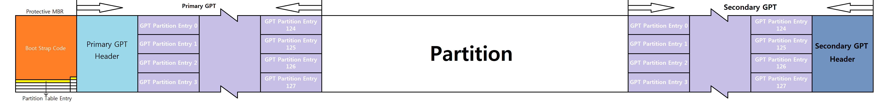

 1. Protective MBR - 0 Sector  
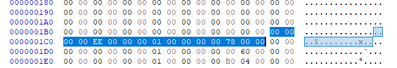  
> 0번 Sector에 위치.  
> EFI를 지원하는 운영체제일 경우에는 해당 위치를 접근하지 않고 EFI를 지원하지 않는 운영체제일 경우에 EFI에서 BIOS 에뮬레이션을 하여 접근하는 부분  
> GPT 파티션 영역의 전체의 시작 주소, 끝 주소를 16 바이트 주 파티션 엔트리 0번에 저장  
> 보는 방법은 MBR과 동일  
 ※ MBR을 사용하는 이유  
> MBR Based Utility에서 잘못 판단하여 오작동을 일으키지 않도록 하기 위해서 사용함. GPT 사용시 MBR의 Partition Type을 0xEE로 전체 GPT Drive를 표시하여 OS에 해당 Drive가 GPT를 사용한다고 알리는데 사용함  
  
 2. Primary GPT Header - 1 Sector
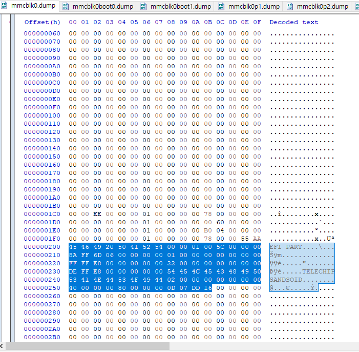
> 1번 Sector에 위치.
> GPT에 대한 전반적인 설정 정보를 기록.
> GPT Header는 보통 92 Byte로 되어 있음. 
> 그 이외에 영역은 NULL 값으로 기록. 

- Signature (8 Byte)
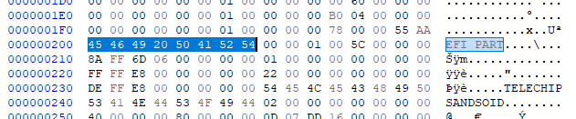
> "EFI PART" 기록.

- Revision (4 Byte)
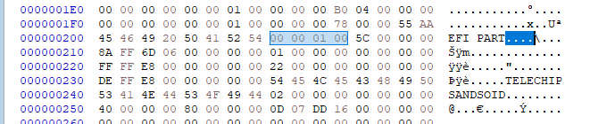
> Version 1.0 을 의미.

- Header Size (4 Byte)
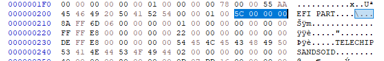
> GPT Header의 사용하는 크기를 의미.
> 보통 92 Byte 를 사용함. 

- CRC32 of Header (4 Byte)
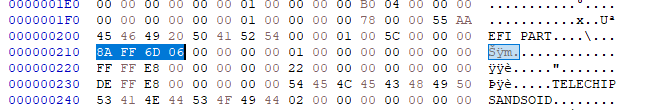
> 무결성을 체크하기 위한 CRC32 값.
> Header의 시작부터 끝나는 위치까지만 체크함.
> GPT Header.

- Reserved (4 Byte)
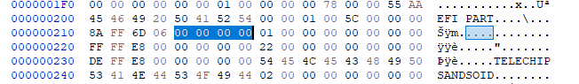
> 예약된 영역으로 사용하지 않음.

- Current LBA (8 Byte)
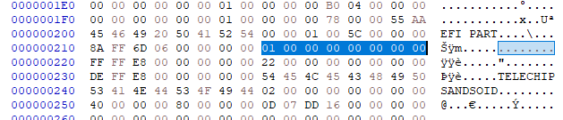
> 현재 LBA 주소.

- Backup LBA (8 Byte)
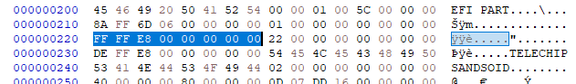
> GPT Header 정보 Backup한 Sector 위치 기록.
> Backup된 GPT Header 의 정보에 Backup LBA는 현재 위치를 기록하고 있음.
 
- First usable LBA for Partition (8 Byte)
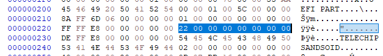
> 파티셔닝 할 수 있는 영역의 시작 위치.
> Primary Partition Table last LBA+1 한 결과 값.

- Last usable LBA (8 Byte)
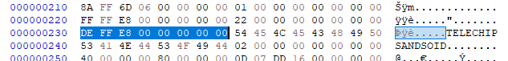
> 파티셔닝 할 수 있는 영역의 끝 위치.
> Secondary Partition Table first LBA-1 한 값.

- Disk GUID (16 Byte)
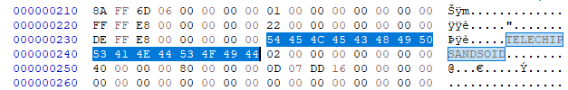
> Unix에 UUID(Universally Unique Identifier)와 동일.

- Partition Entries Starting LBA (8 Byte)
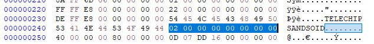
> GPT Partition Entry 에 시작 위치.
> 각 파티션의 정보가 기록되어 있음. 

- Number of Partition Entries (4 Byte)
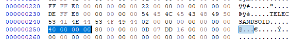
> 지원하는 GPT Partition Entry 의 개수.

- Size of Partition Entry
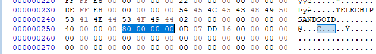
> GPT Partition Entry 의 크기.
> 대부분 128 Byte 를 사용함.

- CRC32 of Partition Entry
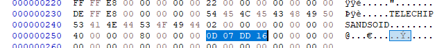
> 파티션의 CRC32 값.

- Reserved (420 Byte)
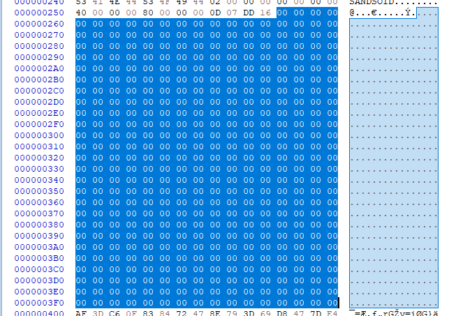
> 해당 Sector 나머지 영역은 사용하지 않음. 

 3. GPT Partition Entry - 2 Sector
> 2번째 Sector에 위치.
> 각 파티션의 정보를 기록.
> MBR의 파티션 Entry는 LBA 시작 주소는 4 Byte에 기록하지만 GPT 파티션 Entry의 LBA 시작 주소는 8 Byte에 기록.
> 128 개의 파티션 정보를 기록 할수 있음.
> 하나의 파티션 Entry는 128 Byte를 이용해서 기록(대부분의 경우)
> GUID 를 이용하여 각 파티션의 정보를 알 수 있음. 

- Partition Type GUID (16 Byte)
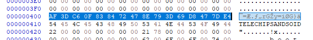
> 파티션 타입을 표현하는 고유한 정보.
> 파티션의 파일 시스템과 사용하는 운영체제 및 서비스 정보를 확인 가능.

- Unique Partition GUID (16 Byte)

> 파티션마다 할당하는 고유한 값을 저장. 

- First LBA (8 Byte)

> 파티션의 시작 주소.
> Little Endian 방식.

- Last LBA (8 Byte)

> 파티션의 끝 주소.
> Little Endian 방식.

- Attribute Flags (8 Byte)
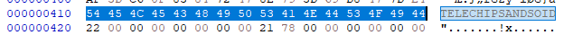
> 파티션의 속성을 나타내는 값. 
| Bit |                                     설명                                     |
|-----|:----------------------------------------------------------------------------:|
| 0   | System Partition(Disk Partitioning Utilities는 파티션을 그대로 보존 해야함.) |
| 2   | Legacy BIOS bootable (old bios booting soulution)                            |
| 60  | Read-Only                                                                    |
| 62  | Hidden                                                                       |
| 63  | Do not Automount                                                             |

- Partition Name(72 Byte)
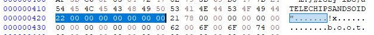
> 파일 시스템 이름.
> UTF-16(LE) code 사용.
