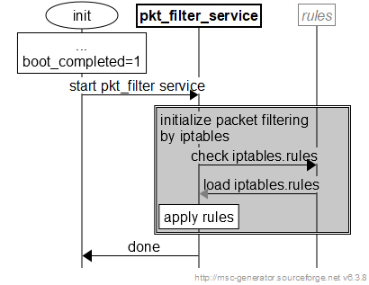

# iptables

## tables

 - The Filter Table
   Iptables에서 가장 널리 사용되는 테이블. 이 Filter 테이블은 패킷이 계속해서 원하는 목적지로 보내거나 요청을 거부하는데에 대한 결정을 하는데 사용된다. 방화벽 용어로 이것은 “filtering” 패킷들로 알려진다.

 - The NAT Table
   네트워크 주소 변환 규칙을 구현하는데 사용된다. 패킷들이 네트워크 스택에 들어오면, 이 테이블에 있는 규칙들은 패킷의 source 혹은 destination 주소를 변경하거나 변경하는 방법을 결정한다. 보통 direct access가 불가능할 때 네트워크에 패킷들을 라우팅하는데 종종 사용된다. 

 - The Mangle Table
   다양한 방법으로 패킷의 IP 헤더를 변경하는데 사용된다. 예를 들어 패킷의 TTL (Time to Live) Value를 조정할수 있다. 이 테이블은 다른 테이블과 다른 네트워킹 툴에 의해 더 처리되기 위해 패킷위에 내부 커널 “mark”를 위치 시킨다. 이 “marks”는 실제 패킷을 건들이지는 않지만 패킷의 커널의 표현에 mark를 추가하는 것이다. 

 - The Raw Table
    Iptables 방화벽은 stateful 방식이다. 이것은 패킷들은 이전 패킷들과 연관되어 평가된다는 것이다. Connection tracking 기능들은 netfilter 프레임워크의 최 상단에서 빌드되어지고 이것은 iptables가 ongoing connection 혹은 관계없는 패킷의 스트림으로의 세션 일부분으로 패킷을 살펴 볼 수 있도록 허용해준다. 이 Raw 테이블은 배우 좁게 정의된 기능이다. 이것의 유일한 목적은 connection tracking을 위한 패킷을 표시하기 위한 메커니즘을 제공하는 것이다.

 - The Security Table
   내부의 internal SELinux 보안 context marks를 패킷에 설정하는데 사용된다. 이것은 SELinux나 다른 시스템들이 어떻게 패킷을 핸들링하는데 영향을 미치는지에 대해 관여한다. 

## chain
 
 - INPUT
   외부에서 방화벽(목적지IP가 방화벽) 서버로 들어오는 패킷 제어

 - FORWARD
   외부 패킷이 방화벽을 통과해 다른 네트워크로 흘러가는것을 제어(ex. 브릿지 방화벽, vpn등)

 - OUTPUT
   방화벽(출발지 IP가 방화벽)에서 외부로 나가는 패킷 제어

```
-----> INPUT ----> Linux Box -----> OUTPUT ----->
        ^                            ^
        |                            |
        V                            V
        +----------> FORWARD --------+
```

### chain 관련 옵션

- chain 생성
```
# iptables -N richgold
```
- chain 제거
```
# iptables -X richgold
```
 기본적으로 제공하는 chain은 제거 할 수 없으며, chain의 이름을 지정하지 않으면 모든 사용자 체인은 제거 됩니다.

- chain 의 규칙 지우기
```
# iptables -F forward
```
 chain을 지정하지 않으면 모든 chain 규칙이 제거됩니다. 

- chain list up
```
# iptables -L richgold
```
 chain의 이름을 생략하면 모든 chain이 나열됩니다. 
  * '-v' : 규칙의 자세한 정보(packet과 byte counter, tos)가 출력됩니다.

### chain 규칙 종류
 - ACCEPT : packet 허용
 - DENY : packet을 허용하지 않는다는 message를 return
 - DROP : packet을 허용하지 않으며, 허용하지 않는다는 message를 return하지 않음.  
 - REJECT : match된 경우, 거절한다는 error message를 return.   match되지 않은 경우, DROP과 동일하게 작동함.
   * --reject-with tcp-reset : RST packet을 return하여 연결을 해제 하도록 함.
   * --reject-with icmp-net-unreachable : return error message.
   * --reject-with icmp-host-unreachable : return error message.
   * --reject-with icmp-port-unreachable : return error message.
   * --reject-with icmp-proto-unreachable : return error message.
   * --reject-with icmp-net-prohibitedor : return error message.
   * --reject-with icmp-host-prohibited : return error message.
 - nat : packet의 목적지나 start point을 변경.
 - 필터링 관련 옵션
   * ip 주소의 지정 규칙  
     : 출처('-s', '--source', '--src')와 목적지('-d', '--destination', '--dst') IP 주소를 지정하는데 여러가지 방법이 있다.  
	 : 첫번째 방법은 'www.linuxhq.com', 'localhost' 처럼 이름을 이용하는 것이다.   
	 두번째 방법은 '127.0.0.1' 처럼 IP 주소를 이용하는 것이다.   
	 세번째와 네번째 방법은 IP 주소의 그룹을 지정하는 것으로 '199.95.207.0/24' 또는 '199.95.207.0/255.255.255.0' 같은 형태이다. 이 둘은 모두 199.95.207.0 부터 199.95.207.255 사이의 모든 IP 주소를 지정한다. '/' 다음의 숫자는 IP 주소의 어떤 부분이 의미있는가를 나타낸다. '/32' 나 '/255.255.255.255' 가 기본값이다.(IP 주소의 모든부분이 일치해야 한다.) 모든 IP 주소를 지정하는데 '/0' 가 사용된다.    
  
 - icmp 확장   
  이 확장은 '--protocol icmp'가 지정되고 그 적용이 지정되지 않으면 자동으로 적재된다. 이것은 단 하나의 새로운 옵션만 지원함.  
    * --icmp-type   : '!' 옵션이 선행될 수 있다. 이후에 ICMP 타입의 이름('host-unreachable') 이나 숫자형태 ('3'), 또는 숫자형태와 코드('/'로 분리 예. '3/3') 의 형 태가 사용된다. 사용할 수 있는 ICMP 형태의 이름의 리스트는 '-p icmp --help' 하면 나타난다.   
	0 : echo-reply - ping  
	3 : destination-unreachable - Any TCP/UDP traffic  
	5 : redirect - routing if not running routing daemon  
	8 : echo-request - ping  
	11 : time-exceeded - traceroute  
	echo-request : ping프로그램으로 사용자가 목적지에 보내는 packet  
	echo-reply : echo-request에 대하여 목적지 시스템이 사용자에게 return 하는 packet  


---


## develop 


### iptables 적용

제품 운용환경에 맞는 iptables rule를 제품 시작시 초기화하여 패킷 필터링 기능을 적용합니다.

  


---

### iptables rules 생성

> iptables rules 생성방법에 대해 설명합니다.

command 를 입력하여 iptables rule을 초기화&추가합니다.

```bash
## iptalbes 초기화
> iptables -F
>  

## set Chain policy
> iptables -P INPUT DROP		#DROP시, 사용
> iptables -P FORWARD DROP		#DROP시, 사용
> iptables -P OUTPUT DROP		#DROP시, 사용

> #iptables -P INPUT ACCEPT
> #iptables -P FORWARD ACCEPT
> #iptables -P OUTPUT ACCEPT

# iptables allow icmp syntax
> iptables -A INPUT -m conntrack --ctstate ESTABLISHED,RELATED -j ACCEPT

## Enable or allow ICMP ping incoming client request
> iptables -A INPUT -p icmp --icmp-type 8 -s 0/0 -d 0/0 -m state --state NEW,ESTABLISHED,RELATED -j ACCEPT
> iptables -A OUTPUT -p icmp --icmp-type 0 -s 0/0 -d 0/0 -m state --state ESTABLISHED,RELATED -j ACCEPT
> iptables -A INPUT -p icmp --icmp-type 8 -m limit --limit 1/minute --limit-burst 2 -j LOG --log-prefix " PING-PONG-FLOOD "

## Allow or enable outgoing ping request
> iptables -A OUTPUT -p icmp --icmp-type 8 -s 0/0 -d 0/0 -m state --state NEW,ESTABLISHED,RELATED -j ACCEPT
> iptables -A INPUT -p icmp --icmp-type 0 -s 0/0 -d 0/0 -m state --state ESTABLISHED,RELATED -j ACCEPT
 
## product rule
> iptables -A INPUT -s 10.0.0.0/8 -j ACCEPT
> iptables -A OUTPUT -d 10.0.0.0/8 -j ACCEPT
> iptables -A INPUT -s 13.125.68.181 -j ACCEPT
> iptables -A OUTPUT -d 13.125.68.181 -j ACCEPT

## iptables rules 확인
> iptables -nL --line-numbers


## iptables rules 저장
>  iptables-save > /data/local/tmp/(rule_name).rules


## iptables rules 백업
(host_pc) adb pull /data/local/tmp/(rule_name).rules

## iptables rules 적용
(host_pad adb push /vendor/etc/iptables.rules
```

---

reference site : https://linux.die.net/man/8/iptables
