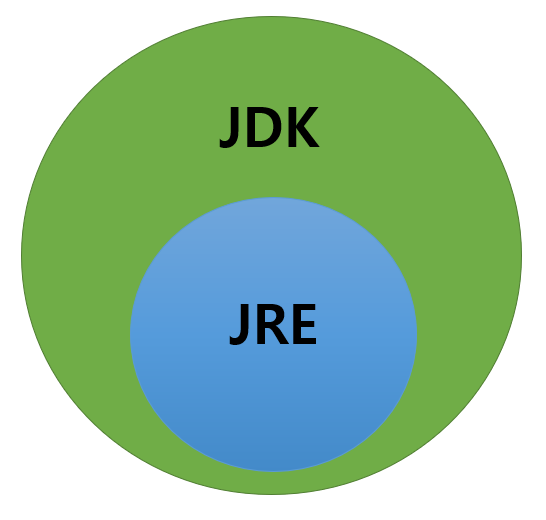
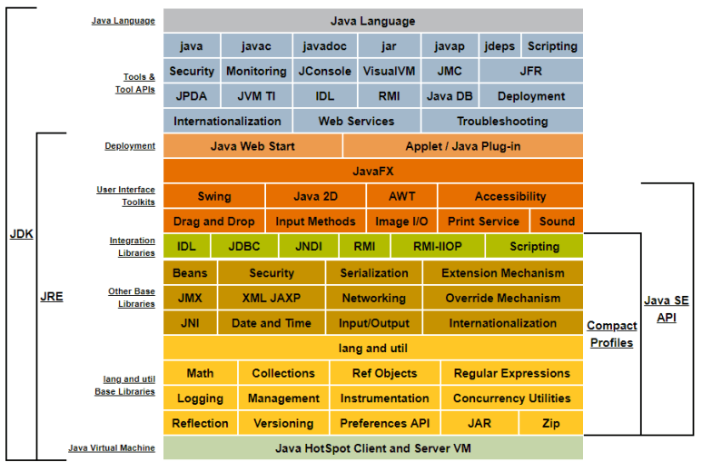

JAVA
=====

 JRE와 JDK는 모두 JAVA를 실행하는데 필요한 소프트웨어이다. 
 JRE와 JDK는 서로 다른 기능을 제공한다.

 - JRE 
   * Java Runtime Environment 의 약자로 JAVA Application을 실행하는데 필요한 소프트웨어. 
   * JRE에는 JAVA 가상 머신(JVM), class library, 기타 지원 파일이 포함되어 있다.
  

 - JDK
   * JDK는 Java Develop Kit의 약자로 JAVA Application을 개발하는데 필요한 소프트웨어.
   * JDK는 JRE를 포함할 뿐만 아니라 컴파일러(javac), javadoc, jar  등 개발에 유용한 도구들을 포함하고 있다.

 - JRE와 JDK 내부 구성

   * 사용자 디렉터리 구성요소
     + bin : 자바 개발, 실행에 필요한 도구와 유틸리티 명령
     + conf : 여러 종류의 패치 파일
     + include : 네이티브 코드 프로그래밍에 필요하는 C언어 헤더 파일
     + jmods : 컴파일된 모듈 파일들
     + legal : 각 모듈에 대한 저작권과 라이선스 파일
     + lib : 실행 시간에 필요한 라이브러리 클래스들

   * bin 디렉터리에 들어 있는 주요한 개발 소프트웨어
     + javac : 자바 컴파일러로 자바 소스를 바이트 코드로 변환
     + java : 자바 프로그램 실행기 → 자바 가상 기계를 작동시켜 자바 프로그램 실행
     + javadoc : 자바 소스로부터 HTML 형식의 API 도큐먼트 생성
     + jar : 자바 클래스 파일을 압축한 자바 아카이브 파일(.jar) 생성, 관리
     + jmod : 자바의 모듈 파일(.jmd)을 만들거나 모듈 파일의 내용 출력
     + jlink : 응용프로그램에 맞춘 맞춤형 JRE 생성
     + jdb : 자바 응용프로그램의 실행 중 오류를 찾는 데 사용하는 디버거
     + javap : 클래스 파일의 바이트 코드를 소스와 함께 보여주는 디어셈블러

 JAVA 애플리케이션을 실행하려면 JRE가 필요하고, JARA 애플리케이션을 개발하려면 JDK가 필요하다.

Java version
-----

 Java에는 다양한 버전이 존재한다. 그중 가장 많이 사용하는 버전은 JAVA 8,11,17이다. 
 LTS(Long Term Support) 버전이기 때문에, 

 - JAVA8
   * 오라클이 자바 인수 후 출시한 첫 번째 LTS 버전
   * 32bit를 지원하는 마지막 공식 Java 버전
   * Oracle JDK(Oracle사에서 지원하는 버전으로 유료) , Open JDK(오픈소스 기반의 무료)로 나뉨
   * 새로운 날짜와 시간 API(LocalDateTime 등)
   * 람다식(Lambda), Stream API
   * PermGen 영역 삭제
   * Static Link JNI Library

 - JAVA11
   * Oracle JDK와 Open JDK 통합
   * Oracle JDK가 구독형 유료 모델로 전환
   * 람다 지역 변수 사용법 변경
   * Third Party JDK로의 이전 필요
   * HTTP 클라이언트 표준화 기능
   *  

 - JAVA17
   * 가장 최신 LTS 버전
   * 봉인 클래스(Sealed Class) 정식 추가
   * 패턴 매칭 프리뷰 단계
   * Incubator (Foreign Function & Memory API)
   * 애플 M1 및 이후 프로세서 탑재 제품군에 대한 정식 지원 (Mac 유저들 환호)
   * 난수 생성 API 추가

reference
-----

- https://www.oracle.com/java/java-se-subscription/

