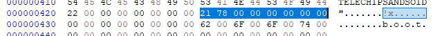
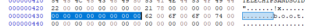
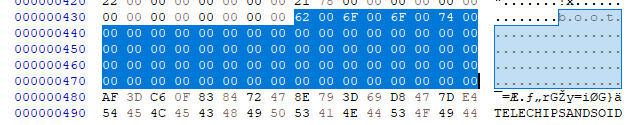

# 경동원 (ROM Writing 관련 H26M41208HPR eMMC 정보)
=====

 1. Primary GPT Header - 1 Sector  
  

- Signature (8 Byte)  
  

- Revision (4 Byte)  
  
> - Version 1.0.

- Header Size (4 Byte)  
  

- CRC32 of Header (4 Byte)  
  
> - CRC32 값.
> - Header의 시작부터 끝나는 위치까지만 체크함.
> - GPT Header.

- Reserved (4 Byte)  
  

- Current LBA (8 Byte)  
  
> - 현재 LBA 주소.

- Backup LBA (8 Byte)  
  
> - GPT Header 정보 Backup한 Sector 위치 기록.
> - Backup된 GPT Header 의 정보에 Backup LBA는 현재 위치를 기록하고 있음.
 
- First usable LBA for Partition (8 Byte)  
  
> - 파티셔닝 영역의 시작 위치.
> - Primary Partition Table last LBA+1 한 결과 값.

- Last usable LBA (8 Byte)  
  
> - 파티셔닝 할 수 있는 영역의 끝 위치.
> - Secondary Partition Table first LBA-1 한 값.

- Disk GUID (16 Byte)  
  

- Partition Entries Starting LBA (8 Byte)  
  
> - GPT Partition Entry 에 시작 위치.
> - 각 파티션의 정보가 기록되어 있음. 

- Number of Partition Entries (4 Byte)  
  

- Size of Partition Entry  
  
> - GPT Partition Entry 의 크기.

- CRC32 of Partition Entry  
  
> - 파티션의 CRC32 값.

- Reserved (420 Byte)  
  
> - 해당 Sector 나머지 영역은 사용하지 않음. 

 2. GPT Partition Entry - 2 Sector
> - 각 파티션의 정보를 기록.

- Partition Type GUID (16 Byte)  
  
> - 파티션 타입을 표현하는 고유한 정보.

- Unique Partition GUID (16 Byte)  
  
> - 파티션마다 할당하는 고유한 값을 저장. 

- First LBA (8 Byte)  
  
> - 파티션의 시작 주소.
> - Little Endian 방식.

ex)  
| No | NAME     | first LBA | LAST LBA | block | ptr start addr |
|----|----------|-----------|----------|-------|----------------|
| 1  | boot     | 0x22      | 0x7821   | 0x200 | 0x0000 4400    |
| 2  | system   | 0x7822    | 0x607821 | 0x200 | 0x00f0 4400    |
| 3  | cache    | 0x607822  | 0x652821 | 0x200 | 0xc0f0 4400    |
| 4  | recovery | 0x652822  | 0x65a021 | 0x200 | 0xca50 4400    |
| 5  | dtb      | 0x65a022  | 0x65b021 | 0x200 | 0xcb40 4400    |
| 6  | splash   | 0x65b022  | 0x65d821 | 0x200 | 0xcb60 4400    |
| 7  | misc     | 0x65d822  | 0x65e021 | 0x200 | 0xcbb0 4400    |
| 8  | tcc      | 0x65e022  | 0x65e821 | 0x200 | 0xcbc0 4400    |
| 9  | vendor   | 0x65e822  | 0x690821 | 0x200 | 0xcbd0 4400    |
| 10 | sest     | 0x690822  | 0x694821 | 0x200 | 0xd210 4400    |
| 11 | userdata | 0x694822  | 0xe8ffdd | 0x200 | 0xd290 4400    |

- Last LBA (8 Byte)  
  
> - 파티션의 끝 주소.
> - Little Endian 방식.

- Attribute Flags (8 Byte)  
  
> - 파티션의 속성을 나타내는 값.   
  
| Bit |                                     설명                                     |
|-----|:----------------------------------------------------------------------------:|
| 0   | System Partition(Disk Partitioning Utilities는 파티션을 그대로 보존 해야함.) |
| 2   | Legacy BIOS bootable (old bios booting soulution)                            |
| 60  | Read-Only                                                                    |
| 62  | Hidden                                                                       |
| 63  | Do not Automount                                                             |

- Partition Name(72 Byte)  
  
> - 파일 시스템 이름.
> - UTF-16(LE) code 사용.
