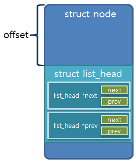
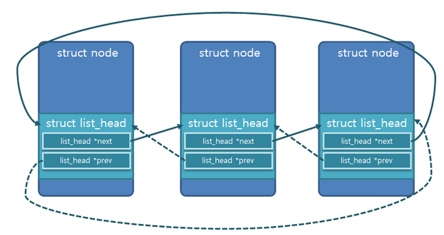
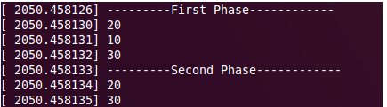

list_head
----
linux kernel 에서 사용하는 list_head 이중 연결 리스트 분석.

list_head 는 2.6.39.4 kernel 의 경우 /include/linux/types.h 에 정의하고 있다. 
list_head 의 동작 구현은 /include/linux/lish.h 에 있다. 

```c
struct list_head {
	struct list_head *next, *prev;
};
```


list_head 는 하나의 node의 member 이다. 
node의 시작 주소에서 offset 만큼 떨어진 곳에 위치 하게 된다. 
만약 아래와 같이 구조체를 만들었다면 offset 은 4(sizeof(int))가 될 것이다.
```c
struct item {
	int number;
	struct list_head list;
};
```

만약 3개가 연결되어 있다면 아래 그림과 같다.


그림에서 보이 듯 각각의 node 주소를 가르키고 있는 것이 아니라 node의 member인 list_head를 가르키고 있기 때문에 node의 주소를 알기 위해 (node->list_head) - offset 을 하여 node 즉 item 의 주소를 계산하여 (item*)로 형변환하고 각각의 member 에 접근 한다.

이를 쉽게 사용하기 위해 kernel 에서는 list_entry()를 define 하여 사용한다.
```c
/**
  * list_entry - get the struct for this entry
  * @ptr: the &struct list_head pointer.
  * @type: the type of the struct this is embedded in.
  * @member: the name of the list_struct within the struct.
  */
#define list_entry(ptr, type, member)	\
	container_of(ptr, type, member)
```

list_entry()는 container_of()를 다시 호출한다. (/include/linux/kernel.h)

```c
/**
  * container_of - cast a member of a structure out to the containing structure
  * @ptr: the pointer to the member.
  * @type: the type of the container struct this is embedde din.
  * @member: the name of the member within the struct.
  *
  */
#define container_of(ptr, type, member)	({	\
		const typeof( ((type *)0)->member ) *__mptr = (ptr);	\
		(type *)( (char *)__mptr - offsetof(type,member) );})
```
container_of() 의 내용을 보면 위 설명대로 item 의 list 위치에서 offset 만큼의 거리를 뺀 주소 즉, item 의 주소를 가져오는 역할을 한다. 

list_head 연결리스트를 사용하기 위한 다양한 함수들이 존재 한다.

* list_add - list 의 head 뒤에 새로운 node를 추가한다.
* list_add_tail - list의 마지막에 새로운 node를 추가한다.
* list_replace - 해당 node를 새로운 node로 변경한다.
* list_del_init - 모든 list 를 지우고 초기화 한다.
* list_move - 해당 node 를 지우고 새로운 node를 head 뒤에 추가한다.
* list_move_tail - 해당 node를 지우고 새로운 node를 list의 마지막에 추가한다.
* list_is_last - 해당 node가 마지막인지 검사한다.
* list_empty - 비여있는 list인지 검사한다.
* list_for_each_entry - for 문 처럼 각각의 node를 순서대로 접근한다. 

list_for_each_entry 사용 예제
```c
struct item *curr;
list_for_each_entry(curr, &my_list, list)
{
	printk("%d \n", curr->number);
}
````

첫 번째 인자는 해당 함목을 가져올 임시 변수.
두 번째 인자는 연결 리스트의 시작 주소.
세 번째 인자는 node에서 연결리스트 멤버 변수.

이 밖에도 다양한 macro 들이 정의되어있다.

예제 소스 - 한빛미디어 리눅스 커널 프로그래밍
list.c
```c
#include <linux/kernel.h>
#include <linux/module.h>
#include <linux/list.h>

struct item	{
	int number;
	struct list_head list;
};

LIST_HEAD (my_list);

static struct item item1;
static struct item item2;
static struct item item3;

int list_init(void)
{
	struct item *curr;

	item1.number = 10;
	item2.number = 20;
	item3.number = 30;

	INIT_LIST_HEAD(&my_list);

	// list_head -> 10
	list_add(&item1.list, &my_list);
	// list_head -> 20 -> 10
	list_add(&item2.list, &my_list);
	// list_head -> 20 -> 10 -> 30
	list_add_tail(&item3.list, &my_list);

	printk("-----First phase-----\n");
	list_for_each_entry(curr, &my_list, list)
	{
		printk("%d \n", curr->number);
	}

	// list_head -> 20 -> 30
	list_del(&item1.list);

	printk("-----Second phase-----\n");
	list_for_each_entry(curr, &my_list, list)
	{
		printk("%d \n", curr->number);
	}

	return 0;
}

void list_exit(void)
{
	list_empty(&my_list);
	list_del_init(&my_list);
}

module_init(list_init);
module_exit(list_exit);
MODULE_LICENSE("GPL");
```

Makefile
```Makefile
KERNELDIR = /lib/modules/$(shell uname -r)/build

obj-m = list.o

KDIR := /lib/modules/$(shell uname -r)/build
PWD := $(shell pwd)

default:
	${MAKE} -C ${KDIR} SUBDIRS=${PWD} modules

CC := /usr/bin/gcc


%.c%:
	${CC} -o $@ $^

clean:
	rm -rf *.ko
	rm -rf *.mod.*
	rm -rf .*.cmd
	rm -rf *.o
	rm -rf .tmp_versions
```

수행 화면

