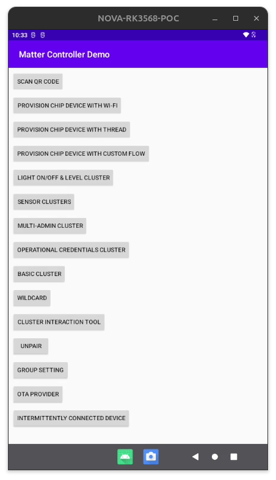

MATTER CHIPTool 



# 기능 설명

 - SCAN QR CODE
QR 코드를 스캔하여 Matter 장치를 네트워크에 추가하거나 설정하는 기능입니다. 
QR 코드에는 장치의 네트워크 정보와 설정 정보가 포함되어 있습니다.

 - PROVISION CHIP DEVICE WITH WI-FI
Wi-Fi를 통해 Matter 장치를 프로비저닝(설정)하는 기능입니다. 
이 기능을 사용하여 장치를 Wi-Fi 네트워크에 연결하고 초기 설정을 수행할 수 있습니다.

 - LIGHT ON/OFF & LEVEL CLUSTER
조명 장치의 On/Off 상태와 밝기 수준을 제어하는 클러스터입니다. 
이 메뉴를 통해 조명 장치를 켜고 끄거나 밝기를 조절할 수 있습니다.

 - SENSOR CLUSTERS
다양한 센서(예: 온도, 습도, 동작 감지 등)와 관련된 클러스터입니다. 
이 메뉴를 통해 센서 데이터를 읽고 모니터링할 수 있습니다.

 - MULTI-ADMIN CLUSTER
여러 관리자가 장치를 제어할 수 있도록 하는 클러스터입니다. 
이 메뉴를 통해 장치에 여러 관리자를 추가하거나 관리할 수 있습니다.

 - OPERATION CREDENTIALS CLUSTER
장치의 운영 자격 증명(예: 인증서, 키 등)을 관리하는 클러스터입니다. 
이 메뉴를 통해 자격 증명을 설정하고 관리할 수 있습니다.

 - BASIC CLUSTER
장치의 기본 정보(예: 제조사, 모델, 소프트웨어 버전 등)를 제공하는 클러스터입니다. 
이 메뉴를 통해 장치의 기본 정보를 확인할 수 있습니다.

 - WILDCARD
다양한 클러스터와 상호작용할 수 있는 범용 도구입니다. 
이 메뉴를 통해 특정 클러스터와의 상호작용을 테스트하거나 디버깅할 수 있습니다.

 - CLUSTER INTERACTION TOOL
클러스터와의 상호작용을 위한 도구입니다. 
이 메뉴를 통해 특정 클러스터에 명령을 보내거나 데이터를 요청할 수 있습니다.

 - UNPAIR
장치를 네트워크에서 제거하는 기능입니다. 
이 메뉴를 통해 장치를 네트워크에서 분리하고 초기 상태로 되돌릴 수 있습니다.

 - GROUP SETTING
장치를 그룹으로 설정하고 관리하는 기능입니다. 
이 메뉴를 통해 여러 장치를 그룹으로 묶어 동시에 제어할 수 있습니다.

 - OTA PROVIDER
OTA(Over-The-Air) 업데이트를 제공하는 기능입니다. 
이 메뉴를 통해 장치의 펌웨어를 무선으로 업데이트할 수 있습니다.

 - INTERMITTENTLY CONNECTED DEVICE
간헐적으로 연결되는 장치를 관리하는 기능입니다. 
이 메뉴를 통해 네트워크에 간헐적으로 연결되는 장치의 상태를 모니터링하고 관리할 수 있습니다.


<br/>
<br/>
<br/>
<br/>
<hr>

# Develop environment

```
vscode@kdiwin-nb:/workspaces/connectedhomeip$ echo $ANDROID_HOME 
/workspaces/Android/Sdk/
vscode@kdiwin-nb:/workspaces/connectedhomeip$ echo $ANDROID_NDK_HOME 
/workspaces/Android/Sdk/ndk/23.2.8568313/
vscode@kdiwin-nb:/workspaces/connectedhomeip$ echo $TARGET_CPU 
arm64
vscode@kdiwin-nb:/workspaces/connectedhomeip$ echo $JAVA_HOME 
/usr/lib/jvm/java-11-openjdk-amd64
vscode@kdiwin-nb:/workspaces/connectedhomeip$ java -version
openjdk version "11.0.24" 2024-07-16
OpenJDK Runtime Environment (build 11.0.24+8-post-Ubuntu-1ubuntu320.04)
OpenJDK 64-Bit Server VM (build 11.0.24+8-post-Ubuntu-1ubuntu320.04, mixed mode, sharing)
vscode@kdiwin-nb:/workspaces/connectedhomeip$ echo $PATH
/usr/lib/kotlinc/bin:/workspaces/connectedhomeip/third_party/pigweed/repo/out/host/host_tools:/home/vscode/pigweed/env/pigweed-venv/bin:/home/vscode/pigweed/env/cipd/packages/arm/bin:/home/vscode/pigweed/env/cipd/packages/arm:/home/vscode/pigweed/env/cipd/packages/zap:/home/vscode/pigweed/env/cipd/packages/pigweed/bin:/home/vscode/pigweed/env/cipd/packages/pigweed:/home/vscode/pigweed/env/cipd:/vscode/vscode-server/bin/linux-x64/65edc4939843c90c34d61f4ce11704f09d3e5cb6/bin/remote-cli:/usr/local/sbin:/usr/local/bin:/usr/sbin:/usr/bin:/sbin:/bin:/usr/lib/kotlinc/bin:/usr/lib/jvm/java-17-openjdk-amd64/bin:/workspaces/Android/Sdk/ndk/23.2.8568313/:/usr/lib/jvm/java-17-openjdk-amd64/bin
```

