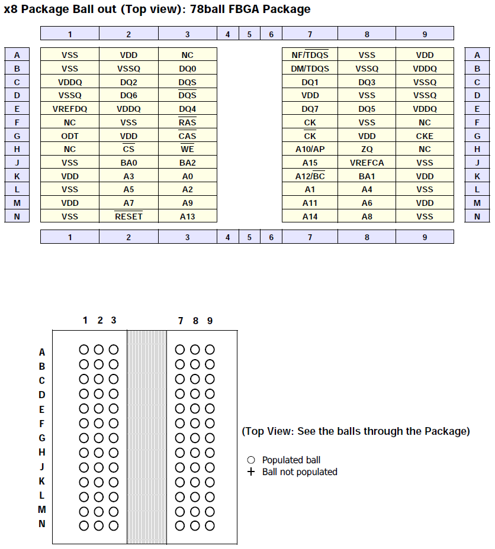

# SDRAM Interface 설명.
=====

## SDRAM 측면.
-----
RAM은SRAM(Static RAM)과 DRAM(Dynamic RAM)으로 나뉜다.  
SRAM은 플립플랍(논리게이트)을 이용하여 비트 데이터를 저장한다. 가장 빠른 램의 형태로 외부 자원 회로가 거의 필요 없으며, 전력 소모가 상대적으로 낮다.  
반면 비트 당 저장 비용이 비싸다.  
  
DRAM은 커패시터 배열을 이용하여 비트 데이터를 저장한다. 커패시터 배열이 전하를 금방 방전해 버리므로 DRAM은 1000분의 1초와 같은 일정 주기로 재충전을 해주어야 한다.  
바로 이 재 충전을 위해서는 부가회로가 필요하며, 재충전으로 인해 프로세서가 메모리를 참조하는 과정이 지연될 수 있다.  
반면 비트 당 저장 비용은 싸다.  
  
컴퓨터의 메모리 계층 구조에서, 바로 캐쉬가 SRAM으로 구성되고, 주메모리가 DRAM으로 구성된다.  
(요즘은 보통 SDRAM, DDR 이 주 이지만...)  
  
SDRAM은 Syncronous DRAM이다. 기술적인 이유인지, 역사적인 이유인지 몰라도 DRAM을 개선하면서 '동기적'이라는 용어를 붙였다.   
  
- DRAM의 동작원리에서 무엇을 개선했길레, Syncronous DRAM이라고 하였나.?  
  
 우리가 사용하는 것은 Hynix의 H5TQ4G83CFR-xxC 이다.  
 4Gbit  
 SDRAM 8M * 8bit * 8banks  
 이라고 명시되어있다.   
   
 보통 메모리의 용량을 말할 땐, 비트단위를 사용한다.  
 여기선 전체가 4기가비트이므로 (4*1024/8=512) 512메가바이트 짜리 SDRAM 이 되는 것이다.  
 그리고 8비트 데이터 버스폭이고 뱅크가 4개 있다는 뜻이다.   
  
## SDRAM의 내부다이어그램.   
-----  
  
  
SDRAM 인터페이스는 표준이므로, 항상 다음과 같은 핀들을 보게 된다.   
  
| 핀       | 설명                              |
|----------|-----------------------------------|
| CLK      | clock 보통 프로세서에서 생성한다. |
| CKE      | clock enable                      |
| nCS      | chip selector                     |
| A0:A15   | 어드레스                          |
| BA0:BA2  | 뱅크 어드레스                     |
| DQ0:DQ7  | 데이터                            |
| nRAS     | Row 스트로브 신호                 |
| nCAS     | Column 스트로브 신호              |
| nWE      | write enable                      |
| DQM      | DQ input/output Mask              |
  
보통 32비트 프로세서에는 SDRAM 콘트롤러가 들어있는데, 위의 핀에 해당하는 핀들이 프로세서에도 나와 있다.   
고로 잘 확인해서 연결만 하면 되는 것이다.   
복잡한 내부 동작은 이 SDRAM 콘트롤러가 다 알아서 처리해준다.  
프로세서에는 이 SDRAM 콘트롤러를 제어하는 시스템 레지스터가 있을 것이고 우리는 이 레지스터를 잘 조작해면 되는 것이다.  
  
메모리의 용량이 커질수록 메모리의 번지를 어드레싱하는 어드레스 핀 수가 늘어나게 된다.  
예를들어, 512MB 용량의 메모리는 어드레스 핀 수가 A0:A15 까지 16 개가 필요하다.  
DRAM 용량이 갈수록 늘어나므로, 초창기 메모리 개발자들은 이를 어떻게 해결 할 수 있을까 고민하다가,  
어드레스를 기존과 같이 1차원적으로 만드는 것이 아니라 3차원적으로 만들어 내는 방법을 고안해 내었는데,   
이것이 바로 SDRAM의 어드레싱 기본원리이다.  
결론적으로, 직육면체를 생각해보자.  
  
> column address, row address, bank address 가 바로 (x,y,z)가 되어 직육면체의 어느 한 곳(=한바이트)를 지정하게 되는 것이다.  
> 그리고 conlumn address와 row address 두 주소를 시간 차이를 두어 A0:A12핀에다가 실어 주고(이를 위해서 라스와 카스(RAS, CAS) 스트로브 핀이 있는 것이다.)  
> bank address는3핀이니, BA0, BA1, BA2을 사용하는 것이다.  
  

SDRAM의 액세스 동작의 순서는 nCS와 RAS(Row Address Strobe)신호를 활성화 시켜서 Row Address를 주소버스에 실어준다.  
그 다음 RAS를 비활성화 시키고 CAS(Column Address Strobe)신호를 활성화 시키고, 읽거나 쓰기 동작에 따라서 nWE신호를 주면 되는 것이다.  
결국 원하는 특정주소를 지정하고 나면, 거기서부터 Column Address를 하나씩 증가시켜가며 데이터를 버스트하게 액세스 하는 것이다.  
모든 동작은 CLK이라는 클럭에 positive edge 에 동기되어 동작한다.   
(그래서 syncronous 인것 같다.)   
여기서 CAS latency 라는 용어가 대두되는데, read 커맨드와 첫번째 유효한 데이터 사이의 딜레이이다.   
단위는 clock cycle이고, 보통 2,3의 값을 갖는다. 즉 2,3번 클럭 사이클 이후에 실제 데이터가 데이터버스에 실린다는 뜻이다.   
  
SDRAM의 read, write 액세스 동작은 버스터(burst) 지향적이다.   
이말은 특정 어드레스의 데이터를 액세스할 때, 한 바이트만을 하는게 아니라 한번에 여러 바이트를 액세스한다는 의미이다.   
burst length는 칩마다 다른데 보통 1,2,4,8,full page 정도이다.   
  

BA0, BA2을 프로세서의 어떤 핀에 연결해야 되는 지는 프로세서의 데이터 시트를 보면 된다.   
데이터 시트에서 지정해주는 대로 연결 하면 된다.   

## DQM의 정확한 기능은 무엇인가?   
-----  
8비트, 16비트 마이크로콘트롤러에서는 이런 SDRAM 콘트롤러가 프로세서 내에 들어있지 않으므로 별도의 DRAM, SDRAM 콘트롤러 칩이 필요하다.  
32비트 이상의 프로세서에는 이런 DRAM, SDRAM 콘트롤러가 거의 다 들어있다.   

## 뱅크란?  
-----  
ChipSelect 를 같이 쓰는 동일한 메모리들을 말한다. 왜 동일한 것을 써야하는지는 아래의 환경을 읽어보면 알수 있다.   
(뱅크의 개념은 앞의 메모리 덩어리가 병렬로 4개가 존재한다고 생각하면 된다. 이 뱅크 개념은 DRAM의 특성한 전하충전시간이 필요한데 이러한 충전시간을 각각의 뱅크로 분산시켜 좀 더 빠른 응답속도를 갖기 위해서 이다.)  

