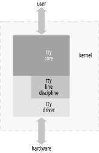
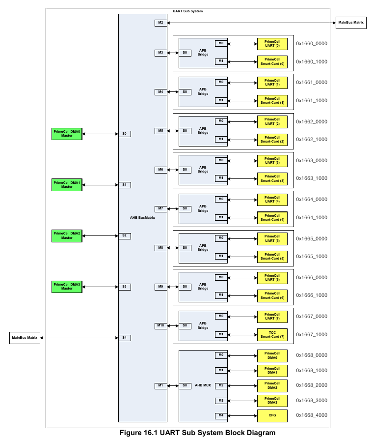
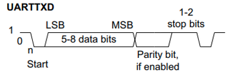
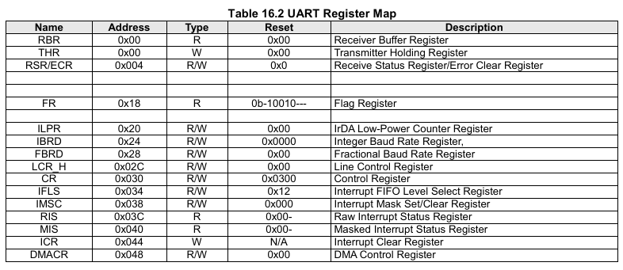
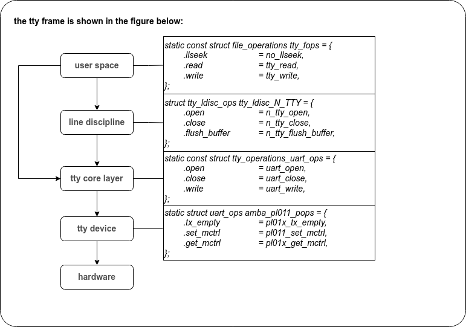
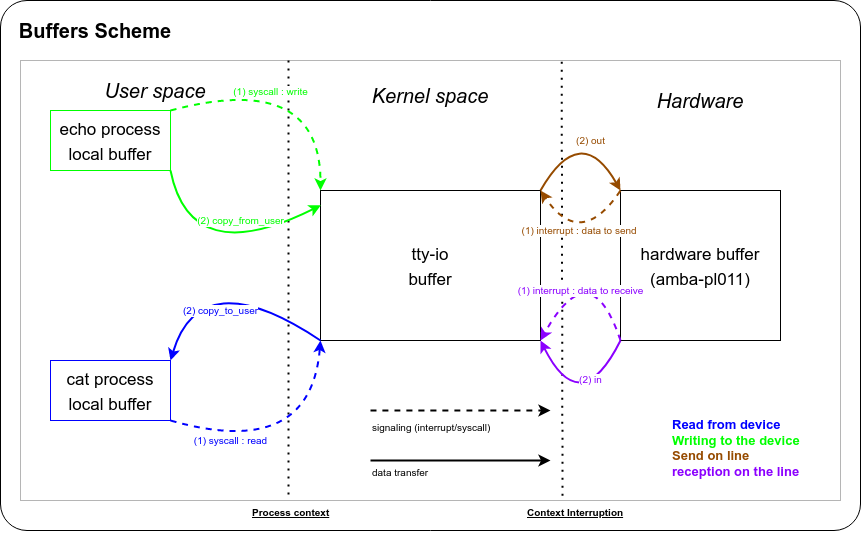

# Serial 


## TTY



## Prime cell uart(pl011)

tcc8985에는 serial module pl011을 포함하고 있습니다. 이 모듈은 pl011으로 AMBA와 호환되는 peripheral입니다. 
아래와 같은 특징을 가지고 있습니다.
- transmit fifo 32x8
- receive fifo 32x12
- programmable baud rate generator
- support direct memory access

uart block diagram  
  

APB interface를 통해서 uart 모듈의 레지스터를 read/write할수 있습니다.   
transmit/receive FIFO가 모듈내에 존재하고 있습니다.   
- transmit fifo는 8bit word를 32개 저장할 수 있습니다. ap가 uart를 통해 전송하려는 데이터들은 실제로 전송 되기 전에 transmit fifo 에 저장됩니다.  
- receive fifo는 12bit word를 32개 저장할 수 있습니다. 수신된 데이터 8bit와 각종 status 4bit를 포함하여 12bit 이며, receiver 모듈에서 수신된 데이터는 ap에서 read 되기 전까지 receive fifo에 저장되어 있습니다.  


### 데이터 transmit 및 receive 과정

- **transmit 과정**   
 데이터는 transmit fifo에 저장됩니다.   
 uart가 동작 중이라면 해당 fifo에 위치한 값들을 전송하기 시작해서 transmit fifo가 비워질 때까지 전송합니다.   
- **receive 과정**  
 receive modue 이 수신된 데이터 중, start bit를 발견하게 되면 데이터 샘플링을 시작합니다.   
 유효한 stop bit를 받게 된다면 전송이 완료되었다고 판단합니다.   
 이때 한 word가 완성되면 receive fifo에 push하게 되며 전송시 발생한 error도 함께 전송합니다.   
 uart의 한 character frame은 아래와 같습니다.    
  


### pl011 register 



- *PBR & THR*	: uart를 통해 주고 받는 데이터를 접근할 수 있는 레지스터 입니다.  
해당 레지스터는 width가 12/8 두가지의 경우를 가지고 있습니다.  
읽을 때는 receive fifo에 접근하기 때문에 12bit이고, 쓸 때는 transmit fifo에 접근하기 때문에 8bit 입니다.   
- *RSR/ECR*		: receive 할 때 발생한 에러들은 receive fifo뿐만 아니라 RSR/ECR 을 읽으면 확인 할 수 있습니다.  
해당 레지스터에 값을 write하여 에러를 clear할 수도 있습니다. 
- *FR*			: 각각의 fifo의 상태를 알수 있습니다.  
즉, fifo가 비어있는지 또는 fifo가 다 찻는지 확인할 수 있습니다.   
- *ILPR*			: InDR(unuse)  
- *IBRD & FBRD*	: uart는 baud rate에 따라서 데이터를 샘플링합니다.  
이때 baud rate는 해당 uart모듈에 전달되는  uartclk를 이용해서 생성됩니다.  
이때 IBRD & FBRD에 저장된 값을 사용하여 uartclk를 나누게 됩니다.  
- *LCR_H*			: line control에 관련된 세팅을 저장하고 있습니다.   
- *CR*			: 실제로 uart동작을 활성화 & 비활성화 할 수 있는 비트가 있습니다.   
transmit/receive의 기능을 각각 활성화 비활성화 하는 비트들도 존재합니다.   
- *IFLS*			:  
- *IMSC*			: 인터럽트 관련 레지스터 입니다.  
- *RIS*			:  
- *MIS*			:  
- *ICR*			:  
- *DMACR*			:  


	> link :https://developer.arm.com/documentation/ddi0183/f/introduction?lang=en  
	> note : AMBA(Advanced Microcontroller Bus Architecture)는 ARM사가 개발한 시스템 LSI용 온칩(On-Chip, 칩 내부) 버스 표준입니다.   


## serial_core, uart_driver, serial_console

> BUG_ON(in_interrupt()); // 이 구문이 인터럽트 핸들러 안에서 수행하면 BUG!!

uart ip device driver(hardware specific driver)는 커널에서 drivers/tty/serial/ 에서 존재하게 되고,     
상위 framework는 serial_core.c입니다.    
drivers/tty/serial/ 는 serial_core kernel framework와 hw device driver가 존재하게 됩니다.     
보통 serial_core.o + uart_ip_device_driver.o 조합으로 구성되어 있습니다.  
  
 - tty driver framework 분석 
	
	  
	전체 framework의 일반적인 모습은 위의 그림과 같이 대략 4개의 layer로 나눌 수 있다.  
	* 첫번째 계층은 하드웨어와 직접 접촉하는 *serial port driver layer* 이다.  
	* 상위 layer는 userspace 와 직접 연결 되는 ops구조를 가지며 userspace는 등록된 캐릭터 디바이스 노드를 통해 접근 하게 된다.  
	(layer by layer jump 가 가능) 

 -----
  
 - **serial_core는 자기에게 등록 될 수 있는 함수 *uart_register_driver*와 *uart_add_one_port*를 제공합니다.**
  
### uart_register_driver 함수 #1

uart_register_driver함수 struct uart_driver구조체를 매개 변수로 받습니다.  
구조체 내용은 <첨부1>을 참고합니다.  
  
uart_register_driver의 주석 내용을 확인하면,     

<uart driver(hw)를 core driver(serial_core)에 등록한다.     
이 함수 안에서 tty layer에 등록하고 core driver를 초기화 한다.    
normal driver(tty layer)등록 이후, /proc/tty/driver/"named"를 가진다.    
(named는 uart driver(hw) name으로 정해 지는 것으로 보임)    
struct uart_driver->port는 NULL이어야만 한다.   
uart_register_driver 함수 호출 이후에 uart_add_one_port를 호출 하여   
각 port 구조체가 등록 될 것이다.>  
  
정리하면, uart_register_driver함수는 serial_core에서 제공해 주는 함수로 struct tty_driver를 생성하여 tty layer에 등록하도록 도와주는 함수 입니다.  

```bash
+----------------------------------------------+
| tty layer <-> serial_core <-> hw uart driver |
+----------------------------------------------+
```
  
또 다른 의미로는 hw uart driver가 가진 struct uart_driver 구조체를 초기화 하는 것으로도 설명 할 수 있습니다.  
왜냐하면 이 초기화된 struct uart_drvier 구조체를 이용하여 uart_add_one_port 함수를 호출하여 hw uart driver가 가지고 있는 struct uart_port를 등록 할 수 있기 때문 입니다.  
(즉, uart_port를 등록하기 위한 key입니다. )  
  
### uart_register_driver 함수 #2

소스레벨에서 분석해보면, 

```c
int uart_register_driver(struct uart_driver *drv) drivers/tty/serial/serial_core.c
	|
	+-> */
		struct tty_driver *normal 을 alloc_tty_driver(drv->nr) 를 이용하여 생성. 
		drv->nr 은 hw uart driver의 hw 개수 혹은 (=port 개수 = ip)
		drv->tty_driver = normal; 수행하여 hw uart driver 가 생성한 tty driver를 가르키도록 하고,
		drv->state에 memory alloc하여 struct uart_state도 만들어 준다. (drv->nr 개수 만큼)
		normal->driver_name	= drv->driver_name;
		normal->name		= drv->dev_name;
		normal->major		= drv->major;
		normal->minor_start	= drv->minor;
		normal->type		= TTY_DRIVER_TYPE_SERIAL;
		normal->subtype		= SERIAL_TYPE_NORMAL;
		normal->init_termios	= tty_std_termios;
		normal->init_termios.c_cflag = B9600 | CS8 | CREAD | HUPCL | CLOCAL;
		normal->init_termios.c_ispeed = normal->init_termios.c_ospeed = 9600;
		normal->flags		= TTY_DRIVER_REAL_RAW | TTY_DRIVER_DYNAMIC_DEV;
		normal->driver_state    = drv;
		위와 같이 수행하고, 
		tty_set_operations(normal, &uart_ops);를 수행하여, 
		serial_core.c 내부에 있는 uart_ops를 tty_driver->ops에 연결 한다.
		uart_ops를 <첨부2>를 참고한다. 
		uart_ops는 대부분 struct uart_port의 ops 함수를 호출한다. 
			|
			+-> tx_empty(port) : 'port'에 transmitter fifo 와 shifter가 비어져 있는지 테스트하며, 비어진 경우, "TIOCSER_TEMT" 를 아닌경우, 0을 반환한다.
		struct uart_port의 ops는 hw uart driver에서 선언되어 있으면 hw를 control하는 코드 이다. 

		for (i = 0; i < drv->nr; i++) {
			struct uart_state *state = drv->state + i;
			struct tty_port *port = &state->port;

			tty_port_init(port);
			port->ops = &uart_port_ops;
			port->close_delay     = HZ / 2;	/* .5 seconds */
			port->closing_wait    = 30 * HZ;/* 30 seconds */
		}

		drv->nr 개수 만큼 반복하여 tty_port_init 함수를 호출하여 port를 init하는데 매개변수는 
		struct tty_port 이다.
		struct tty_port는 위에서 생성한 state(struct uart_state)그조체 안에 있는 port이다.
		struct uart_state->port <첨부1-1> 참고한다.

		tty_port_init 함수의 주 역할은 tty_port 구조체의 값을 초기화 하는 역할이고,
		port->ops가 중요하다. 여기에 uart_port_ops를 연결하는데 <첨부2-1>
		이 이후, tty_register_driver(normal);를 호출하여 tty_layer에 등록한다. 
		tty_register_driver 안에서 character driver를 등록한다.
		이로써 매개변수 struct uart_driver *drv는 초기화 되었다. 
		struct uart_driver *drv는 hw uart driver 에서 static으로 가지고 있다.
		*/
```

```bash
+------------------------------------------------------------------------------+
|                                                                              |
|    +-------------------+                                                     |   
| +->|struct tty_driver  |                                                     |   
| |  |                   |                                                     |   
| |  |                   |                                                     |   
| |  |  driver_state ----+--> +------------------+                             |   
| |  |                   |    |struct uart_driver|       +------------------+  |
| |  +-------------------+    |                  |  +--> |struct console    |  |        
| +---------------------------+-- tty_driver     |  |    |                  |  |
|                +------------+-- state          |  |    |                  |  |
|    	         |            |   con -----------+--+    +------------------+  |  
|                |            +------------------+                             |
|                |                                                             |
|                |                                                             |
|                +--->  +-------------------------+[0]                         |
|                       |struct uart_state(0)     |                            |
|                       |tty_port(st tty_port)    |      +------------------+  |
|                       |uart_port(st uart_port) -+--->  |struct uart_port  |  |
|                       +-------------------------+      +------------------+  |
|                       +-------------------------+[1]                         |
|                       |struct uart_state(1)     |                            |
|                       |tty_port(st tty_port)    |      +------------------+  |
|                       |uart_port(st uart_port) -+--->  |struct uart_port  |  |
|                       +-------------------------+      +------------------+  |
|                       +-------------------------+[2]                         |
|                       |struct uart_state(2)     |                            |
|                       |tty_port(st tty_port)    |      +------------------+  |
|                       |uart_port(st uart_port) -+--->  |struct uart_port  |  |
|                       +-------------------------+      +------------------+  |
|                       +------------------------ +[3]                         |
|                       |struct uart_state(3)     |                            |
|                       |tty_port(st tty_port)    |      +------------------+  |
|                       |uart_port(st uart_port) -+--->  |struct uart_port  |  |
|                       +-------------------------+      +------------------+  |            
+------------------------------------------------------------------------------+
```

위 그림은 구조체 개념도 입니다.   
*struct tty_driver*가 user space와 담당하는 모듈이고,   
*struct uart_driver*가 hw driver를 호출하고 등록/제거 하며,  tty_driver와 유기적으로 동작합니다.  
  
*struct uart_driver, struct console, struct uart_port* 이 3 구조체는 hw uart driver에서 static변수로 가지고 등록되는 형식이고,   
*struct tty_driver, struct uart_state(struct tty_port)* 이 2 구조체는 uart_register_driver함수를 호출하면 동적으로 생성됩니다.
  
  
### uart_add_one_port 함수 #1

매개 변수로 struct uart_driver와  struct uart_port를 받는데  
uart_driver는 uart_register_driver 함수를 등록 되어지고, 초기화 되어 있어야 합니다.  
struct uart_port 구조체는 hw uart driver가 static 변수로 가지고 있을 것이고,   
add port하기 전에 line (ip 번호 및 port 번호)을 지정하여야 하고 <첨부2-2> 참고  
기타 등등 몇가지를 초기화 하고 uart_add_one_port 함수를 호출합니다. <첨부 3-1> 참고  

### uart_add_one_port 함수 #2

소스 레벨에서 분석해보면
```c
int uart_add_one_port(struct uart_driver *drv, struct uart_port *uport) drivers/tty/serial/serial_core.c
```

<첨부1>-start
```c
struct uart_driver {
	struct module		*owner;
	const char		*driver_name;
	const char		*dev_name;
	int			 major;
	int			 minor;
	int			 nr;
	struct console		*cons;

	/*
	 * these are private; the low level driver should not
	 * touch these; they should be initialised to NULL
	 */
	struct uart_state	*state;
	struct tty_driver	*tty_driver;
};


```
<첨부1>-end


<첨부1-1>-start
```c
struct uart_state {
	struct tty_port		port;

	enum uart_pm_state	pm_state;
	struct circ_buf		xmit;

	struct uart_port	*uart_port;
};

```
<첨부1-1>-end


<첨부2>-start
```c
struct uart_ops {
	unsigned int	(*tx_empty)(struct uart_port *);
	void		(*set_mctrl)(struct uart_port *, unsigned int mctrl);
	unsigned int	(*get_mctrl)(struct uart_port *);
	void		(*stop_tx)(struct uart_port *);
	void		(*start_tx)(struct uart_port *);
	void		(*throttle)(struct uart_port *);
	void		(*unthrottle)(struct uart_port *);
	void		(*send_xchar)(struct uart_port *, char ch);
	void		(*stop_rx)(struct uart_port *);
	void		(*enable_ms)(struct uart_port *);
	void		(*break_ctl)(struct uart_port *, int ctl);
	int		(*startup)(struct uart_port *);
	void		(*shutdown)(struct uart_port *);
	void		(*flush_buffer)(struct uart_port *);
	void		(*set_termios)(struct uart_port *, struct ktermios *new,
				       struct ktermios *old);
	void		(*set_ldisc)(struct uart_port *, int new);
	void		(*pm)(struct uart_port *, unsigned int state,
			      unsigned int oldstate);
	void		(*wake_peer)(struct uart_port *);

	/*
	 * Return a string describing the type of the port
	 */
	const char	*(*type)(struct uart_port *);

	/*
	 * Release IO and memory resources used by the port.
	 * This includes iounmap if necessary.
	 */
	void		(*release_port)(struct uart_port *);

	/*
	 * Request IO and memory resources used by the port.
	 * This includes iomapping the port if necessary.
	 */
	int		(*request_port)(struct uart_port *);
	void		(*config_port)(struct uart_port *, int);
	int		(*verify_port)(struct uart_port *, struct serial_struct *);
	int		(*ioctl)(struct uart_port *, unsigned int, unsigned long);
#ifdef CONFIG_CONSOLE_POLL
	int		(*poll_init)(struct uart_port *);
	void		(*poll_put_char)(struct uart_port *, unsigned char);
	int		(*poll_get_char)(struct uart_port *);
#endif
};

```
<첨부2>-end


<첨부2-1>-start
```c
static const struct tty_port_operations uart_port_ops = {
	.activate	= uart_port_activate,
	.shutdown	= uart_port_shutdown,
	.carrier_raised = uart_carrier_raised,
	.dtr_rts	= uart_dtr_rts,
};
```
<첨부2-1>-end


<첨부2-2>-start
```c
struct uart_port {
	spinlock_t		lock;			/* port lock */
	unsigned long		iobase;			/* in/out[bwl] */
	unsigned char __iomem	*membase;		/* read/write[bwl] */
	unsigned int		(*serial_in)(struct uart_port *, int);
	void			(*serial_out)(struct uart_port *, int, int);
	void			(*set_termios)(struct uart_port *,
				               struct ktermios *new,
				               struct ktermios *old);
	int			(*startup)(struct uart_port *port);
	void			(*shutdown)(struct uart_port *port);
	void			(*throttle)(struct uart_port *port);
	void			(*unthrottle)(struct uart_port *port);
	int			(*handle_irq)(struct uart_port *);
	void			(*pm)(struct uart_port *, unsigned int state,
				      unsigned int old);
	void			(*handle_break)(struct uart_port *);
	unsigned int		irq;			/* irq number */
	unsigned long		irqflags;		/* irq flags  */
	unsigned int		uartclk;		/* base uart clock */
	unsigned int		fifosize;		/* tx fifo size */
	unsigned char		x_char;			/* xon/xoff char */
	unsigned char		regshift;		/* reg offset shift */
	unsigned char		iotype;			/* io access style */
	unsigned char		unused1;

#define UPIO_PORT		(0)
#define UPIO_HUB6		(1)
#define UPIO_MEM		(2)
#define UPIO_MEM32		(3)
#define UPIO_AU			(4)			/* Au1x00 and RT288x type IO */
#define UPIO_TSI		(5)			/* Tsi108/109 type IO */

	unsigned int		read_status_mask;	/* driver specific */
	unsigned int		ignore_status_mask;	/* driver specific */
	struct uart_state	*state;			/* pointer to parent state */
	struct uart_icount	icount;			/* statistics */

	struct console		*cons;			/* struct console, if any */
#if defined(CONFIG_SERIAL_CORE_CONSOLE) || defined(SUPPORT_SYSRQ)
	unsigned long		sysrq;			/* sysrq timeout */
#endif

	/* flags must be updated while holding port mutex */
	upf_t			flags;

#define UPF_FOURPORT		((__force upf_t) (1 << 1))
#define UPF_SAK			((__force upf_t) (1 << 2))
#define UPF_SPD_MASK		((__force upf_t) (0x1030))
#define UPF_SPD_HI		((__force upf_t) (0x0010))
#define UPF_SPD_VHI		((__force upf_t) (0x0020))
#define UPF_SPD_CUST		((__force upf_t) (0x0030))
#define UPF_SPD_SHI		((__force upf_t) (0x1000))
#define UPF_SPD_WARP		((__force upf_t) (0x1010))
#define UPF_SKIP_TEST		((__force upf_t) (1 << 6))
#define UPF_AUTO_IRQ		((__force upf_t) (1 << 7))
#define UPF_HARDPPS_CD		((__force upf_t) (1 << 11))
#define UPF_LOW_LATENCY		((__force upf_t) (1 << 13))
#define UPF_BUGGY_UART		((__force upf_t) (1 << 14))
#define UPF_NO_TXEN_TEST	((__force upf_t) (1 << 15))
#define UPF_MAGIC_MULTIPLIER	((__force upf_t) (1 << 16))
/* Port has hardware-assisted h/w flow control (iow, auto-RTS *not* auto-CTS) */
#define UPF_HARD_FLOW		((__force upf_t) (1 << 21))
/* Port has hardware-assisted s/w flow control */
#define UPF_SOFT_FLOW		((__force upf_t) (1 << 22))
#define UPF_CONS_FLOW		((__force upf_t) (1 << 23))
#define UPF_SHARE_IRQ		((__force upf_t) (1 << 24))
#define UPF_EXAR_EFR		((__force upf_t) (1 << 25))
#define UPF_BUG_THRE		((__force upf_t) (1 << 26))
/* The exact UART type is known and should not be probed.  */
#define UPF_FIXED_TYPE		((__force upf_t) (1 << 27))
#define UPF_BOOT_AUTOCONF	((__force upf_t) (1 << 28))
#define UPF_FIXED_PORT		((__force upf_t) (1 << 29))
#define UPF_DEAD		((__force upf_t) (1 << 30))
#define UPF_IOREMAP		((__force upf_t) (1 << 31))

#define UPF_CHANGE_MASK		((__force upf_t) (0x17fff))
#define UPF_USR_MASK		((__force upf_t) (UPF_SPD_MASK|UPF_LOW_LATENCY))

	/* status must be updated while holding port lock */
	upstat_t		status;

#define UPSTAT_CTS_ENABLE	((__force upstat_t) (1 << 0))
#define UPSTAT_DCD_ENABLE	((__force upstat_t) (1 << 1))

	int			hw_stopped;		/* sw-assisted CTS flow state */
	unsigned int		mctrl;			/* current modem ctrl settings */
	unsigned int		timeout;		/* character-based timeout */
	unsigned int		type;			/* port type */
	const struct uart_ops	*ops;
	unsigned int		custom_divisor;
	unsigned int		line;			/* port index */
	resource_size_t		mapbase;		/* for ioremap */
	struct device		*dev;			/* parent device */
	unsigned char		hub6;			/* this should be in the 8250 driver */
	unsigned char		suspended;
	unsigned char		irq_wake;
	unsigned char		unused[2];
	struct attribute_group	*attr_group;		/* port specific attributes */
	const struct attribute_group **tty_groups;	/* all attributes (serial core use only) */
	void			*private_data;		/* generic platform data pointer */
};
```
<첨부2-2>-end


<첨부3-1>-start
```c
static int pl011_register_port(struct uart_amba_port *uap)
{
	int ret;

	/* Ensure interrupts from this UART are masked and cleared */
	pl011_write(0, uap, REG_IMSC);
	pl011_write(0xffff, uap, REG_ICR);

	if (!amba_reg.state) {
		ret = uart_register_driver(&amba_reg);
		if (ret < 0) {
			dev_err(uap->port.dev,
				"Failed to register AMBA-PL011 driver\n");
			return ret;
		}
	}

	ret = uart_add_one_port(&amba_reg, &uap->port);
	if (ret)
		pl011_unregister_port(uap);

	return ret;
}

```
<첨부3-1>-end

---

## the function call flow of tty and uart




### 1. 어플리케이션 layer에서 data send 절차

```c
write(uartfd, p, size)
|
+-> static const struct file_operations tty_fops = {
|		.write		= tty_write,
|
+-> static ssize_t tty_write(struct file *, const char __user *, size_t, loff_t *);
	|/** 
	|  * line discipline 을 통하여 tty device 에 data를 write합니다.
	|  * line discipline : include/uapi/linux/tty.h
	|  * 새로운 line discipline이 필요한 경우, 정의가 필요합니다. 
	|  */
	|
	+->	static inline ssize_t do_tty_write(
				ssize_t (*write)(struct tty_struct *, struct file *, const unsigned char *, size_t),
				struct tty_struct *tty,
				struct file *file,
				const char __user *buf,
				size_t count)
			/**
			  * tty_ldisc->tty_ldisc_ops->write 
			  */
			  |
			  +-> tty_ldisc_ops.write = static int uart_write(struct tty_struct *tty, const unsigned char *buf, int count)
			  	/**
				  * write 함수는 line discipline module에 의해 정의 되었나? 
				  * tty->ops->write(tty, tbuf->buf, tbuf->count)
				  * tty_struct->tty_driver->tty_operations->write
				  * user로부터 전달 받은 buf의 데이터를 circ buffer로 copy
				  */
				  |
				  +-> void __uart_start(struct tty_struct *tty)
				  	/** 
					  * port->ops->start_tx(port);
					  * uart_port->uart_ops->start_tx
					  */
					  |
					  +-> struct uart_ops amba_pl011_pops = {
						.start_tx  = pl011_start_tx
```
 - 위 포인트에서 user message(data)가 전송 됩니다. 
 - message flow에서 message가 ldisc line discipine layer를 통과한 다음, tty layer 를 통하여 hardware driver layer로 전달되는 것을 확인 할 수 있습니다.
 - message 전송 시, ldiscipine layer를 통과하여 tty layer 으로 전송된 다음 hardware driver layer로 전송되는 이유는??   

    * file_operation.do_tty_write(ld->ops->write, tty, file, buf, count);  
	  tty_ldisc->ops->(*write)(struct tty_struct *tty, struct file *file, const unsigned char *buf, size_t nr);  
    * tty_ldisc_ops.n_tty_write(struct tty_struct *tty, struct file *file, const unsigned char *buf, size_t nr);  
	  tty->ops->write(tty, b, nr); tty_operations->ops->(*write)(struct tty_struct *tty, const unsigned char *buf, int count)  
	* tty_operations.uart_write(struct tty_struct *tty, const unsigned char *buf, int count)  
	  memcpy(circ->buf + circ->head, buf, c);  
	* uart_ops.pl011_start_tx(struct uart_port *port)  
	  pl011_write(c, uap, REG_DR);  


### 2. 레이어별 uart와 tty 간의 호출 관계
  
#### 2.1 file_operation 함수 세팅 할당에 대해 설명 

     - *file_operations* 및 *tty_operations* 함수 세트의 초기화는 *uart_register_driver* 함수에서 완료됩니다.

```c
int uart_register_driver(struct uart_driver *drv)
	/**
	  * uart core layer에  driver 등록합니다. tty layer에 등록하고, core driver port의 상태를 초기화 합니다. 
	  * /proc/tty/driver에 proc 파일시스템을 생성합니다.
	  * drv->port는 NULL상태이어야 하며, uart_add_one_port 함수를 통하여 등록합니다.
	  */
	  |
	  +-> tty_set_operations(normal, &uart_ops);
	  |	  /**
	  |	    * tty_operation 할당, serial_core.c의 structure 초기화 진행
	  |		*/
      +-> tty_register_driver(normal);
		|
		+-> tty_cdev_add(driver, dev, 0, driver->num);
			|
			+-> cdev_init(&driver->cdevs[index], &tty_fops); 
```

drivers/tty/tty_io.c
```c
static const struct file_operations tty_fops = {
	.llseek		= no_llseek,
	.read		= tty_read,
	.write		= tty_write,
	.poll		= tty_poll,
	.unlocked_ioctl	= tty_ioctl,
	.compat_ioctl	= tty_compat_ioctl,
	.open		= tty_open,
	.release	= tty_release,
	.fasync		= tty_fasync,
};

```
#### 2.2 tty_operation 함수 세팅 할당에 대해 설명
   > 2.1 file_operation 함수 세팅과 동일
 
```c
int uart_register_driver(struct uart_driver *drv)
	|
	+-> tty_set_operations(normal, &uart_ops)
	|	/**
	|	  * tty_operation 할당 완료. (serial_core.c)
	|	  */
    +-> tty_register_driver(normal);
```

drivers/tty/serial/serial_core.c
```c
static const struct tty_operations uart_ops = {
	.open		= uart_open,
	.close		= uart_close,
	.write		= uart_write,
	.put_char	= uart_put_char,
	.flush_chars	= uart_flush_chars,
	.write_room	= uart_write_room,
	.chars_in_buffer= uart_chars_in_buffer,
	.flush_buffer	= uart_flush_buffer,
	.ioctl		= uart_ioctl,
	.throttle	= uart_throttle,
	.unthrottle	= uart_unthrottle,
	.send_xchar	= uart_send_xchar,
	.set_termios	= uart_set_termios,
	.set_ldisc	= uart_set_ldisc,
	.stop		= uart_stop,
	.start		= uart_start,
	.hangup		= uart_hangup,
	.break_ctl	= uart_break_ctl,
	.wait_until_sent= uart_wait_until_sent,
#ifdef CONFIG_PROC_FS
	.proc_fops	= &uart_proc_fops,
#endif
	.tiocmget	= uart_tiocmget,
	.tiocmset	= uart_tiocmset,
	.get_icount	= uart_get_icount,
#ifdef CONFIG_CONSOLE_POLL
	.poll_init	= uart_poll_init,
	.poll_get_char	= uart_poll_get_char,
	.poll_put_char	= uart_poll_put_char,
#endif
};
```

#### 2.3 tty_ldisc_ops 함수 세팅 할당에 대해 설명

```c
int tty_register_ldisc(int disc, struct tty_ldisc_ops *new_ldisc)
	/**
	  * line discipline module 초기화 시 호출 됩니다. 
	  */
	|
	+-> tty_ldiscs[disc] = new_ldisc;
		/**
		  * tty_ldisc에는 각 line discipline number가 포힘되어 있습니다.
		  * default tty인 경우, n_tty.c의global variable tty_ldisc_N_TTY가 사용됩니다.
		  *
		  * 아래는 n_tty.c에 정의된 default N_tty 예제 입니다.
		  * user 는 line regulation module을 작성하고, 데이터 캡슐화를 수행하고 method를 세팅할 수 있습니다. 
		  */
```

drivers/tty/n_tty.c
```c
struct tty_ldisc_ops tty_ldisc_N_TTY = {
	.magic           = TTY_LDISC_MAGIC,
	.name            = "n_tty",
	.open            = n_tty_open,
	.close           = n_tty_close,
	.flush_buffer    = n_tty_flush_buffer,
	.chars_in_buffer = n_tty_chars_in_buffer,
	.read            = n_tty_read,
	.write           = n_tty_write,
	.ioctl           = n_tty_ioctl,
	.set_termios     = n_tty_set_termios,
	.poll            = n_tty_poll,
	.receive_buf     = n_tty_receive_buf,
	.write_wakeup    = n_tty_write_wakeup,
	.fasync		 = n_tty_fasync,
	.receive_buf2	 = n_tty_receive_buf2,
};
```

#### 2.4 uart_ops 함수 세팅 할당에 대해 설명

drivers/tty/serial/amba-pl011.c
```c
static struct uart_ops amba_pl011_pops = {
	.tx_empty	= pl011_tx_empty,
	.set_mctrl	= pl011_set_mctrl,
	.get_mctrl	= pl011_get_mctrl,
	.stop_tx	= pl011_stop_tx,
	.start_tx	= pl011_start_tx,
	.stop_rx	= pl011_stop_rx,
	.enable_ms	= pl011_enable_ms,
	.break_ctl	= pl011_break_ctl,
	.startup	= pl011_startup,
	.shutdown	= pl011_shutdown,
	.flush_buffer	= pl011_dma_flush_buffer,
	.set_termios	= pl011_set_termios,
	.type		= pl011_type,
	.release_port	= pl011_release_port,
	.request_port	= pl011_request_port,
	.config_port	= pl011_config_port,
	.verify_port	= pl011_verify_port,
#ifdef CONFIG_CONSOLE_POLL
	.poll_init     = pl011_hwinit,
	.poll_get_char = pl011_get_poll_char,
	.poll_put_char = pl011_put_poll_char,
#endif
};
```

### 3. line regulation number 설정
   
#### 3.1 serial port default line procedure 과정  

```c
open("/dev/ttyAMA3", O_RDWR | O_NOCTTY | O_NONBLOCK); 
	/**
	  * app layer
	  */
	  |
	  +-> tty_operations.tty_open
	  	|
		+-> tty_init_dev
			|
			+-> initialize_tty_struct
				|
				+-> tty_ldisc_init
					|
					+-> struct tty_ldisc *ld = tty_ldisc_get(N_TTY)
						|
						+-> struct tty_struct *tty->ldisc = ld;
							/**
							  * tty_struct 및 N_TTY가 binding 되며 serial port의 기본 라인 규칙
							  */ 
```
 

---

## rs485 block

```bash
+------------------------------------------------+
|                                                |
|                                                |
|                                                |
|                    (rxd)    (txd)    (txen)    | 
|                      |        |        |       |
|                     (R)      (D)   (DE)(RE)    |
| ZT485LEEN            +---+----+---+----+       |
|                          |        |            |
|                       (485_a)  (485_b)         |
|                          |        |            |
+------------------------------------------------+
```


---

## reference code

drivers/tty/serial/atmel_serial.c

```dts
RS485 example for Atmel USART:
	usart0: serial@fff8c000 {
		compatible = "atmel,at91sam9260-usart";
		reg = <0xfff8c000 0x4000>;
		interrupts = <7>;
		atmel,use-dma-rx;
		atmel,use-dma-tx;
		linux,rs485-enabled-at-boot-time;
		rs485-rts-delay = <0 200>;		// in milliseconds
	};

```

## reference site
https://man7.org/linux/man-pages/man3/tcflush.3.html

--- 

## develop rs485 on soc board

> note : BUG_ON(in_interrupt()); // 이 구문이 인터럽트 핸들러 안에서 수행하면 BUG!!

### to do
 AMBA PL011은 rs485 에 support가 되지 않습니다.   
 2개의 timer를 사용하여 하나는 rs485 delays에 사용되고,   
 두번째 timer는 tx fifo polling에 사용됩니다.  
 PL011 은 tx fifo empty interrupt가 없으므로, 두번째 timer에 의해 제어됩니다.  

---

- *review code(tcc8985)*

```c
static int __init pl011_init(void)	drivers/tty/serial/amba-pl011.c

```


```c
static void uart_start(struct tty_struct *tty) drivers/tty/serial/serial_core.c
	|
	+-> static voi dpl011_start_tx(struct uart_port *port)	drivers/tty/serial/amba-pl011.c  

```

- issue

**RS485 txen gpio support 기능**
1. kernel layer 에서 제어. (txen gpio를 kernel layer에서 제어 한다. )
  - **~~커널 RS485 API를 사용하는 방법.~~**
    * rs485 기능을 지원하는 오픈 소스 코드가 커널에 포함되어 있으므로 해당 코드 분석 필요. 
    * 참고 : https://www.kernel.org/doc/Documentation/serial/serial-rs485.txt
    * struct serial_rs485 를 사용. 
    * _*검토 결과, RTS 와 DTR  신호를 사용하여 TXEN 인터페이스를 제어하는데 사용하고 있음. 일부 SoC (Atmel AT91,,)에서만 사용가능한 코드로 보임.*_
  - **uart_port의 control methods(uart_ops)를 사용하는 방법. (uart ip device driver)**
    * transmitter buffer에서 데이터 전송과 TXEN 인터페이스를 제어하는 타이밍을 세팅해주어야 함. 
    * control methods 를 통한 TXEN 인터페이스 제어는 정상 동작 되지 않음. 
    * 데이터 전송 후, uart register를 체크하여 txen 을 제어하는 방법을 검토 중.  
    * TX/RX는 확인 되었지만 TXEN 인터페이스가 타이밍에 맞게 제어되지 않는 경우 발생되어 다른 구현 방법을 검토 중. 
  - **n_gsm 모돌을 레퍼런스하여 새로운 드라이버 작성하여 구현하는 방법.**
    * *검토 중.*
2. user layer 에서 제어. (txen gpio를 user layer에서 제어한다.)
  - **uart tx 전/후 txen gpio를 제어하는 인터페이스를 사용하도록 하는 방법**


---

- note

tty_io
serial_core
amba_pl011


```c

```


