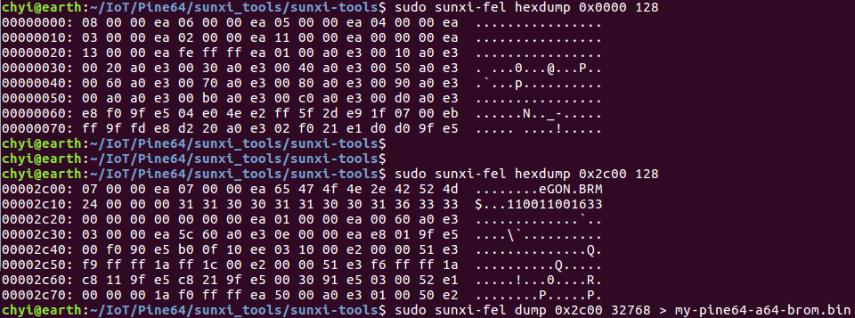
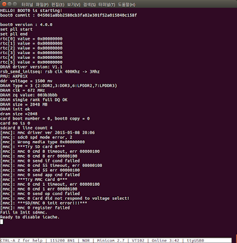

# Sunxi-tools
-----

## sunxi-fexc and wrappers
-----
> sunxi-fexc는 FEX와 binary representation을 변환하는 툴이다. 
>
- sunxi-fexc
```
Usage: ./sunxi-fexc [-vq] [-I <infmt>] [-O <outfmt>] [<input> [<output>]]

infmt:  fex, bin  (default:fex)
outfmt: fex, bin, uboot  (default:bin)
```
> 인수가 제공되지 않으면 stdin을 기다립니다. 마찬가지로 <output>이 제공되지 않으면 stdout에 덤프됩니다. 이것은 배관에는 좋지만 터미널을 엉망으로 만들 수 있습니다 (터미널을 재설정하고 다시 이해하려면 reset을 입력하십시오).


- bin2fex
> 이것은 script.bin을 취하고 .fex 텍스트를 덤프하는 sunxi-fexc의 사본입니다.

- fex2bin
> 이것은 .fex 텍스트 파일을 받아 바이너리를 덤프하는 sunxi-fexc의 복사본입니다.

- sunxi-pio
> PIO 설정을 조작합니다 (GPIO / pinmux 구성).
> fel-gpio 스크립트에서 사용하기위한 PIO 레지스터의 파일 덤프에서 또는 직접 mmap 하드웨어 액세스를 통해 장치에서 기본적으로 사용할 수 있습니다.

- sunxi-fel and helpers
> FEL은 USB를 통해 Allwinner SoC BROM과 대화하는 수단입니다. 장치에 액세스하려면 먼저 장치에서 FEL 모드를 활성화해야합니다.


- sunxi-fel
> FEL과 대화하기위한 스크립트 인터페이스를 제공하는 메인 프로그램.
> --dev 또는 --sid 옵션을 사용하여 특정 장치를 선택하지 않는 한이 도구는 찾은 첫 번째 Allwinner 장치 (FEL 모드)에 액세스합니다. sunxi-fel --list --verbose로 현재 연결 / 감지 된 모든 FEL 장치 목록을 인쇄 할 수 있습니다.
> 인수없이 호출되면 sunxi-fel은 사용 정보를 표시합니다.

- usb-boot
> FEL 모드에서 USB를 통해 부팅하기위한 레거시 스크립트가 더 이상 사용되지 않습니다. 자세한 내용은 USB 부팅 페이지를 참조하십시오.

- fel-pio
> 타겟에서 실행되는 작은 바이너리. FEL 모드를 통해 IO 레지스터 액세스를 활성화합니다. 직접 사용해서는 안됩니다.

- fel-gpio
> sunxi-fel을 사용하여 fel-pio를 대상에 업로드 한 다음 sunxi-pio 유틸리티를 사용하고 FEL / USB를 통해 GPIO 설정을 조작 할 수있는 스크립트입니다.

- fel-sdboot
> FEL 모드를 강제로 실행하여 버튼을 누르지 않고도 FEL 모드로 바로 부팅하는 작은 ARM 네이티브 SD 부팅 코드입니다.

- jtag-loop
> PF (CARD0)를 JTAG 모드로 설정 한 다음 JTAG로 연결하기를 기다리는 작은 ARM 네이티브 SD 부팅 코드입니다.

- sunxi-bootinfo
> Allwinner 부팅 파일 (boot0 / boot1)의 덤프 정보
> --type = sd SD 부팅 정보 포함
> --type = nand NAND 부팅 정보 포함 (구현되지 않음)

- meminfo
> 이 장치 측 도구는 레지스터 정보를 읽고 U-Boot에 새 장치 지원을 추가하는 데 필요한 모든 정보를 인쇄합니다. 이 도구는 정적으로 컴파일되므로 Android에서도 사용할 수 있습니다.

- script-extractor
> 이 장치 측 도구는 매직 주소 0x43000000의 RAM에서 script.bin 데이터를 읽고 파일에 저장합니다. 이 도구는 정적으로 컴파일되므로 Android에서도 사용할 수 있습니다. FEX 기반 커널 (스톡 Android 펌웨어에서 사용됨)에서만 사용할 수 있으며 devicetree 기반 메인 라인 커널에서는 의미가 없습니다.

- phoenix-info
> phoenixcard 유틸리티로 생성 된 phoenix SD 이미지에 대한 정보를 제공하고 선택적으로 숨겨진 파티션에서 내장 된 부트 코드 및 펌웨어 파일을 추출합니다. LiveSuit 이미지에는 사용할 수 없습니다.

- sunxi-nand-part
> sunxi-nand-part는 sunxi 장치에서 내부 NAND를 다시 분할하는 도구입니다. 장치의 아키텍처에 대해 (교차) 컴파일되어야하며 전체 NAND를 블록 장치로 노출하려면 장치에 특수 커널 패치 (이미 커널 트리에 포함됨)가 있어야합니다.


## FEL mode. 
-----
> Allwinner SoC은 USB OTG를 통해 부팅 가능한 FEL 모드라는 것을 지원한다. Android의 fastboot 기능과 유사한 기능이라고 볼 수도 있는데, FEL 기능 자체가 BootROM(primary bootloader) 내에 탑재되어 있으므로, fastboot(일반적으로 secondary bootloader에 탑재) 방식이 할 수 없는 일 즉, boot media(예: NAND flash)에 설치된 image(혹은 secondary bootloader)에 이상이 생겼을 경우, 이를 복구하는 것이 근본적으로 가능한 방식이라 하겠다(JTAG이 없이도 FEL mode만으로 복구가 가능함. 물론 JTAG은 BootROM 영역도 제어가 가능한 방식이지만 ...).

FEL mode 와 관련해서는 아래 사이트를 참고.
- http://linux-sunxi.org/FEL/USBBoot
- https://blog.hypriot.com/post/the-pine-a64-is-about-to-become=the-cheapest-ARM-64-bit-platform-to-run-Docker/

### FEL mode 진입
-----
> FEL mode 시험을 위해서는 보드가 FEL mode로 진입해야만 하며, 이를 확인하기위해서는 sunxi-fel 이라는 tool 필요.

< FEL mode 진입 방법 >
- target board 의 FEL Pin을 Enable.

- lsusb 명령을 통해 usb OTG 장치(target board)가 제대로 인식되는지 확인.
```
$ lsusb 
Bus 002 Device 001: ID 1d6b:0003 Linux Foundation 3.0 root hub
Bus 001 Device 005: ID 067b:2303 Prolific Technology, Inc. PL2303 Serial Port
Bus 001 Device 004: ID 148f:5372 Ralink Technology, Corp. RT5372 Wireless Adapter
Bus 001 Device 003: ID 2188:0ae1  
Bus 001 Device 002: ID 03f0:044a Hewlett-Packard 
Bus 001 Device 007: ID 1f3a:efe8 Onda (unverified) V972 tablet in flashing mode
Bus 001 Device 001: ID 1d6b:0002 Linux Foundation 2.0 root hub
```

- sunxi-fel 확인.
아래와 같은 메시지가 출력되면 정상적으로 fel mode로 진입된것. 
```
$ sudo sunxi-fel version
AWUSBFEX soc=00001689(A64) 00000001 ver=0001 44 08 scratchpad=00017e00 00000000 00000000
```

- 이미지 추출.
sunxi-fel tool을 사용하여 아래와 같이BROM image(binary)추출 가능.
```
$ sudo sunxi-fel hexdump 0x0000 128
$ sudo sunxi-fel hexdump 0x2c00 128
```



- FEL mode 로 부팅하기.(legacy 방법)
> longsleep 및 armbian(default version) 모두 kernel 3.10.105를 사용하고 있음. 아래 내용은 이 version을 기준으로 정리 됨.
 정상 부팅 시, BROM 이 제일 먼저 구동하는 것은 boot0 loader이다. 
 sunxi-fel을 사용하여 boot0.bin loader를 구동 시킨다.

 [target board] 						      	[host pc]
  USB Port	------------------------------------ USB Port
 FEL mode 진입.                               sunxi-fel spl boot0.bin
   BROM                                             |
     |                                              |
      <---------------------------------------------+
     |                  boot0.bin 전달
	 V
 Execute boot0.bin by BROM
    ...

```
$ sudo sunxi-fel spl ./boot0.bin
```
> 명령을 통해 FEL mode에서 실제로 아래와 같이 boot0.bin 이 실행됨. 



출처 :
https://slowbootkernelhacks.blogspot.com/2017/07/pine-a64-64-bit-arm-linux.html
http://linux-sunxi.org/Pine64#Boot_sequence
https://blog.hypriot.com/post/the-pine-a64-is-about-to-become=the-cheapest-ARM-64-bit-platform-to-run-Docker/
