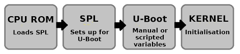
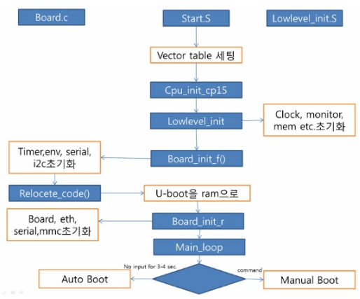

## U-BOOT 
-----

## Source Tree
-----
| arch/arm/cpu                         | 각종 vendor 별 CPU dependent Intialization code를 갖는다.                                                   |
|--------------------------------------|-------------------------------------------------------------------------------------------------------------|
| arch/arm/cpu/armv7                   | entry point인 start.S 파일을 가진다.                                                                        |
| arch/arm/cpu/armv7/sun8iw11p1        |                                                                                                             |
| arch/arm/include                     | cpu관련 c파일                                                                                               |
| arch/arm/include/asm/arch-sun8iw11p1 |                                                                                                             |
| board                                | 각종 vendor별 board dependent initialization code                                                           |
| board/sunxi/sun8iw11p1               | clock init, DMC init                                                                                        |
| common                               | 각종 명령어, user interface main routine, CLI architecture or target board에 무관한 소프트웨어 command 구현 |
| drivers                              | 각종 디바이스 드라이버를 가지고 있다. BLOCK, DMA, GPIO, I2C, INPUT, MMC, MTD, NET, PCI, RTC, SERIAL, USB,,, |
| include                              | u-boot header information                                                                                   |
| include/config.mk                    | 컴파일 후 생성되는 파일, ARCH, CPU, BOARD, VENDOR, SOC 정보를 가짐                                          |
| include/configs/sun8iw11p1.h         | 보드에 대한 설정 파일                                                                                       |
| lib                                  |                                                                                                             |


## 부팅 과정
-----
 SPL 은 u-boot의 기능 중 초기부분을 떼어서 만든거라고 봐도 된다. 초기작을 수행한 후 u-boot을 로딩한다. mcu에 따라 쓰는것도 있고 안쓰기도 한다.



## bootloader 기능
-----
1. 하드웨어 초기화
> CPU clock, Memory Timing, Interrupt, UART, GPIO 등 초기화.
> 코드상에서는 (lowlevel_init, board_init_f, board_init_r) 3가지 routine으로 분류.

2. Image loading
> flash memory 에 있는 zImage, file system을 sdram으로 복사.

3. jump to kernel


## 전체적인 초기화 routine
-----


1. watch dog 중지하고, interrupt disable을수행.
2. clock 설정:  PPL
3. 메모리 시스템 초기화
4. stack 셋업 : c program을 위해서는 스택이 설정되어 있어야 한다.
5. IRQ, 예외처리 핸들러 설정, IRQ enable
6. C에서 사용되는 변수 초기화.

## u-boot.lds
-----
```
OUTPUT_FORMAT("elf32-littlearm", "elf32-littlearm", "elf32-littlearm")                                                                                                                                                                                   
OUTPUT_ARCH(arm)
ENTRY(_start)
SECTIONS
{
 . = 0x4A000000;
 . = ALIGN(4);
 .head :
 {
  *(.__image_copy_start)
  arch/arm/cpu/armv7/spare_head.o (.data*)
 }
        .hash :
        {
  arch/arm/cpu/armv7/uboot_hash.o(.data*)
        }
 . = ALIGN(4);
 .text :
 {
  *(.vectors)
  arch/arm/cpu/armv7/start.o (.text*)
  *(.text*)
 }
 . = ALIGN(4);
 .rodata : { *(SORT_BY_ALIGNMENT(SORT_BY_NAME(.rodata*))) }
 . = ALIGN(4);
 .data : { 
  *(.data*)
 }
 . = ALIGN(4);
 . = .;
 . = ALIGN(4);
 .u_boot_list : { 
  KEEP(*(SORT(.u_boot_list*)));
 }
 . = ALIGN(4);
 .image_copy_end :
 {
  *(.__image_copy_end)
 }
 .rel_dyn_start :
 {
  *(.__rel_dyn_start)
 }
 .rel.dyn : { 
  *(.rel*)
 }
 .rel_dyn_end :
 {
  *(.__rel_dyn_end)
 }
 .end :
 {
  *(.__end)
 }
 _image_binary_end = .;
 . = ALIGN(4096);
 .mmutable : { 
  *(.mmutable)
 }
 .bss_start __rel_dyn_start (OVERLAY) : { 
  KEEP(*(.__bss_start));
  __bss_base = .;
 }
 .bss __bss_base (OVERLAY) : { 
  *(.bss*)
   . = ALIGN(4);
   __bss_limit = .;
 }
 .bss_end __bss_limit (OVERLAY) : { 
  KEEP(*(.__bss_end));
 }
 .dynsym _image_binary_end : { *(.dynsym) }
 .dynbss : { *(.dynbss) }
 .dynstr : { *(.dynstr*) }
 .dynamic : { *(.dynamic*) }
 .plt : { *(.plt*) }
 .interp : { *(.interp*) }
 .gnu.hash : { *(.gnu.hash) }
 .gnu : { *(.gnu*) }
 .ARM.exidx : { *(.ARM.exidx*) }
 .gnu.linkonce.armexidx : { *(.gnu.linkonce.armexidx.*) }
}

```
> LD(loader & linker)의 input으로 주어져서, object 파일을 생성하는데 규칙을 제공. 
- OUTPUT_FORMAT	:	ELF32의 little endian으로 코드를 생성.
- OUTPUT_ARCH	:	binary을 실행할 수 있는 CPU architecture로 ARM을 사용.
- ENTRY point	:	Program의 시작을 가리키며, 시작되는 함수는 "_start".
- SECTIONS		:	정의를 보면, head, text, rodata, data, u_boot_list, image_copy_end, bss_start, bss, 라는 section들이 정의.
* .text 	:	실행할 프로그램 코드 영역.
* .rodata	:	read-only data 영역.
* .data		:	initiallzed data 영역.
* .got		:	global offset table 영역.
* .bss		:	uninitialized data 영역.
- 특수한 링커 변수 dot'.'는 항상 현재 출력 address point을 담고 있다.
* address point는 출력 섹션의 크기만큼 증가한다.
* '*'는 어떤 파일명에도 대응한다. '*(.text)'는 모든 입력파일의 모든 입력 섹션 '.text'을 의미한다.
- 프로그램 코드는 0x4A000000에서 시작해서 4Byte단위로 정렬된 text section에 놓여질 것이다. 
- u-boot의 시작은 entry point에 선언된 _start부터 시작된다.
- _start는 'arch/arm/cpu/armv7/start.S'에 정의.
- TEXT_BASE에 의해 Linker수행 시, symbol들은 상대적 주소를 갖는다. 
- Power가 on 한 후, 0x00번지(즉, flash)에서 시작하여 memory 초기화를 거쳐 flash의 내용을 dram에 relocate하면 비로써 dram 에서 동작하게 된다. 
- Symbol들은 모두 TEXT_BASE의 상대적 주소 값을 가지고 있으므로, dram에 relocate전에는 offset branch 명령만 사용해야 한다. (B, BL, ADR)

## arch/arm/cpu/armv7/start.S
-----
```
/*************************************************************************                                                                                                                                                                               
 *
 * Startup Code (reset vector)
 *
 * do important init only if we don't start from memory!
 * setup Memory and board specific bits prior to relocation.
 * relocate armboot to ram
 * setup stack
 *
 *************************************************************************/
.globl  _TEXT_BASE
_TEXT_BASE:
    .word   CONFIG_SYS_TEXT_BASE

    .globl  reset

reset:
    bl  save_boot_params
    /*  
     * disable interrupts (FIQ and IRQ), also set the cpu to SVC32 mode,
     * except if in HYP mode already
     */
    mrs r0, cpsr
    and r1, r0, #0x1f       @ mask mode bits
    teq r1, #0x1a       @ test for HYP mode
    bicne   r0, r0, #0x1f       @ clear all mode bits
    orrne   r0, r0, #0x13       @ set SVC mode
    orr r0, r0, #0xc0       @ disable FIQ and IRQ
    msr cpsr,r0

/*
 * Setup vector:
 * (OMAP4 spl TEXT_BASE is not 32 byte aligned.
 * Continue to use ROM code vector only in OMAP4 spl)
 */
#if !(defined(CONFIG_OMAP44XX) && defined(CONFIG_SPL_BUILD))
    /* Set V=0 in CP15 SCTRL register - for VBAR to point to vector */
    mrc p15, 0, r0, c1, c0, 0   @ Read CP15 SCTRL Register
    bic r0, #CR_V       @ V = 0
    mcr p15, 0, r0, c1, c0, 0   @ Write CP15 SCTRL Register

    /* Set vector address in CP15 VBAR register */
    ldr r0, =_start
    mcr p15, 0, r0, c12, c0, 0  @Set VBAR
#endif

    /* the mask ROM code should have PLL and others stable */
#ifndef CONFIG_SKIP_LOWLEVEL_INIT
    bl  cpu_init_cp15
    bl  cpu_init_crit
#endif

    bl  _main

/*------------------------------------------------------------------------------*/

```

lds 파일에 따르면, u-boot의 entry point는 __start이다.
__start는 0x0번지에 위치하며, 가장 먼저 vector table를 세팅한다.

> cpu_init_cp15 호출.
>> Setup CP15 registers (cache, MMU, TLBs). The I-cache is turned on unless CONFIG_SYS_ICACHE_OFF is defined. disable MMU stuff and acaches.
> cpu_init_crit 호출.
>> lowlevel_init 호출.

## ./arch/arm/cpu/armv7/lowlevel_init.S
-----
```
#include <asm-offsets.h>
#include <config.h>
#include <linux/linkage.h>

ENTRY(lowlevel_init)
        /*
         * Setup a temporary stack
         */
        ldr     sp, =CONFIG_SYS_INIT_SP_ADDR
        bic     sp, sp, #7 /* 8-byte alignment for ABI compliance */
#ifdef CONFIG_SPL_BUILD
        ldr     r9, =gdata
#else
        sub     sp, sp, #GD_SIZE
        bic     sp, sp, #7
        mov     r9, sp
#endif
        /*
         * Save the old lr(passed in ip) and the current lr to stack
         */
        push    {ip, lr}

        /*
         * go setup pll, mux, memory
         */
        bl      s_init
        pop     {ip, pc}
ENDPROC(lowlevel_init)
```
> setup pll,mux,memory

## arch/arm/lib/crt0.S
-----
```
/*
 * entry point of crt0 sequence
 */

ENTRY(_main)

/*
 * Set up initial C runtime environment and call board_init_f(0).
 */

#if defined(CONFIG_SPL_BUILD) && defined(CONFIG_SPL_STACK)
    ldr sp, =(CONFIG_SPL_STACK)
#else
    ldr sp, =(CONFIG_SYS_INIT_SP_ADDR)
#endif
    bic sp, sp, #7  /* 8-byte alignment for ABI compliance */
    sub sp, sp, #GD_SIZE    /* allocate one GD above SP */
    bic sp, sp, #7  /* 8-byte alignment for ABI compliance */
    mov r9, sp      /* GD is above SP */
    mov r0, #0
    bl  board_init_f

#if ! defined(CONFIG_SPL_BUILD)

/*
 * Set up intermediate environment (new sp and gd) and call
 * relocate_code(addr_moni). Trick here is that we'll return
 * 'here' but relocated.
 */

    ldr sp, [r9, #GD_START_ADDR_SP] /* sp = gd->start_addr_sp */
    bic sp, sp, #7  /* 8-byte alignment for ABI compliance */
    ldr r9, [r9, #GD_BD]        /* r9 = gd->bd */
    sub r9, r9, #GD_SIZE        /* new GD is below bd */

    adr lr, here
    ldr r0, [r9, #GD_RELOC_OFF]     /* r0 = gd->reloc_off */
    add lr, lr, r0
    ldr r0, [r9, #GD_RELOCADDR]     /* r0 = gd->relocaddr */
    b   relocate_code
here:

/* Set up final (full) environment */

    bl  c_runtime_cpu_setup /* we still call old routine here */

    ldr r0, =__bss_start    /* this is auto-relocated! */
    ldr r1, =__bss_end      /* this is auto-relocated! */

    mov r2, #0x00000000     /* prepare zero to clear BSS */

clbss_l:cmp r0, r1          /* while not at end of BSS */
    strlo   r2, [r0]        /* clear 32-bit BSS word */
    addlo   r0, r0, #4      /* move to next */
    blo clbss_l

    bl coloured_LED_init
    bl red_led_on

    /* call board_init_r(gd_t *id, ulong dest_addr) */
    mov     r0, r9                  /* gd_t */
    ldr r1, [r9, #GD_RELOCADDR] /* dest_addr */
    /* call board_init_r */
    ldr pc, =board_init_r   /* this is auto-relocated! */

    /* we should not return here. */

#endif

ENDPROC(_main)   
```


## board/sunxi
